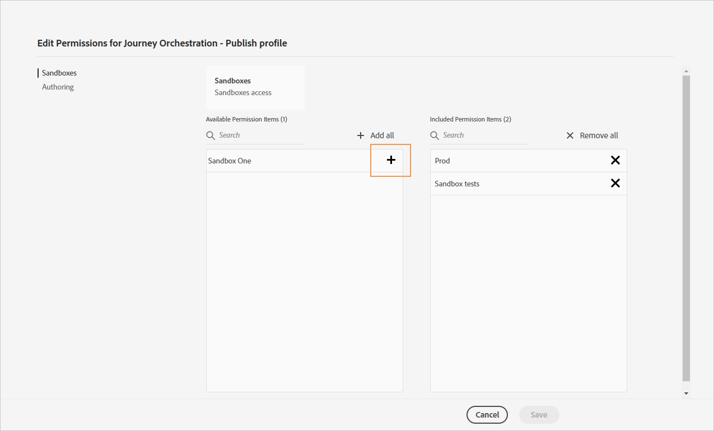
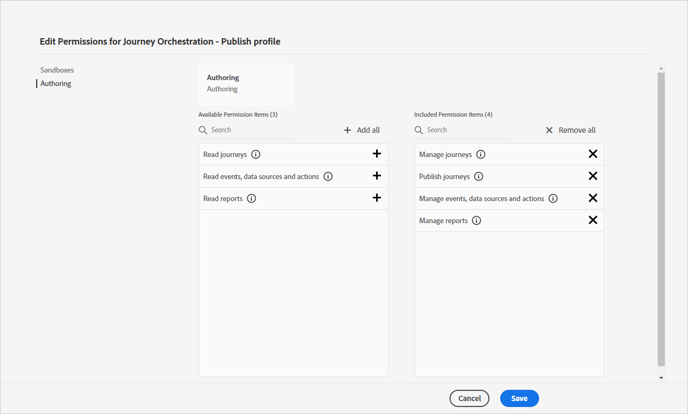

# 存取管理{#concept_rfj_wpt_52b}

## 關於存取管理 {#about-access-management}

[!DNL Journey Orchestration] 可讓您指派一組權限給您的使用者，以定義使用者可存取的介面部分。

管理員可以存取管理控制台。 有關管理控制台的詳細資訊，請參閱本 [檔案](https://helpx.adobe.com/enterprise/managing/user-guide.html)。

若要存取， [!DNL Journey Orchestration]使用者必須：

* 與權限關 [!DNL Journey Orchestration] 聯 **[!UICONTROL product profile]** 的一 [!DNL Journey Orchestration] 部分。
* 屬於 [!DNL Adobe Experience Platform]**[!UICONTROL product profile]**。 沒有強制性的許可。 使用者應具有 **[!UICONTROL profile management]** 從介面建立和編輯平台區段的 [!DNL Journey Orchestration] 權限。 For more on this, refer to this [page](https://docs.adobe.com/content/help/en/experience-platform/access-control/home.html#adobe-admin-console).

在「管理控制台」中，您可以指派下列其中一個現成可用的產品設定檔給您的使用者：

* **[!UICONTROL Limited Access User]**: 具有歷程和報告唯讀存取權的使用者。 此產品設定檔包含下列權限：
   * 閱讀歷程
   * 閱讀報告

* **[!UICONTROL Administrators]**: 使用者可存取管理功能表，並可管理歷程、事件和報表。 此產品設定檔包含下列權限：
   * 管理歷程
   * 發佈歷程
   * 管理事件、資料來源和動作
   * 管理報表

   >[!NOTE]
   >
   >**[!UICONTROL Administrators]** 是唯一允許在Adobe Campaign Standard中建立、編輯和發佈交易訊息（或訊息範本）的產品設定檔。 如果您使用Adobe Campaign Standard在歷程中傳送訊息，就需要此產品設定檔。

* **[!UICONTROL Standard User]**: 具有基本存取權的使用者，例如歷程管理。 此產品設定檔包含下列權限：
   * 管理歷程
   * 發佈歷程
   * 管理報表

如果現成可用的設定檔不足以管理使用者，您也可以建立自己的產品設定檔。
使用者必須永遠連結至產品設定檔，讓您指派特定的內建權限，例如：

* **[!UICONTROL Read journeys]**
* **[!UICONTROL Read reports]**
* **[!UICONTROL Manage events, data sources and actions]**
* **[!UICONTROL Read events, data sources and actions]**
* **[!UICONTROL Manage journeys]**
* **[!UICONTROL Publish journeys]**
* **[!UICONTROL Manage reports]**

您可以在下方找到權限與不同功 [!DNL Journey Orchestration]能之間的相容性。

## 建立產品設定檔 {#create-product-profile}

[!DNL Journey Orchestration] 可讓您建立自己的產品設定檔，並指派一組權限和沙盒給您的使用者。 使用產品設定檔，您可以授權或拒絕存取介面中的特定功能或物件。

如需如何建立和管理沙盒的詳細資訊，請參閱 [Adobe Experience Platform檔案](https://docs.adobe.com/content/help/en/experience-platform/sandbox/ui/user-guide.html)。

若要建立產品設定檔並指派一組權限和沙盒：

1. 在「管理控制台」中，選取 **[!UICONTROL Journey Orchestration]**。 在標籤 **[!UICONTROL Product profile]** 中按一下 **[!UICONTROL New Profile]**。

   

1. 新增 **[!UICONTROL Profile Name]** 和 **[!UICONTROL Description]** 新產品設定檔。 如果您希望您的個人檔案 **[!UICONTROL Display name]** 不同，請取消勾 **[!UICONTROL Same as Profile Name]** 選並輸入 **[!UICONTROL Display name]**。

1. 在類別 **[!UICONTROL User Notifications]** 中，選擇當使用者從此產品設定檔新增或移除時，是否會收到電子郵件通知。

1. 完成後，按一下 **[!UICONTROL Done]**。 您的新產品設定檔現在已建立。

   

1. 選擇您的新產品設定檔，開始管理權限。 在標籤 **[!UICONTROL Users]** 中，將使用者新增至您的產品設定檔。 For more on this, refer to this [page](../about/access-management.md#assigning-product-profile).

1. 執行與上述步驟相同的步驟，以新增至 **[!UICONTROL Admin]** 您的產品設定檔。

1. 從標 **[!UICONTROL Permissions]** 簽中，選擇兩個類別中的一個， **[!UICONTROL Sandbox]** 或 **[!UICONTROL Authoring]** 者開啟頁面，並添 **[!UICONTROL Edit Permissions]** 加或移除產品配置檔案的權限。

   

1. 在權限 **[!UICONTROL Sandboxes]** 類別中，選擇要指派給您產品設定檔的沙盒。 在下 **[!UICONTROL Available Permissions Items]**&#x200B;方，按一下加號(+)圖示，將沙盒指派給您的描述檔。 For more information on sandboxes, refer to this [section](../about/access-management.md#sandboxes).

   

1. 如有需要，請在 **[!UICONTROL Included Permission Items]**&#x200B;下方按一下移除您產品設定檔權限旁的X圖示。

   

1. 在權限 **[!UICONTROL Authoring]** 類別中，執行與上述步驟相同的步驟，將權限新增至您的產品設定檔。
    有關權限和權限與不同功能之間的 [!DNL Journey Orchestration]相容性的詳細資訊，請參 [閱本節](../about/access-management.md#about-access-management)。

   

1. 完成後，按一下 **[!UICONTROL Save]**。

您的產品設定檔現在已建立並設定。 連結至此設定檔的使用者現在可以連線至 [!DNL Journey Orchestration]。

## 指派產品設定檔 {#assigning-product-profile}

產品設定檔會指派給一組使用者，這些使用者在您的組織中擁有相同的權限。
您可在本節中找到每個具備指派權限的現成可用產品設定檔清單。

要為用戶分配產品配置檔案以訪問 [!DNL Journey Orchestration]:

1. 在「管理控制台」中，選取 **[!UICONTROL Journey Orchestration]**。

   

1. 選擇新使用者將連結至的產品設定檔。

   

1. 按一下「**[!UICONTROL Add user]**」。

   您也可以將新使用者新增至使用者群組，以微調共用權限集。 For more on this, refer to this [page](https://helpx.adobe.com/enterprise/using/user-groups.html).

   

1. 輸入新使用者的電子郵件地址，然後按一下 **[!UICONTROL Save]**。

   

然後，您的使用者應會收到重新導向至您實例的 [!DNL Journey Orchestration] 電子郵件。

## 使用沙盒 {#sandboxes}

[!DNL Journey Orchestration] 允許您將實例分區到名為沙盒的獨立虛擬環境中。
沙盒會透過管理控制台中的產品設定檔來指派。 如需如何指派沙盒的詳細資訊，請參閱本 [節](../about/access-management.md#create-product-profile)。

[!DNL Journey Orchestration] 反映為特定組織所建立的Adobe Experience Platform沙盒。
您可以從Adobe Experience Platform實例建立或重設Adobe Experience Platform沙盒。 如需詳細步 [驟，請參閱](https://docs.adobe.com/content/help/en/experience-platform/sandbox/ui/user-guide.html) 「沙盒」使用指南。

您可在螢幕左上方找到沙盒切換器控制項。 若要從一個沙盒切換至另一個沙盒，請按一下切換器中目前作用中的沙盒，然後從下拉式清單中選取另一個沙盒。
