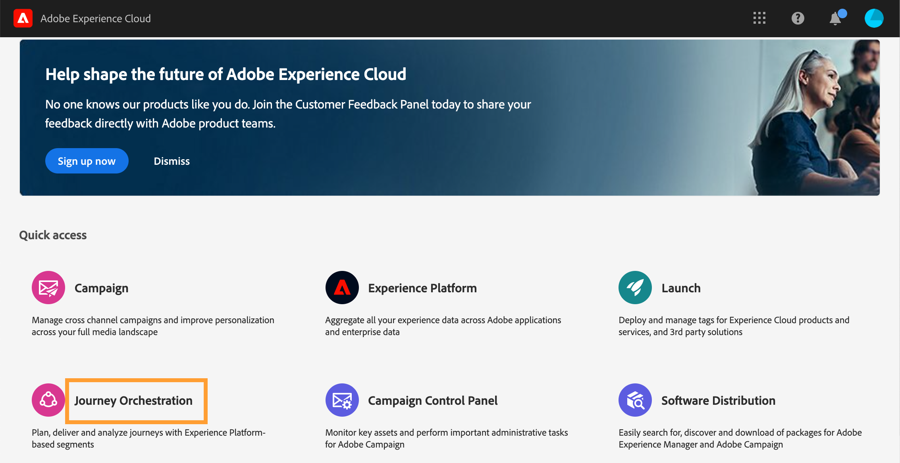
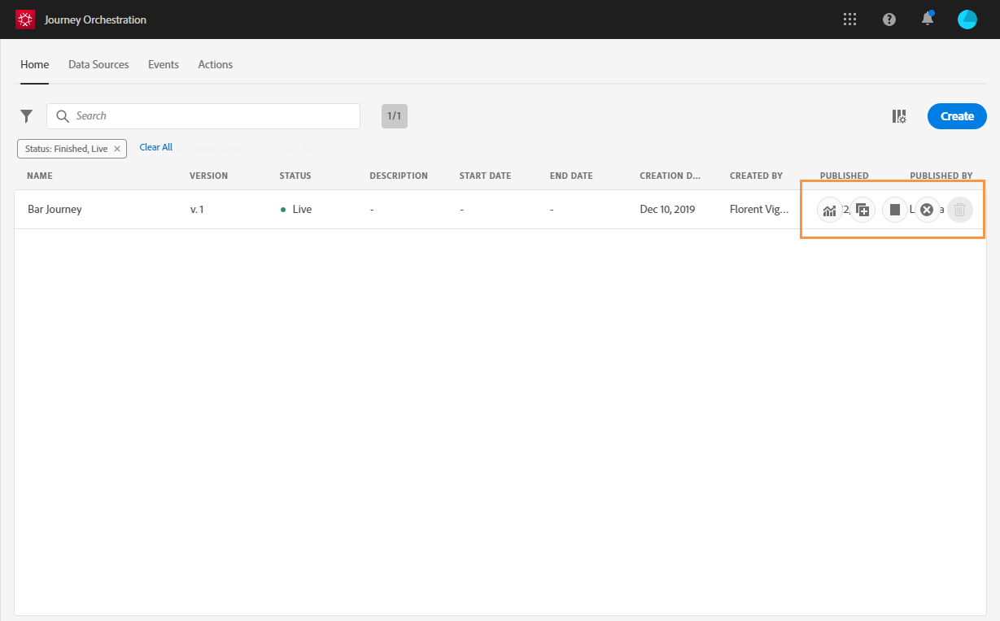

# 使用者介面 {#concept_rcq_lqt_52b}

>[!CONTEXTUALHELP]
>id=&quot;jo_home&quot;
>title=&quot;關於旅程清單&quot;
>abstract=&quot;歷程清單可讓您一次檢視所有歷程、查看其狀態並執行基本動作。 您可以複製、停止或刪除您的歷程。 視歷程而定，某些動作可能無法使用。 例如，您無法停止或刪除已完成的歷程。 您也可以使用搜尋列來搜尋旅程。」
>additional-url=&quot;https://images-tv.adobe.com/mpcv3/38af62cb-9390-4bc0-a576-d336849adb97_1574809570.1920x1080at3000_h264.mp4&quot; text=&quot;Watch demo video&quot;

>[!NOTE]
>
>為了充份運用Journey Orchestration，我們建議您使用Chrome做為網際網路瀏覽器。
>
>本檔案會經常更新，以反映產品的最近變更。 不過，有些螢幕擷取畫面可能會與產品的介面稍有不同。

## 探索介面{#section_jsq_zr1_ffb}

若要存取Journey Orchestration的介面，請按一下右 **[!UICONTROL App Selector]** 上角的圖示。 然後按 **[!UICONTROL Journey Orchestration]**&#x200B;一下「體驗平台」下方的右側。

您也可以從Experience cloud首頁的「歷程協調」區段中存 **[!UICONTROL Quick access]** 取。

頂級功能表可讓您瀏覽歷程協調的不同功能： **[!UICONTROL Home]**（旅程）**[!UICONTROL Data Sources]**, **[!UICONTROL Events]**, **[!UICONTROL Actions]**

按一  下畫面右上角的圖示，以顯示內容相關說明。 它可跨不同的「歷程協調」清單畫面（歷程、活動、動作和資料來源）使用。 這可讓您檢視目前功能的快速說明，並存取相關文章和影片。

## 搜尋和篩選{#section_lgm_hpz_pgb}

在、 **[!UICONTROL Home]****[!UICONTROL Data Sources]**、和 **[!UICONTROL Events]****[!UICONTROL Actions]** 清單中，搜索欄允許您搜索項目。

按 **[!UICONTROL Filters]** 一下清單左上方的篩選圖示即可存取。 篩選器菜單允許您根據不同的條件篩選顯示的元素。 您可以選擇只顯示特定類型或狀態的元素、您建立的元素或最近30天內修改的元素。

在和列 **[!UICONTROL Data Sources]**&#x200B;表中 **[!UICONTROL Events]** ，使 **[!UICONTROL Actions]** 用「建立」篩選器 **** ，以篩選建立日期和用戶。 例如，您可以選擇只顯示您在過去30天內建立的事件。

在歷程清單(在 **[!UICONTROL Home]**&#x200B;下)中，除了 **[!UICONTROL Creation filters]**，您也可以根據其狀態和版本(**[!UICONTROL Status and version filters]**)篩選顯示的歷程。 您也可以選擇只顯示使用特定事件、欄位群組或動作(**[!UICONTROL Activity filters]** 和 **[!UICONTROL Data filters]**)的歷程。 可 **[!UICONTROL Publication filters]** 讓您選擇出版日期或使用者。 例如，您可以選擇只顯示昨天發佈之即時歷程的最新版本。 參見。

>[!NOTE]
>
>請注意，顯示的欄可使用清單右上角的設定按鈕進行個人化。 個人化會儲存給每個使用者。

在事件、資料來源和動作設定窗格中，欄 **[!UICONTROL Used in]** 位會顯示使用該特定事件、欄位群組或動作的歷程次數。 您可以按一下按 **[!UICONTROL View journeys]** 鈕，以顯示對應歷程的清單。

在不同的清單中，您可以對每個元素執行基本動作。 例如，您可以複製或刪除項目。

## 使用不同的捷徑{#section_ksq_zr1_ffb}

以下是「歷程協調」介面中提供的不同捷徑。

_在歷程、動作、資料來源或事件清單中：_

* 按下 **c** ，以建立新的歷程、動作、資料來源或活動。

_在歷程中設定活動時：_

畫布會自動儲存。 您可以在畫布的左上角看到儲存狀態。

* 按 **Escape** 關閉配置窗格並放棄所做的更改。 這等同於按 **[!UICONTROL Cancel]** 鈕。
* 按或 **[!UICONTROL Enter]** 按一下窗格外部以關閉配置窗格。 更改將保存。 這等同於按 **[!UICONTROL Ok]** 鈕。
* 如果您按 **[!UICONTROL Delete]** 或 **空格**，則可以按 **[!UICONTROL Enter]** 確認刪除。

_在快顯視窗中：_

* 按 **Escape** 以關閉它(相當於 **Cancel** 按鈕)。
* 按 **[!UICONTROL Enter]** 以儲存或確認(相當於 **[!UICONTROL Ok]** 或 **[!UICONTROL Save]** 按鈕)。

_在事件中，資料源或操作配置窗格：_

* 按 **Escape** 關閉配置窗格而不保存。
* 按以 **[!UICONTROL Enter]** 保存修改並關閉配置窗格。
* 按 **Tab** ，在不同欄位間跳轉以進行設定。

_在簡單運算式編輯器中_

* 連按兩下左側的欄位，以新增查詢（相當於拖放）。

_瀏覽XDM欄位時：_

* 勾選&quot;node&quot;將選擇該節點的所有欄位。

_在所有文字區域：_

* 使用 **Ctrl/Command + a鍵組合** ，選取文字。 在裝載預覽中，它會選取裝載。

_在具有搜索欄的螢幕中：_

* 使用 **Ctrl/Command + f鍵組合** ，選擇搜索欄。

_在旅程的畫布中：_

* 使用 **Ctrl/Command + a鍵組合** ，選擇所有活動。
* 選取一或多個活動時，按 **[!UICONTROL Delete]** 或 **空格** 以刪除。 然後，您可 **[!UICONTROL Enter]** 以按確認彈出式視窗中的確認。
* 從左側浮動視窗按兩下活動，即可在第一個可用位置（從上到下）加入活動。
