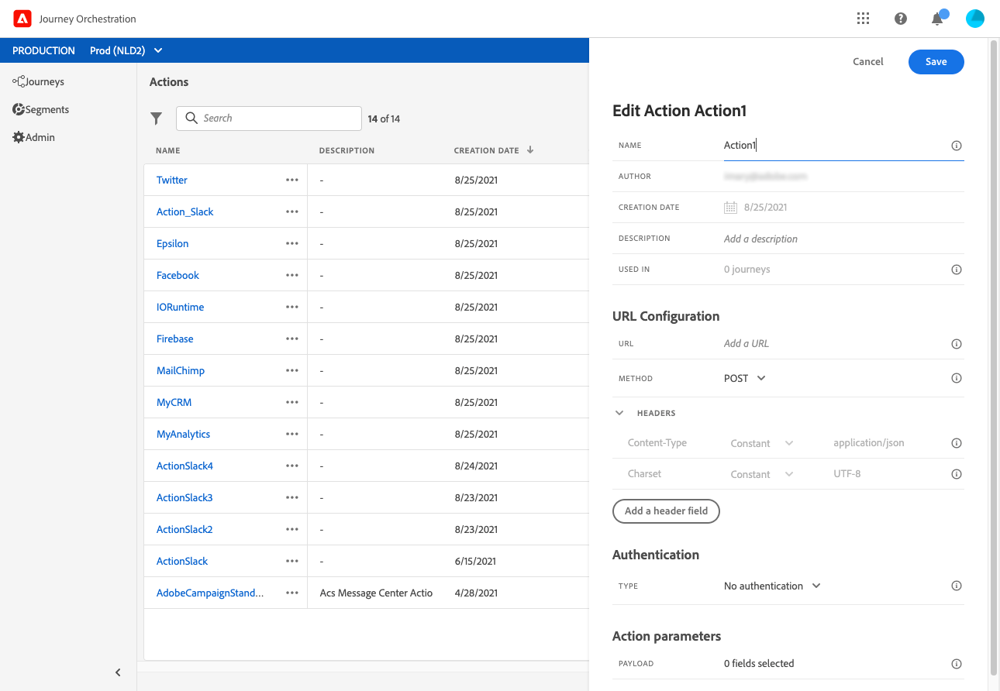

# 關於自訂動作組態 {#concept_sxy_bzs_dgb}

如果您使用第三方系統發送消息，或者 [!DNL Journey Orchestration] 要向第三方系統發送API調用，請在此配置其與 [!DNL Journey Orchestration]。 然後，技術用戶定義的自定義操作將在您旅程的左側調色板中提供。 **[!UICONTROL Action]** 類別(請參閱 [此頁](../building-journeys/about-action-activities.md)。 以下是一些系統示例，您可以通過自定義操作連接到這些系統：Epsilon、Facebook、Adobe、io、Firebase等

限制列在 [此頁](../about/limitations.md)。

在自定義操作參數中，可以傳遞簡單集合以及對象集合。 有關限制，請參閱 [此頁](../usecase/collections.md#limitations)。 另請注意，參數具有預期格式(例如：字串、小數等)。 您必須小心遵守這些預期格式。 請參閱此 [用例](../usecase/collections.md)。

以下是配置自定義操作所需的主要步驟：

1. 從 **[!UICONTROL Actions]** 清單，按一下 **[!UICONTROL Add]** 的子菜單。 操作配置窗格在螢幕右側開啟。

   

1. 輸入操作的名稱。

   >[!NOTE]
   >
   >請勿使用空格或特殊字元。請勿使用超過 30 個字元。

1. 向操作添加說明。 此步驟為選填。
1. 使用此操作的行程數顯示在 **[!UICONTROL Used in]** 的子菜單。 您可以按一下 **[!UICONTROL View journeys]** 按鈕來顯示使用此操作的行程清單。
1. 定義不同 **[!UICONTROL URL Configuration]** 參數。 請參閱[此頁面](../action/url-configuration.md)。
1. 配置 **[!UICONTROL Authentication]** 的子菜單。 此配置與資料源相同。  請參閱[本節](../datasource/external-data-sources.md#section_wjp_nl5_nhb)。
1. 定義 **[!UICONTROL Action parameters]**。 請參閱[此頁面](../action/defining-the-message-parameters.md)。
1. 按一下「**[!UICONTROL Save]**」。

   現在已配置自定義操作，並準備在您的旅途中使用。 請參閱[此頁面](../building-journeys/about-action-activities.md)。

   >[!NOTE]
   >
   >在行程中使用自定義操作時，大多數參數都是只讀的。 您只能修改 **[!UICONTROL Name]**。 **[!UICONTROL Description]**。 **[!UICONTROL URL]** 和 **[!UICONTROL Authentication]** 的子菜單。
