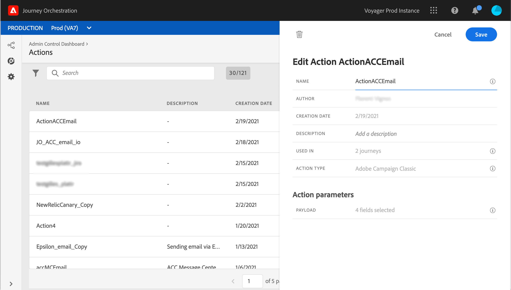

# 使用 Adobe Campaign v7/v8 {#integrating-with-adobe-campaign-classic}

此整合適用於從21.1版開始的Adobe Campaign Classic v7和Adobe Campaign v8。 它可讓您使用Adobe Campaign交易訊息功能來傳送電子郵件、推播通知和簡訊。

Journey Orchestration 與 Campaign 執行個體之間的連線在佈建時由 Adobe 設定。

此[section](../usecase/campaign-classic-use-case.md)中顯示了端到端使用案例。

對於已設定的每個動作，歷程設計器浮動視窗中都會提供動作活動。 請參閱此[節](../building-journeys/using-adobe-campaign-classic.md)。

## 重要附註

* 消息沒有限制。 根據我們目前的促銷活動SLA，可將可傳送的訊息數量限制為50,000/小時。 因此，Journey Orchestration僅應用於單一使用案例（個別事件，而非區段）。

* 您需要針對要使用的範本，在畫布上設定一個動作。 您需要針對要從Adobe Campaign使用的每個範本，在Journey Orchestration中設定一個動作。

* 建議您使用為此整合托管的專用訊息中心例項，以避免影響您可能進行的任何其他Campaign作業。 行銷伺服器可托管或內部部署。 所需的版本編號為21.1 Release Candiate或更高版本。

* 裝載或促銷活動訊息正確無誤。

* 您無法搭配區段資格事件使用促銷活動動作。

## 先決條件

在Campaign中，您需要建立並發佈交易式訊息及其相關事件。 請參閱[Adobe Campaign檔案](https://experienceleague.adobe.com/docs/campaign-classic/using/transactional-messaging/introduction/about-transactional-messaging.html#transactional-messaging)。

您可以依照下列模式，建立與每個訊息對應的JSON裝載。 然後您會在Journey Orchestration中設定動作時貼上此裝載（請參閱下方）

其範例如下：

```
{
    "channel": "email",
    "eventType": "welcome",
    "email": "example@adobe.com",
    "ctx": {
        "firstName": "John"
    }
}
```

* **管道**:為您的Campaign交易範本定義的管道
* **eventType**:促銷活動事件的內部名稱
* **ctx**:變數。

## 設定動作

在Journey Orchestration中，您需要為每個交易式訊息設定一個動作。 請依照下列步驟操作：

1. 建立新動作。 請參閱此[節](../action/action.md)。
1. 輸入名稱和說明。
1. 在&#x200B;**動作類型**&#x200B;欄位中，選取&#x200B;**Adobe Campaign Classic**。
1. 按一下&#x200B;**裝載**&#x200B;欄位，並貼上與促銷活動訊息對應之JSON裝載的範例。 請聯絡Adobe以取得此裝載。
1. 視您要在歷程畫布上對應不同欄位，將其調整為靜態或變數。 某些欄位(例如電子郵件地址和個人化欄位(ctx)的管道參數)，您可能會想要定義為要在歷程內容中對應的變數。
1. 按一下「**儲存**」。




