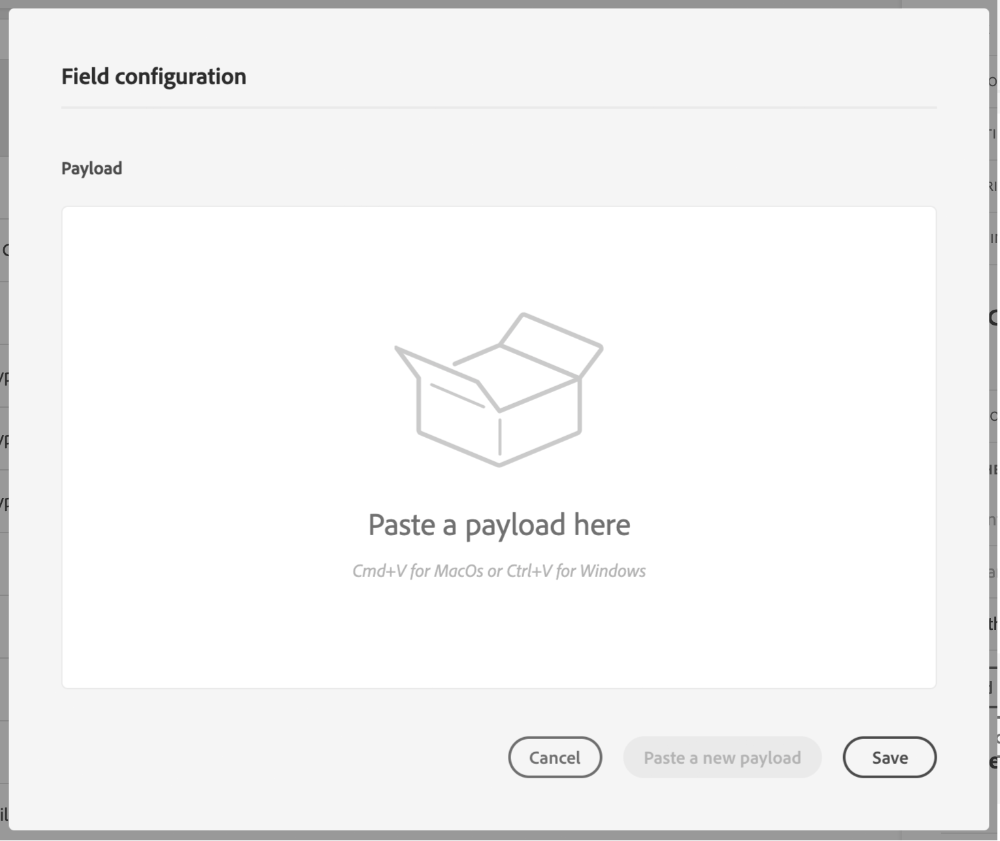

# 定義動作參數 {#concept_wy4_bf1_2gb}

在 **[!UICONTROL Action parameters]** 區段中，貼上要傳送至外部服務的JSON裝載範例。

>[!NOTE]
>
>裝載中的欄位名稱不能包含「。」 字元. 開頭不能為「$」字元。

您將能定義參數類型(例如：字串、整數等)。

您也可以選擇指定參數為常數或變數：

* 常數表示參數的值是由技術人員在動作設定窗格中定義。 歷程中的值一律相同。 此值不會有所不同，且行銷人員在歷程中使用自訂動作時不會看到。 例如可能是協力廠商系統預期的ID。 在此情況下，切換常數/變數右側的欄位即為傳遞的值。
* 變數表示參數的值會有所不同。 在歷程中使用此自訂動作的行銷人員將可自由傳遞所需值，或指定要擷取此參數值的位置(例如從事件、從Adobe Experience Platform等)。 在此情況下，切換常數/變數右側的欄位，即為行銷人員在歷程中看到的用以命名此參數的標籤。

