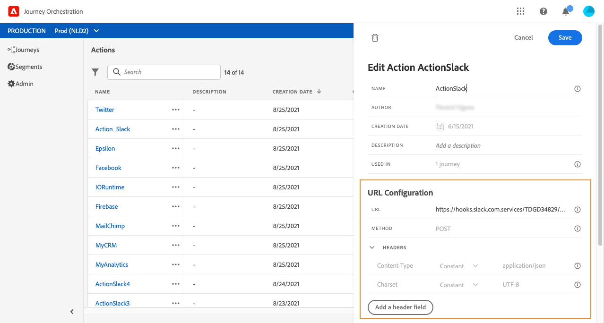
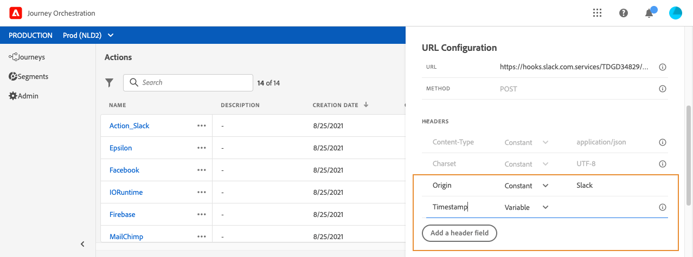

# URL 組態 {#concept_gbg_1f1_2gb}

配置自定義操作時，需要定義以下 **[!UICONTROL URL Configuration]** 參數：

1. 在 **[!UICONTROL URL]** 欄位，指定外部服務的URL:

   * 如果URL是靜態的，請在此欄位中輸入URL。

   * 如果URL包含動態路徑，則只輸入該URL的靜態部分，即方案、主機、埠以及（可選）路徑的靜態部分。

      範例：`https://xxx.yyy.com/somethingstatic/`

      將自定義操作添加到行程時，將指定URL的動態路徑。 [了解更多](../building-journeys/using-custom-actions.md)。
   >[!NOTE]
   >
   >出於安全原因，強烈建議您將HTTPS方案用於URL。 我們不允許使用非公有的Adobe地址和IP地址。
   >
   >定義自定義操作時僅允許預設埠：80表示http,443表示https。

1. 選擇呼叫 **[!UICONTROL Method]**:它可以 **[!UICONTROL POST]** 或 **[!UICONTROL PUT]**。
1. 在 **[!UICONTROL Headers]** 定義要發送到外部服務的請求消息的HTTP標頭：
   1. 要添加標題欄位，請按一下 **[!UICONTROL Add a header field]**。
   1. 輸入標題欄位的鍵。
   1. 要為鍵值對設定動態值，請選擇 **[!UICONTROL Variable]**。 否則，選擇 **[!UICONTROL Constant]**。

      例如，對於時間戳，可以設定動態值。

   1. 如果已選擇 **[!UICONTROL Constant]**，然後輸入常數值。

      如果已選擇 **[!UICONTROL Variable]**，則在將自定義操作添加到行程時將指定此變數。 [了解更多](../building-journeys/using-custom-actions.md)。

      

   1. 要刪除標題欄位，請指向標題欄位，然後按一下 **[!UICONTROL Delete]** 表徵圖
   的 **[!UICONTROL Content-Type]** 和 **[!UICONTROL Charset]** 預設情況下設定標題欄位。 不能修改或刪除這些欄位。

   在將自定義操作添加到行程後，如果行程處於草稿狀態，則仍可將題頭欄位添加到行程。 如果不希望行程受配置更改的影響，請複製自定義操作，並將標題欄位添加到新的自定義操作。

   >[!NOTE]
   >
   >根據欄位分析規則驗證標頭。 [了解更多](https://tools.ietf.org/html/rfc7230#section-3.2.4)。
