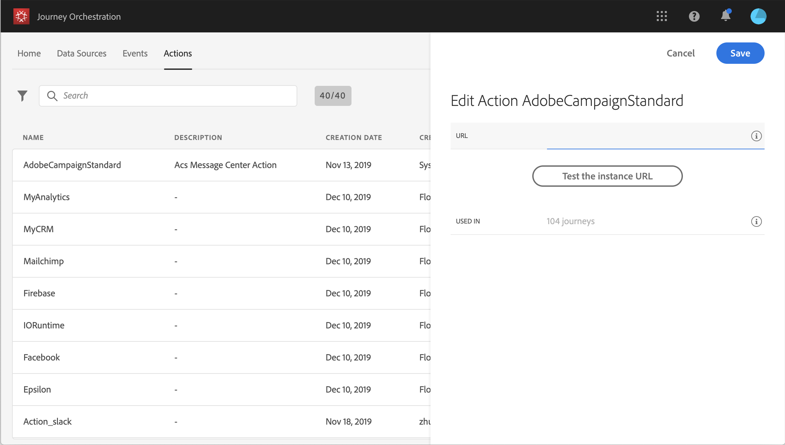
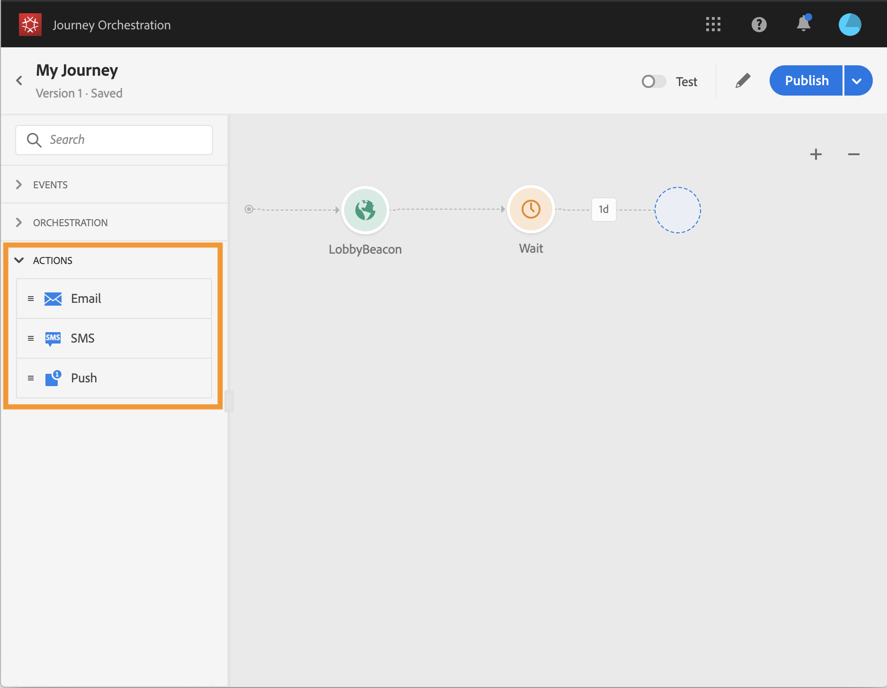

# 使用 Adobe Campaign {#using_adobe_campaign_standard}

您可以使用Adobe Campaign Standard的「交易訊息」功能，傳送電子郵件、推播通知和簡訊。

[!DNL Journey Orchestration] 隨附現成可用的動作，可讓您連線至Adobe Campaign Standard。

必須發佈Campaign Standard交易訊息及其相關事件，才能用於歷程協調。 如果活動已發佈但訊息未發佈，則「歷程協調」介面將無法顯示。 如果訊息已發佈，但其相關事件未發佈，則會在「歷程協調」介面中顯示，但無法使用。

>[!NOTE]
>
>Adobe Campaign Standard交易訊息在特定例項的各個通道中，每小時最多可傳送50 000則訊息。 若要降低超出負荷的風險，建議您為「促銷活動標準」 **整合設定** 「上限規則」。
>
>閱讀更多有關 [Adobe Campaign標準產品說明中的交易訊息SLA](https://helpx.adobe.com/legal/product-descriptions/campaign-standard.html)。

以下是設定它的步驟：

1. 從清單 **[!UICONTROL Actions]** 中按一下內建動 **[!UICONTROL AdobeCampaignStandard]** 作。 動作設定窗格會在畫面的右側開啟。

   

1. 複製您的Adobe Campaign Standard例項URL，並貼到欄位 **[!UICONTROL URL]** 中。

1. 按一下 **[!UICONTROL Test the instance URL]** 以測試例項的有效性。

   >[!NOTE]
   >
   >此測試可驗證：
   >
   >主機為&quot;。campaign.adobe.com&quot;或&quot;。campaign-sandbox.adobe.com&quot;,
   >
   >URL以https開頭，
   >
   >與此Adobe Campaign Standard實例關聯的ORG與Journey Orchestration的ORG相同。

在設計您的歷程時，類別中會提供三個動 **[!UICONTROL Action]** 作： **[!UICONTROL Email]**、、 **[!UICONTROL Push]**(請 **[!UICONTROL SMS]** 參 [閱使用Adobe Campaign動作](../building-journeys/using-adobe-campaign-actions.md))。 **Reactions事件** 也可讓您對訊息點按、開啟等做出反應。 (請參 [閱「反應事件](../building-journeys/reaction-events.md)」)。

如果您使用協力廠商系統來傳送訊息，則需要新增及設定自訂動作。 See [About custom action configuration](../action/about-custom-action-configuration.md).
