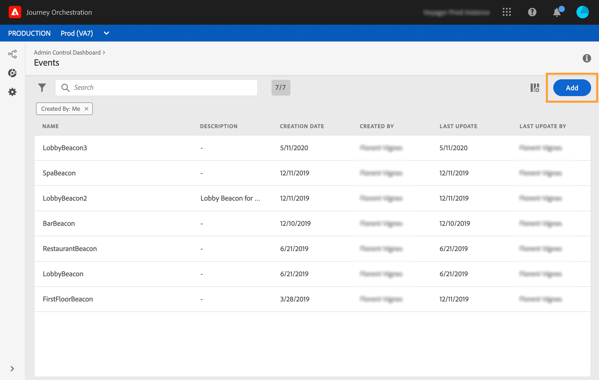

# 規則型事件{#simplified-events}

我們已簡化您設定「體驗」活動的方式。 我們將推出不需要使用eventID的新方法。 當您在「歷程協調」中設定活動時，現在可以定義規則型活動。

這種新類型的事件不會產生eventID。 使用簡單運算式編輯器，您現在只需定義規則，系統將使用該規則來識別將觸發您歷程的相關事件。 此規則可以根據事件裝載中可用的任何欄位，例如描述檔位置或新增至描述檔購物車的項目數。

這種新方法對用戶來說大多是透明的。 唯一的變更是事件定義畫面中的新欄位。

1. 在左側功能表中，按一下圖 **[!UICONTROL Admin]** 示，然後按一下 **[!UICONTROL Events]**。 畫面隨即顯示事件清單。

   

1. 按一下「**[!UICONTROL Add]**」以建立新事件。事件設定窗格會在畫面右側開啟。

   

1. 輸入事件的名稱。 您也可以新增說明。

   

1. 在新欄位 **[!UICONTROL Event ID type]** 中，選取 **[!UICONTROL Rule Based]**。

   

   >[!NOTE]
   >
   >類 **[!UICONTROL System Generated]** 型是需要eventID的現有方法。 請參 [閱本節](../event/about-events.md)。

1. 定義 **[!UICONTROL Schema]** 和裝載 **[!UICONTROL Fields]**。 請參 [閱本節](../event/defining-the-payload-fields.md)。

   

   >[!NOTE]
   >
   >選擇時，只 **[!UICONTROL System Generated type]**&#x200B;有具有eventID類型混合的架構可用。 選擇類型時，所 **[!UICONTROL Rule Based]** 有「體驗事件」結構都可用。

1. 按一下欄位 **[!UICONTROL Event ID condition]** 內。 使用簡單運算式編輯器，定義系統將用來識別將觸發您旅程的事件的條件。

   

   在我們的例子中，我們根據個人檔案的城市寫了一個條件。 這表示每當系統收到符合此條件（欄位和值）的&#x200B;**[!UICONTROL City]** 事件時， **[!UICONTROL Paris]** 就會將它傳送至「歷程協調」。

1. 定義 **[!UICONTROL Namespace]** 和 **[!UICONTROL Key]**。 請參 [閱選擇命名空間](../event/selecting-the-namespace.md)[和定義事件鍵](../event/defining-the-event-key.md)。

   

事件設定和歷程建立的其他步驟保持不變。

現在，該事件已設定好，並可像其他任何事件一樣拖放至歷程中。 每次將符合規則的事件傳送至系統時，就會傳送至Journey Orchestration以觸發您的歷程。

