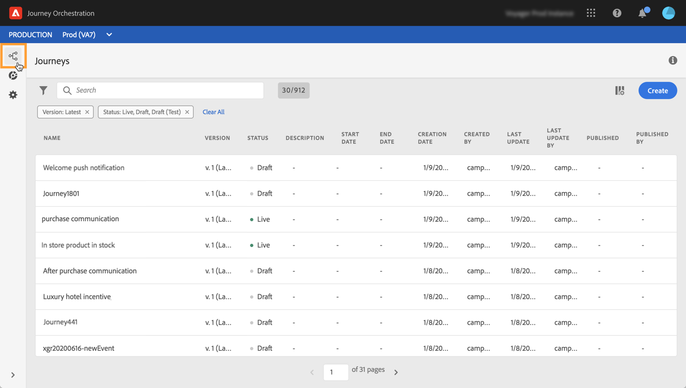

# 發現Alpha版介面{#discovering-alpha-interface}

## 關於Alpha版介面{#about-alpha-interface}

[!DNL Journey Orchestration]功能表內的導覽已增強，以提供與Adobe Experience Platform一致的介面。 變更包括：

* 功能表從介面的上方移至左側，
* 將管理功能分組至單一儀表板。

在[本節](../about/user-interface.md)中，會顯示如何使用和導覽介面（搜尋和篩選、瀏覽Adobe Experience Platform欄位、快速鍵）的全域概念。

## 訪問[!DNL Journey Orchestration]功能{#accessing-journey-orchestration-functionalities}

左側的功能表列可讓您存取不同的功能。 按一下圖示以存取對應的功能表。 您可以按一下左下方的箭頭，展開或收合功能表列。

當您存取[!DNL Journey Orchestration]時，會顯示&#x200B;**[!UICONTROL Journeys]**&#x200B;功能表，讓您存取現有的歷程或建立新歷程。 請參閱[使用旅程設計人員](../building-journeys/using-the-journey-designer.md)。

**[!UICONTROL Segments]**&#x200B;功能表可讓您存取和建立Adobe Experience Platform區段。 請參閱[關於Adobe Experience Platform區段](../segment/about-segments.md)。

**[!UICONTROL Admin]**&#x200B;功能表可供具有管理員權限的所有使用者使用（請參閱[存取管理](../about/access-management.md)）。 它提供控制面板，可讓您設定[資料來源](../datasource/about-data-sources.md)、[events](../event/about-events.md)和[actions](../action/action.md)。

