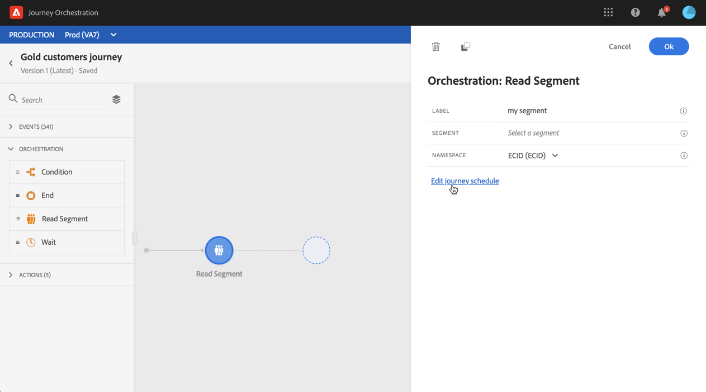
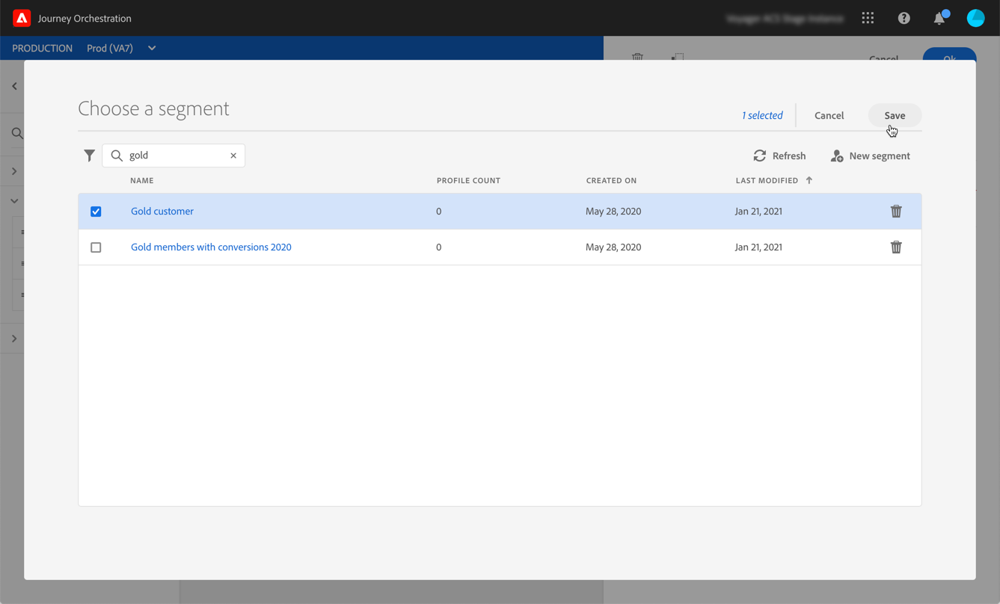

# 區段觸發器活動 {#segment-trigger-activity}

## 關於區段觸發器活動 {#about-segment-trigger-actvitiy}

>[!NOTE]
>
>如果Adobe Campaign Standard的立即可用動作活動在出版時或測試模式啟動時出現在畫布中，則此歷程會在每秒13個入口處調節。  如果在出版時或測試模式啟動時畫布中沒有Adobe Campaign Standard立即可用的動作活動，則此歷程會在每秒1000個事件時被調節。

「區段觸發」活動可讓您讓屬於Adobe Experience Platform區段的所有個人進入歷程。 進入旅程可以執行一次，也可以定期執行。

假設您在Adobe Experience Platform上擁有金級客戶群。 透過「區段觸發」活動，您可以讓屬於黃金客戶區段的所有個人進入歷程，並讓他們進入個人化歷程，以運用所有歷程功能： 條件、計時器、事件、動作。

## 設定活動 {#configuring-segment-trigger-activity}

>[!NOTE]
>
>由於區段匯出延遲，無法在1小時以內的較短時間內觸發以區段為基礎的歷程。

1. 展開類 **[!UICONTROL Orchestration]** 別並將活動拖 **[!UICONTROL Segment Trigger]** 放到畫布中。

   活動必須定位為旅程的第一步。

1. 設定活動 **[!UICONTROL Scheduler type]**。

   依預設，區段將會輸入歷程， **[!UICONTROL As soon as possible]**&#x200B;也就是歷程發佈後1小時。 如果您要讓區段以特定日期／時間或循環方式輸入歷程，請從清單中選取所需選項。

   若是重複的歷程，您也可以定義歷程的開始和結束。

   

1. 在欄位 **[!UICONTROL Segment]** 中，選擇要進入歷程的Adobe Experience Platform區段，然後按一下 **[!UICONTROL Save]**。

   

1. 在欄位 **[!UICONTROL Namespace]** 中，選擇要使用的命名空間以識別個人。 For more on namespaces, refer to [this section](../event/selecting-the-namespace.md).

   >[!NOTE]
   >
   >屬於不同身分之間沒有選取身分（命名空間）之群體的個人無法進入歷程。

1. Click **[!UICONTROL Ok]** to confirm. 然後，您就可以運用現有的活動來建立您的旅程。

1. 一旦旅程準備就緒，您就可以測試它(請參 [閱測試旅程](../building-journeys/testing-the-journey.md))。

   當從活動開始的歷程中啟動測試模式時， **[!UICONTROL Segment Trigger]** 會在符合所選區段的描述檔中隨機選取100個測試描述檔。 測試記錄可讓您查看個人在歷程中的路徑，以及可能遇到的錯誤(請參 [閱檢視記錄](../building-journeys/testing-the-journey.md#viewing_logs))。

   >[!NOTE]
   >
   >請注意，您將無法使用單一旅程中現有的視覺流量功能，來查看旅程後的100人。

1. 然後，您可以發佈您的歷程(請參 [閱發佈歷程](../building-journeys/publishing-the-journey.md))。 屬於區段的個人將在「區段觸發器」活動排程器中指定的日期／時間輸入歷程。

   >[!IMPORTANT]
   >
   >請記住，Adobe Experience Platform區段是每天計算一次(**批次** )或即時計算(串&#x200B;**流** 區段)。
   >
   >如果選取的區段是串流的，屬於此區段的個人可能會即時進入歷程。 如果區段是批次，新符合此區段資格的人員可能會在Adobe Experience Platform上執行區段計算時進入歷程。
