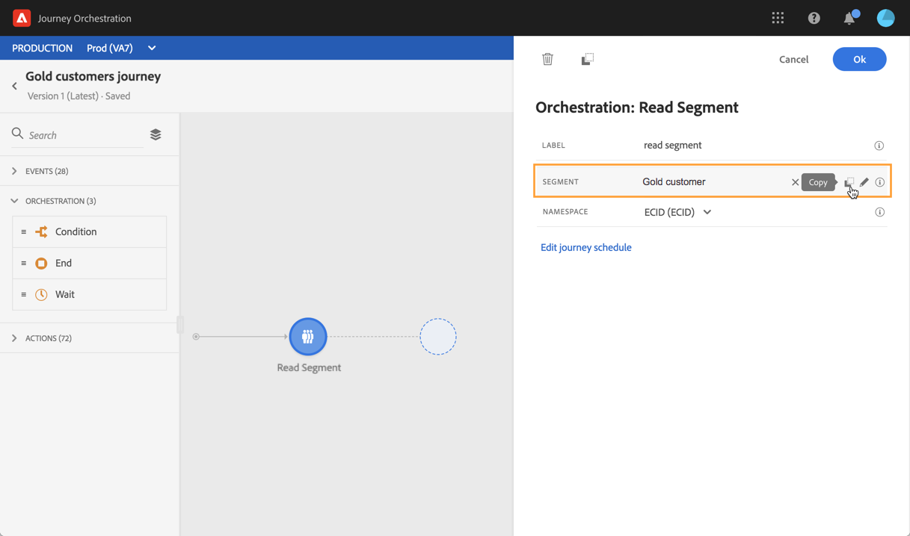
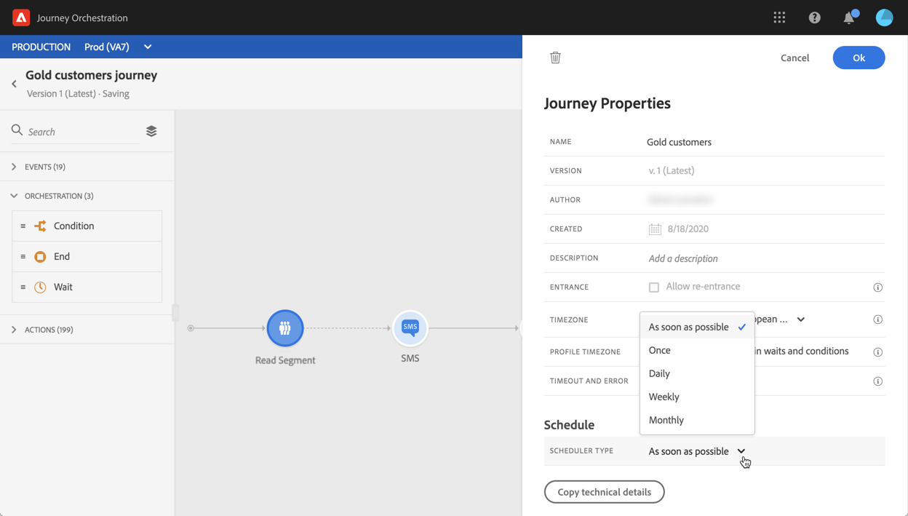
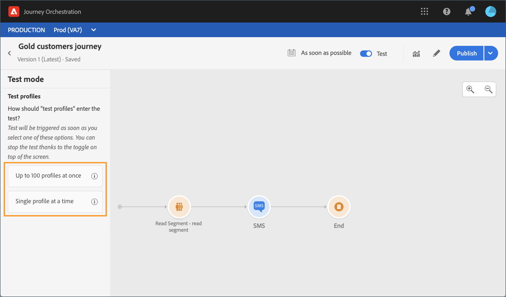
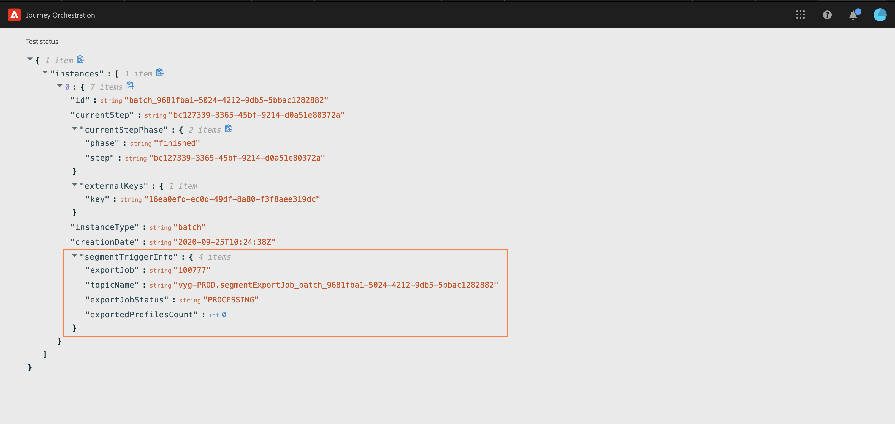

# 閱讀區段活動 {#segment-trigger-activity}

## 關於讀取區段活動 {#about-segment-trigger-actvitiy}

>[!NOTE]
>
>如果Adobe Campaign Standard的立即可用動作活動在出版時或測試模式啟動時出現在畫布中，則此歷程會在每秒13個入口處調節。 否則，每秒1000次的行程將被調節。

「閱讀區段」活動可讓您讓屬於Adobe Experience Platform區段的所有個人進入歷程。 進入歷程可以執行一次，也可以定期執行。

假設您在Adobe Experience Platform上擁有金級客戶群。 透過「閱讀區段」活動，您可以讓屬於黃金客戶區段的所有個人進入歷程，並讓他們進入個人化歷程，以運用所有歷程功能：條件、計時器、事件、動作。

## 設定活動 {#configuring-segment-trigger-activity}

>[!NOTE]
>
>由於區段匯出延遲，無法在1小時以內的較短時間內觸發以區段為基礎的歷程。

1. 展開類 **[!UICONTROL Orchestration]** 別並將活動拖 **[!UICONTROL Read Segment]** 放到畫布中。

   活動必須定位為旅程的第一步。

1. 新增 **[!UICONTROL Label]** 至活動（選用）。

1. 在欄位 **[!UICONTROL Segment]** 中，選擇要進入歷程的Adobe Experience Platform區段，然後按一下 **[!UICONTROL Save]**。

   >[!NOTE]
   >
   >請注意，您可以自訂清單中顯示的欄，並加以排序。

   

   新增區段後，按鈕 **[!UICONTROL Copy]** 可讓您複製其名稱和ID:

   `{"name":"Gold customers,”id":"8597c5dc-70e3-4b05-8fb9-7e938f5c07a3"}`

   

1. 在欄位 **[!UICONTROL Namespace]** 中，選擇要使用的命名空間以識別個人。 For more on namespaces, refer to [this section](../event/selecting-the-namespace.md).

   >[!NOTE]
   >
   >屬於不同身分之間沒有選取身分（命名空間）之群體的個人無法進入歷程。

1. 活動 **[!UICONTROL Read Segment]** 可讓您指定區段將進入歷程的時間。 若要這麼做，請按一 **[!UICONTROL Edit journey schedule]** 下連結以存取歷程的屬性，然後設定欄 **[!UICONTROL Scheduler type]** 位。

   

   依預設，區段會輸入歷程， **[!UICONTROL As soon as possible]**&#x200B;也就是歷程發佈後1小時。 如果您要讓區段以特定日期／時間或循環方式輸入歷程，請從清單中選取所需值。

   >[!NOTE]
   >
   >請注意， **[!UICONTROL Schedule]** 只有在畫布中放入活 **[!UICONTROL Read Segment]** 動時，才能使用區段。

   

## 測試和發佈歷程 {#testing-publishing}

此活 **[!UICONTROL Read Segment]** 動可讓您在單一描述檔上或在100個隨機測試從符合區段的描述檔中選取的描述檔上測試歷程。

若要這麼做，請啟動測試模式，然後從左窗格中選取所需的選項。

然後，您可以照常設定並執行測試模式。 本節提供如何測試歷程的詳細 [步驟](../building-journeys/testing-the-journey.md)。

在測試執行後，按 **[!UICONTROL Show logs]** 鈕可讓您根據選取的測試選項查看測試結果：

* **[!UICONTROL Single profile at a time]**:測試日誌顯示與使用統一測試模式時相同的資訊。 For more on this, refer to [this section](../building-journeys/testing-the-journey.md#viewing_logs)

* **[!UICONTROL Up to 100 profiles at once]**:測試記錄可讓您追蹤從Adobe Experience Platform匯出區段的進度，以及所有進入歷程的人員的個別進度。

   請注意，一次使用最多100個描述檔來測試旅程，不允許您使用視覺流來追蹤個人在旅程中的進度。

   

測試成功後，您就可以發佈您的歷程(請參 [閱發佈歷程](../building-journeys/publishing-the-journey.md))。 屬於此區段的個人將在行程屬性區段中指定的日期／時間輸入行程 **[!UICONTROL Scheduler]** 。

>[!NOTE]
>
>當執行不再重複的區段型歷程新版本（盡快開始或「一次」開始）時，所有先前進入歷程的個人在您發佈新版本時，將不會重新輸入新版本。 如果您想要允許他們重新進入，您應複製旅程。
