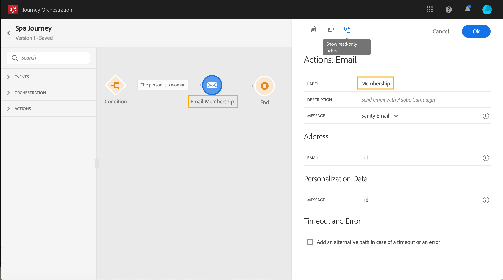

# 關於動作活動 {#concept_hbj_hrt_52b}

從浮動視窗的畫面左側，在&#x200B;**[!UICONTROL Events]**&#x200B;和&#x200B;**[!UICONTROL Orchestration]**&#x200B;下方，您會找到&#x200B;**[!UICONTROL Actions]**&#x200B;類別。

這些活動代表不同的可用通訊通道。您可以結合這些量度，以建立跨管道情境。

如果您有Adobe Campaign Standard，則可使用下列現成可用的動作活動：**[!UICONTROL Email]**、**[!UICONTROL Push]**&#x200B;和&#x200B;**[!UICONTROL SMS]**。 請參見[此頁面](../building-journeys/using-adobe-campaign-actions.md)。

如果您已設定自訂動作，它們也會出現在此處（請參閱[此頁面](../building-journeys/using-custom-actions.md)）。

將動作活動拖放到畫布時，可以定義&#x200B;**[!UICONTROL Label]**。 這可讓您新增尾碼至動作名稱，該名稱會顯示在畫布中的活動底下。 如果您在歷程中多次使用相同的動作，而且想要更輕鬆地識別，這個功能會很實用。 報告也更容易閱讀。 您也可以新增選用&#x200B;**[!UICONTROL Description]**。

當動作或條件發生錯誤時，個人的歷程就會停止。唯一能讓它繼續的方法就是勾選方塊 **[!UICONTROL Add an alternative path in case of a timeout or an error]**。請參閱[本節](../building-journeys/using-the-journey-designer.md#paths)。
