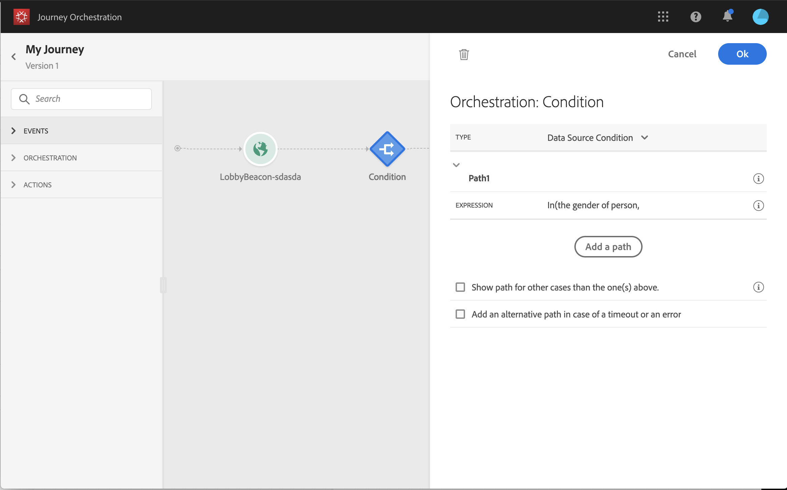

# 關於協調活動 {#concept_ksq_2rt_52b}

>[!CAUTION]
>
>**正在尋找 Adobe Journey Optimizer**？ 按一下[這裡](https://experienceleague.adobe.com/zh-hant/docs/journey-optimizer/using/ajo-home){target="_blank"}以取得 Journey Optimizer 文件。
>
>
>_本文件指的是已由 Journey Optimizer 取代的舊版 Journey Orchestration 資料。 如果您對 Journey Orchestration 或 Journey Optimizer 的存取權有任何疑問，請聯絡您的帳戶團隊。_

從浮動視窗的畫面左側，有下列協調活動：

* [條件活動](../building-journeys/condition-activity.md)
* [結束活動](../building-journeys/end-activity.md)
* [等待活動](../building-journeys/wait-activity.md)

