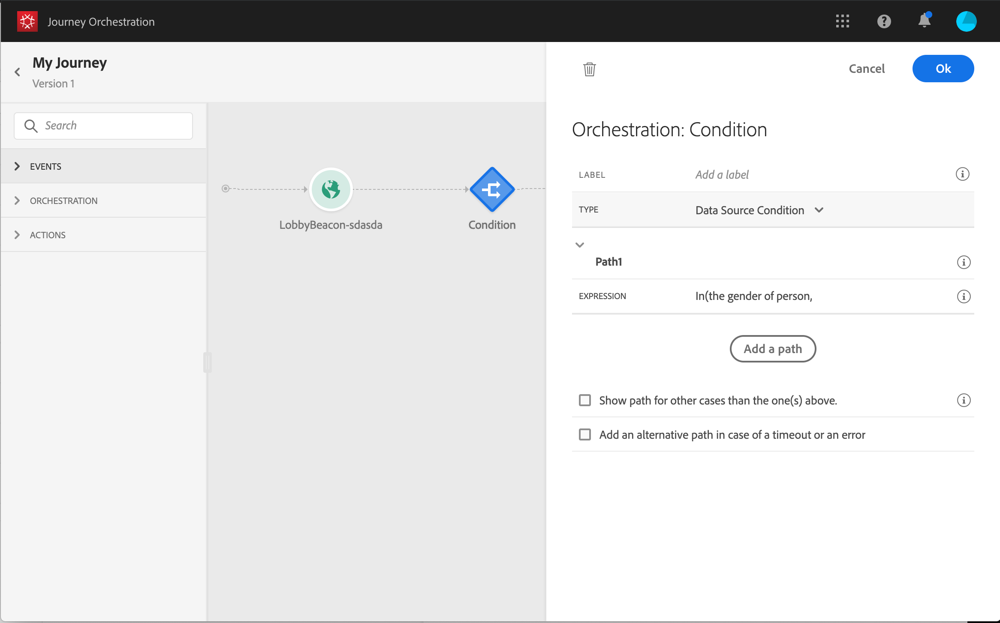
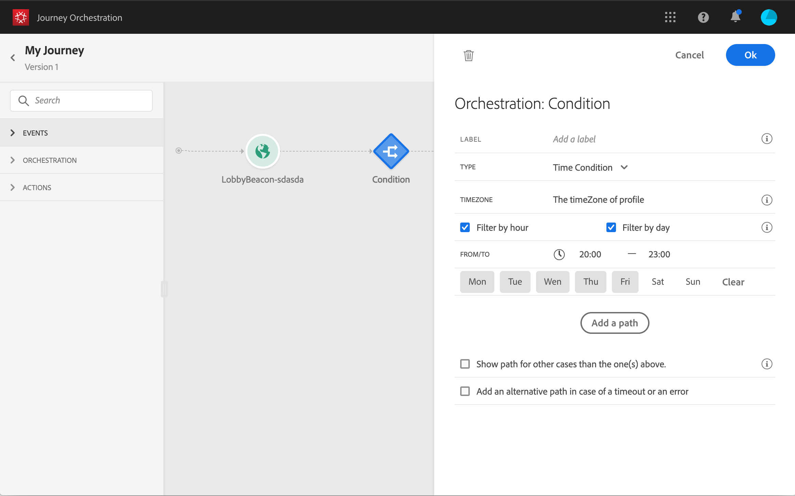
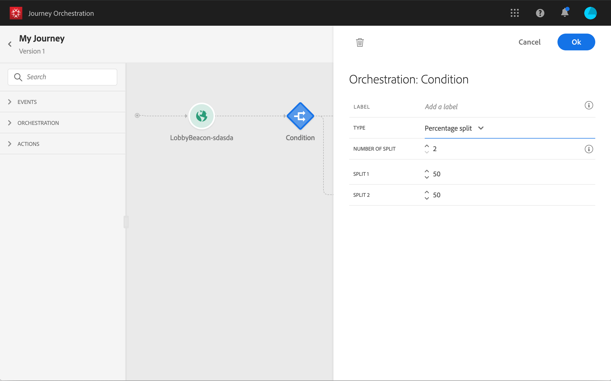

# 條件活動{#section_e2n_pft_dgb}

提供四種條件：

* [資料源條件](#data_source_condition)
* [時間條件](#time_condition)
* [百分比分割](#percentage_split)
* [日期條件](#date_condition)

## 關於條件活動{#about_condition}

在旅程中使用數個條件時，您可以為每個條件定義標籤，以便更輕鬆地識別。

如果要定義幾個條件，請按一下&#x200B;**[!UICONTROL Add a path]**。 對於每個條件，在活動後的畫布中都會新增新路徑。

請注意，歷程設計會對功能產生影響。 在條件後定義多個路徑時，僅會執行第一個符合條件的路徑。 這表示，您可以將路徑置於彼此之上或之下，以改變路徑的優先順序。

例如，讓我們舉第一個路徑的條件「人是VIP」和第二個路徑的條件「人是男性」的例子。 如果符合兩個條件的人員（男性為VIP）通過此步驟，即使他也符合第二個路徑的資格，也會選擇第一個路徑，因為第一個路徑是「高於」。 若要變更此優先順序，請依另一個垂直順序移動活動。

您可以勾選&#x200B;**[!UICONTROL Show path for other cases than the one(s) above]**，為不符合定義條件的對象建立其他路徑。 請注意，此選項不適用於分割條件。 請參閱[百分比分割](#percentage_split)。

簡單模式允許您基於欄位的組合執行簡單查詢。 所有可用欄位都會顯示在畫面的左側。 將欄位拖放至主區域。 若要結合不同的元素，請將它們互相互連結，以建立不同的群組和／或群組層級。 然後，您可以選取邏輯運算子來組合同一層級的元素：

* AND:兩個准則的交集。 只會考慮符合所有准則的元素。
* 或：兩個標準的結合。 考慮匹配兩個條件中至少一個的元素。

如果您使用[Adobe Experience Platform Segmentation Service](https://docs.adobe.com/content/help/en/experience-platform/segmentation/home.html)來建立區段，您可以在歷程條件中運用這些區段。 請參閱[在條件中使用區段](../segment/using-a-segment.md)。

>[!NOTE]
>
>您無法使用簡單編輯器對時間序列執行查詢（例如購買清單、訊息的點按次數）。 為此，您將需要使用進階編輯器。 請參閱[本頁](../expression/expressionadvanced.md)。

當動作或條件發生錯誤時，個人的歷程就會停止。唯一能讓它繼續的方法就是勾選方塊 **[!UICONTROL Add an alternative path in case of a timeout or an error]**。請參閱[本節](../building-journeys/using-the-journey-designer.md#paths)。

## 資料源條件{#data_source_condition}

這可讓您根據資料來源的欄位或先前位於歷程中的事件來定義條件。 要瞭解如何使用表達式編輯器，請參閱[本頁](../expression/expressionadvanced.md)。 使用進階運算式編輯器，您可以設定更進階的條件來控制系列，或使用需要傳遞參數的資料來源。 請參閱[本頁](../datasource/external-data-sources.md)。

## 時間條件{#time_condition}

這可讓您根據一天中的某小時和／或一週中的某天執行不同的動作。 例如，您可以決定在白天傳送SMS訊息，在工作日的晚上傳送電子郵件。

>[!NOTE]
>
>時區不再是特定於某個條件，現在會在歷程屬性的歷程層級定義。 請參見[此頁面](../building-journeys/timezone-management.md)。

## 分割百分比{#percentage_split}

此選項可讓您隨機分割對象，以定義每個群組的不同動作。 定義每個路徑的拆分數和重新分區。 分割計算是統計的，因為系統無法預測在旅程中有多少人流入。 因此，分割具有非常低的誤差裕度。 此函式以Java隨機機制為基礎（請參閱此[page](https://docs.oracle.com/javase/7/docs/api/java/util/Random.html)）。

>[!NOTE]
>
>請注意，在百分比分割條件中沒有添加路徑的按鈕。 路徑數將取決於分割數。 在分割條件中，您無法為其他情況新增路徑，因為路徑不可能發生。 人們總是會走到一條分割的路上。

## 日期條件{#date_condition}

這可讓您根據日期定義不同的流程。 例如，如果人員在「銷售」期間進入步驟，您會傳送特定訊息給他。 今年剩下的時間，你會再傳個資訊。

>[!NOTE]
>
>時區不再是特定於某個條件，現在會在歷程屬性的歷程層級定義。 請參閱[本頁](../building-journeys/timezone-management.md)。

