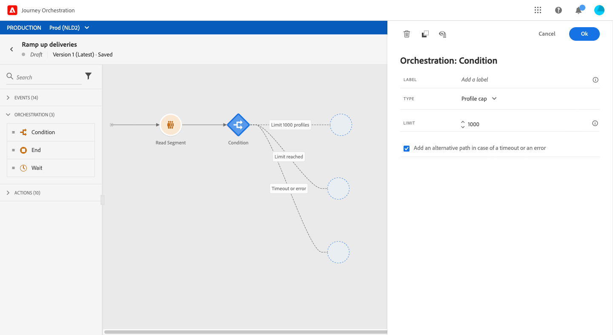

# 條件活動{#section_e2n_pft_dgb}

有四種類型的條件：

* [資料源條件](#data_source_condition)
* [時間條件](#time_condition)
* [分解百分比](#percentage_split)
* [日期條件](#date_condition)

## 關於條件活動 {#about_condition}

在旅途中使用多個條件時，您可以為每個條件定義標籤，以便更容易地識別它們。

按一下 **[!UICONTROL Add a path]** 的雙曲餘切值。 對於每個條件，在活動後的畫布中都會添加新路徑。

請注意，行程設計對功能有影響。 當在條件後定義多個路徑時，將只執行第一個符合條件的路徑。 這意味著您可以通過將路徑置於彼此之上或之下來改變路徑的優先順序。

例如，我們以第一條路的條件「人是VIP」和第二條路的條件「人是男性」為例。 如果符合兩個條件的人(男VIP)通過此步驟，則即使他也有資格獲得第二條路徑，也將選擇第一條路徑，因為第一條路徑是「高於」。 要更改此優先順序，請按另一個垂直順序移動活動。

您可以通過選中為不符合定義條件條件的受眾建立其他路徑 **[!UICONTROL Show path for other cases than the one(s) above]**。 請注意，此選項在分解條件中不可用。 請參閱 [分解百分比](#percentage_split)。

簡單模式允許您基於欄位組合執行簡單查詢。 螢幕左側顯示所有可用欄位。 將欄位拖放到主區域。 要組合不同的元素，請將它們互鎖到彼此中以建立不同的組和/或組級。 然後，您可以選取邏輯運算子來組合同一層級的元素：

* 和：兩個標準的交集。 只考慮與所有條件匹配的元素。
* 或：兩個標準的結合。 考慮匹配兩個條件中至少一個的元素。

如果你用的 [Adobe Experience Platform分段服務](https://experienceleague.adobe.com/docs/experience-platform/segmentation/home.html) 要建立段，您可以在行程條件中利用它們。 請參閱 [在條件中使用段](../segment/using-a-segment.md)。

>[!NOTE]
>
>不能使用簡單編輯器對時間序列（例如購買清單、以前按一下消息）執行查詢。 為此，您需要使用高級編輯器。 請參閱[此頁面](../expression/expressionadvanced.md)。

當動作或條件發生錯誤時，個人的歷程就會停止。唯一能讓它繼續的方法就是勾選方塊 **[!UICONTROL Add an alternative path in case of a timeout or an error]**。請參閱[本節](../building-journeys/using-the-journey-designer.md#paths)。

在簡單編輯器中，您還將在事件和資料源類別下找到「行程屬性」類別。 此類別包含與給定配置檔案的行程相關的技術欄位。 這是系統從即時行程中檢索的資訊，如行程ID或遇到的特定錯誤。 有關詳細資訊，請參見 [此頁](../expression/journey-properties.md)

## 資料源條件 {#data_source_condition}

這允許您基於資料源中的欄位或先前在行程中定位的事件來定義條件。 要瞭解如何使用表達式編輯器，請參見 [此頁](../expression/expressionadvanced.md)。 使用高級表達式編輯器，可以設定操作集合或使用需要傳遞參數的資料源的更高級條件。 請參閱[此頁面](../datasource/external-data-sources.md)。

## 時間條件{#time_condition}

這允許您根據一天中的小時和/或一週中的某天執行不同的操作。 例如，您可以決定在白天發送SMS消息，在工作日發送夜間電子郵件。

>[!NOTE]
>
>時區不再特定於某個條件，現在在行程屬性中的行程級別定義。 請參見[此頁面](../building-journeys/timezone-management.md)。

## 分解百分比 {#percentage_split}

此選項允許您隨機分割受眾，以便為每個組定義不同的操作。 定義每個路徑的拆分數和重新分區。 分割計算是統計的，因為系統無法預測在旅途中會有多少人流入。 因此，分割具有非常低的誤差裕度。 此函式基於Java隨機機制(請參見 [頁](https://docs.oracle.com/javase/7/docs/api/java/util/Random.html))。

在test模式下，當達到拆分時，總是選擇頂部分支。 如果希望test選擇其他路徑，則可以重新組織拆分分支的位置。 請參見[此頁面](../building-journeys/testing-the-journey.md)。

>[!NOTE]
>
>請注意，在百分比分解條件中沒有添加路徑的按鈕。 路徑數將取決於拆分數。 在拆分條件中，無法為其他情況添加路徑，因為它不會發生。 人們總是走在一條分割的路上。

## 日期條件 {#date_condition}

這允許您根據日期定義不同的流。 例如，如果人員在「銷售」期間進入步驟，您將向他們發送特定消息。 今年剩餘時間，你會再發一條消息。

>[!NOTE]
>
>時區不再特定於某個條件，現在在行程屬性中的行程級別定義。 請參閱[此頁面](../building-journeys/timezone-management.md)。

<!--
## Profile cap {#profile_cap}

Use this condition type to set a maximum number of profiles for a journey path. When this limit is reached, the selected profiles take a second path.

You can use this condition type to ramp up the volume of your deliveries. For example, you might have recently moved to another email service provider, IP address, or email domain or subdomain. Using this feature, you can establish your reputation as a sender and avoid that your deliveries be blocked or moved to the spam folder of the recipients' mailbox. Learn how to increase your email reputation with IP warming in the [Deliverability Best Practice Guide](https://experienceleague.adobe.com/docs/deliverability-learn/deliverability-best-practice-guide/additional-resources/generic-resources/increase-reputation-with-ip-warming.html){target="_blank"}.

The default cap is 1000. You must set an integer value that is greater than or equal to 1.

The counter applies only to the selected journey version. By default, the counter is reset to zero after 180 days. After a reset, the selected profiles take the first path again until the counter limit is reached. You can gradually increase this limit up to the total number of your subscribers. After your IP has warmed up, you can remove this condition.

The first path always has priority over the second path, even if you move the second path above the first path on the journey canvas.

-->