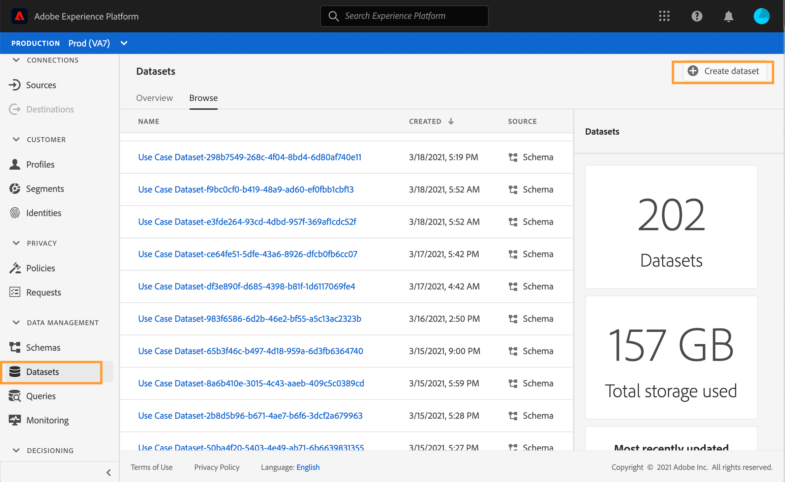
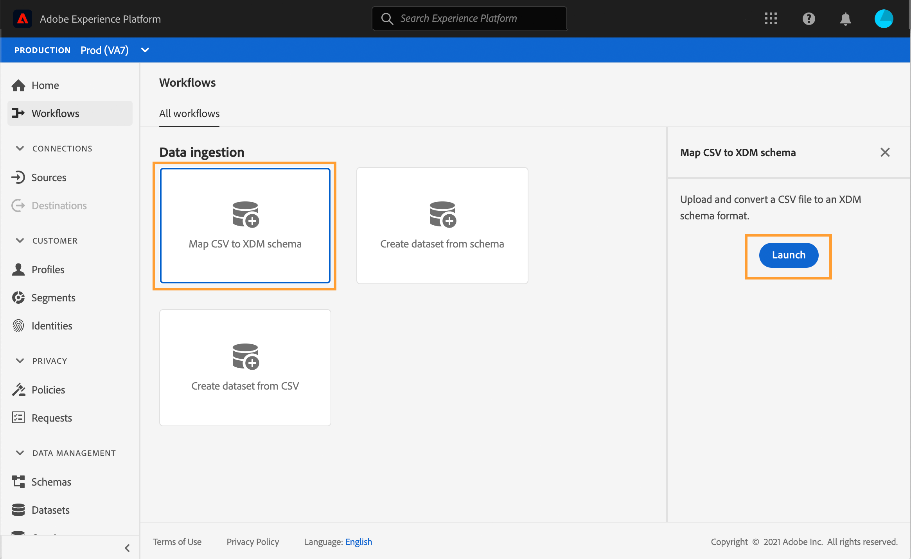
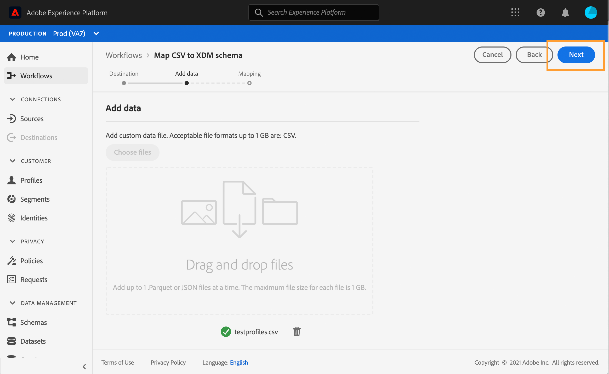

# 建立測試設定檔{#create-test-profiles}


在歷程中使用測試模式時，需要測試設定檔。 要瞭解如何使用測試模式，請參閱[本節](../building-journeys/testing-the-journey.md)。

在Adobe Experience Platform建立測試設定檔有不同的方式。 在本檔案中，我們著重於兩種方法：上傳[csv檔案](../building-journeys/creating-test-profiles.md#create-test-profiles-csv)，並使用[API呼叫](../building-journeys/creating-test-profiles.md#create-test-profiles-api)。 您也可以在資料集中上傳json檔案，請參閱[資料擷取檔案](https://experienceleague.adobe.com/docs/experience-platform/ingestion/tutorials/ingest-batch-data.html#add-data-to-dataset)。

這些匯入方法也可讓您更新描述檔屬性。 這樣，您就可以將現有的描述檔轉換為測試描述檔。 只需使用類似的檔案或API呼叫，並僅包含&quot;testProfile&quot;欄位，其值為&quot;true&quot;。

建立測試描述檔類似於在Adobe Experience Platform建立一般描述檔。 如需詳細資訊，請參閱[即時客戶資料檔案](https://experienceleague.adobe.com/docs/experience-platform/profile/home.html)。

## 必要條件{#test-profile-prerequisites}

為了能夠建立描述檔，您必須先在Adobe Experience Platform建立架構和資料集。

首先，您需要&#x200B;**建立架構**。 請遵循下列步驟：

1. 在Adobe Experience Platform，按一下左菜單中的&#x200B;**方案**。
   
1. 按一下右上角的&#x200B;**建立架構**，然後選擇架構類型，例如&#x200B;**XDM Individual Profile**。
   
1. 選擇方案的名稱。
1. 在&#x200B;**Mixins**&#x200B;區段中，按一下&#x200B;**Add**。
   
1. 選擇適當的混音。 請務必新增&#x200B;**描述檔測試詳細資訊** mixin。 按一下「新增mixin **」。**
   
混合的清單會顯示在架構概述畫面上。

   
1. 在欄位清單中，按一下您要定義為主要身分的欄位。
   
1. 在&#x200B;**欄位屬性**&#x200B;右面板中，檢查&#x200B;**Identity**&#x200B;和&#x200B;**主要識別**&#x200B;選項並選擇命名空間。 如果您希望主要身份是電子郵件地址，請選擇&#x200B;**Email**&#x200B;命名空間。 按一下&#x200B;**Apply**。
   
1. 選擇方案並啟用&#x200B;**方案屬性**&#x200B;中的&#x200B;**Profile**選項。
   
1. 按一下&#x200B;**保存**。

>[!NOTE]
>
>有關模式建立的詳細資訊，請參閱[XDM文檔](https://experienceleague.adobe.com/docs/experience-platform/xdm/ui/resources/schemas.html#prerequisites)。

然後，您需要&#x200B;**建立資料集**，以匯入描述檔。 請遵循下列步驟：

1. 在Adobe Experience Platform，按一下左側功能表中的&#x200B;**Datasets**，然後按一下「建立資料集&#x200B;**」。**
   
1. 選擇&#x200B;**從架構**建立資料集。
   
1. 選擇以前建立的模式，然後按一下&#x200B;**Next**。
   
1. 選擇名稱，然後按一下&#x200B;**完成**。
   
1. 啟用&#x200B;**Profile**選項。
   

>[!NOTE]
>
> 有關建立資料集的詳細資訊，請參閱[目錄服務文檔](https://experienceleague.adobe.com/docs/experience-platform/catalog/datasets/user-guide.html#getting-started)。

## 使用csv檔案建立測試描述檔{#create-test-profiles-csv}

在Adobe Experience Platform，您可以將包含不同描述檔欄位的csv檔案上傳至資料集，以建立描述檔。 這是最簡單的方法。

1. 使用試算表軟體建立簡單的csv檔案。
1. 為每個需要的欄位新增一欄。 請確定您新增主要身分欄位（上述範例中為「personID」）和「testProfile」欄位設為「true」。
   
1. 每個描述檔新增一行，並填入每個欄位的值。
   
1. 將試算表儲存為csv檔案。 請確定逗號是用作分隔符號。
1. 在Adobe Experience Platform，按一下左菜單中的&#x200B;**Workflows**。
   
1. 選擇&#x200B;**將CSV映射至XDM架構**，然後按一下&#x200B;**Launch**。
   
1. 選擇要將配置檔案導入的資料集。 按一下&#x200B;**Next**。
   
1. 按一下「選擇檔案&#x200B;**」，然後選取您的csv檔案。**&#x200B;上傳檔案時，按一下「下一步」。****
   
1. 將來源csv欄位對應至架構欄位，然後按一下「完成&#x200B;**」。**
   
1. 資料匯入開始。 狀態將從&#x200B;**Processing**&#x200B;移至&#x200B;**Success**。 按一下右上角的「預覽資料集」。****
   
1. 檢查測試設定檔是否已正確新增。
   

您的測試設定檔已新增，現在可在測試歷程時使用。 請參閱[本區段](../building-journeys/testing-the-journey.md)。
>[!NOTE]
>
> 有關csv匯入的詳細資訊，請參閱[資料擷取檔案](https://experienceleague.adobe.com/docs/experience-platform/ingestion/tutorials/map-a-csv-file.html#tutorials)。

## 使用API呼叫建立測試設定檔{#create-test-profiles-api}

您也可以透過API呼叫建立測試設定檔。 請參閱此[頁](https://docs.adobe.com/content/help/zh-Hant/experience-platform/profile/home.html)。

您必須使用包含「描述檔測試詳細資訊」混合的描述檔結構。 testProfile標幟是此混音的一部分。

建立描述檔時，請務必傳遞值：testProfile = true。

請注意，您也可以更新現有的描述檔，將其testProfile標幟變更為&quot;true&quot;。

以下是建立測試設定檔的API呼叫範例：

```
curl -X POST \
'https://dcs.adobedc.net/collection/xxxxxxxxxxxxxx' \
-H 'Cache-Control: no-cache' \
-H 'Content-Type: application/json' \
-H 'Postman-Token: xxxxx' \
-H 'cache-control: no-cache' \
-H 'x-api-key: xxxxx' \
-H 'x-gw-ims-org-id: xxxxx' \
-d '{
"header": {
"msgType": "xdmEntityCreate",
"msgId": "xxxxx",
"msgVersion": "xxxxx",
"xactionid":"xxxxx",
"datasetId": "xxxxx",
"imsOrgId": "xxxxx",
"source": {
"name": "Postman"
},
"schemaRef": {
"id": "https://example.adobe.com/mobile/schemas/xxxxx",
"contentType": "application/vnd.adobe.xed-full+json;version=1"
}
},
"body": {
"xdmMeta": {
"schemaRef": {
"contentType": "application/vnd.adobe.xed-full+json;version=1"
}
},
"xdmEntity": {
"_id": "xxxxx",
"_mobile":{
"ECID": "xxxxx"
},
"testProfile":true
}
}
}'
```

