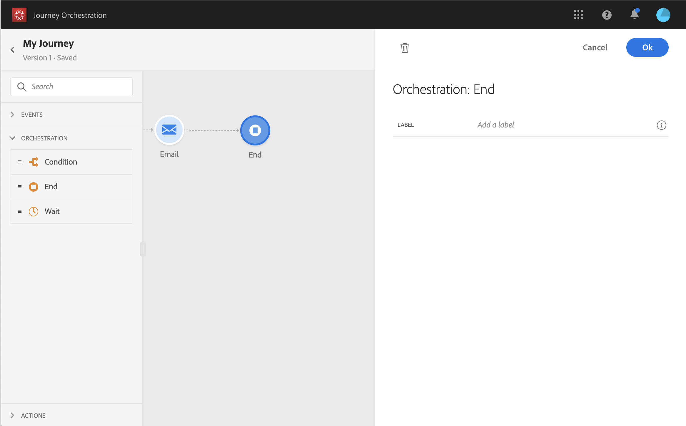

# 結束活動{#section_vqp_4ft_dgb}

>[!CAUTION]
>
>**正在尋找 Adobe Journey Optimizer**？ 按一下[這裡](https://experienceleague.adobe.com/zh-hant/docs/journey-optimizer/using/ajo-home){target="_blank"}以取得 Journey Optimizer 文件。
>
>
>_本文件指的是已由 Journey Optimizer 取代的舊版 Journey Orchestration 資料。 如果您對 Journey Orchestration 或 Journey Optimizer 的存取權有任何疑問，請聯絡您的帳戶團隊。_

**[!UICONTROL End]**&#x200B;活動可讓您標籤歷程每個路徑的結尾。 這並非強制性，但為了視覺清晰度建議使用。 確實如此，如果歷程有多個結束活動，我們建議您為每個結束加上標籤，以使報表更易於閱讀。 請參閱[此頁面](../reporting/about-journey-reports.md)。

