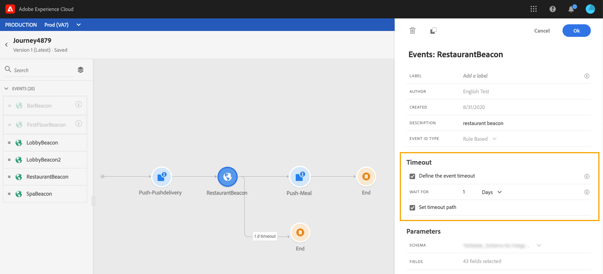
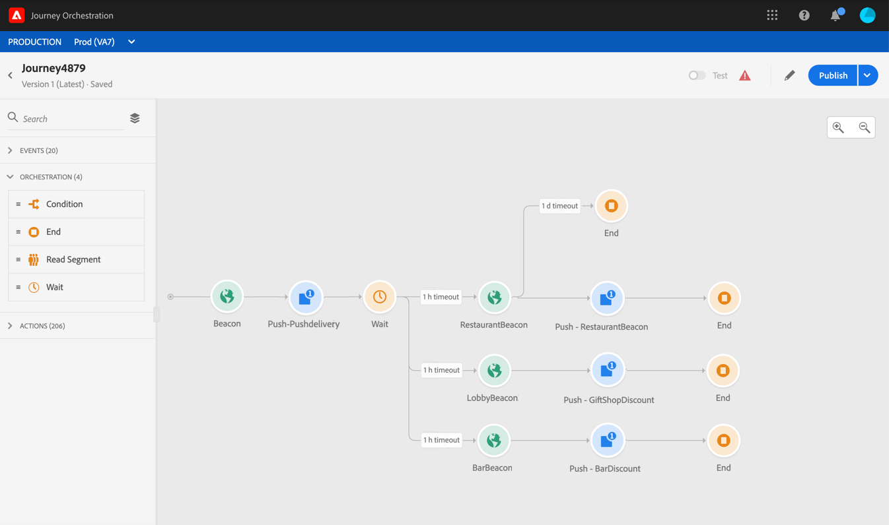

# 關於事件活動 {#concept_rws_1rt_52b}

由技術用戶配置的事件(請參見 [此頁](../event/about-events.md))，所有內容都顯示在螢幕左側的調色板的第一個類別中。

始終通過拖放事件活動來開始您的旅程。 也可以按兩下它。

在畫布中按一下事件活動時，將顯示活動配置窗格。 預設情況下，當您多次使用同一事件時，會向畫布中的事件名稱添加一個遞增的數字。 此外，您還可以 **[!UICONTROL Label]** 欄位，將尾碼添加到將出現在畫布中活動下的事件名稱中。 這對於在畫布中標識您的事件非常有用，尤其是如果您多次使用同一事件。 它還使調試在出現錯誤時更容易，並使報告更易於閱讀。

## 在特定時間內偵聽事件

在行程中定位的事件活動將無限期地偵聽事件。 要僅在特定時間偵聽事件，必須為該事件配置超時。

然後，該行程將在超時指定的時間內偵聽事件。 如果在該期間收到事件，則人員將在事件路徑中流動。 否則，客戶將進入超時路徑或結束其行程。

要為事件配置超時，請執行以下步驟：

1. 激活 **[!UICONTROL Enable the event timeout]** 的子菜單。

1. 指定行程等待事件的時間。

1. 如果要在指定超時內未收到任何事件時將個人發送到超時路徑，請啟用 **[!UICONTROL Set the timeout path]** 的雙曲餘切值。 如果未啟用此選項，則一旦達到超時，個人的行程將結束。

   

在此示例中，此行程將首次向客戶發送歡迎推送。 然後，只有顧客在次日內進入餐廳時，它才會發送一份餐價折扣申請。 因此，我們將餐廳事件配置為1天超時：

* 如果在歡迎推送後不到1天收到餐廳活動，則發送餐點折扣推送活動。
* 如果在下一天內未收到餐廳事件，則該人將通過超時路徑。

請注意，如果要配置在位於 **[!UICONTROL Wait]** 活動，您只需配置其中一個事件的超時。

超時將應用於在 **[!UICONTROL Wait]** 的子菜單。 如果在指定超時之前未收到任何事件，則這些個人將流入一個超時路徑，或結束其行程。

