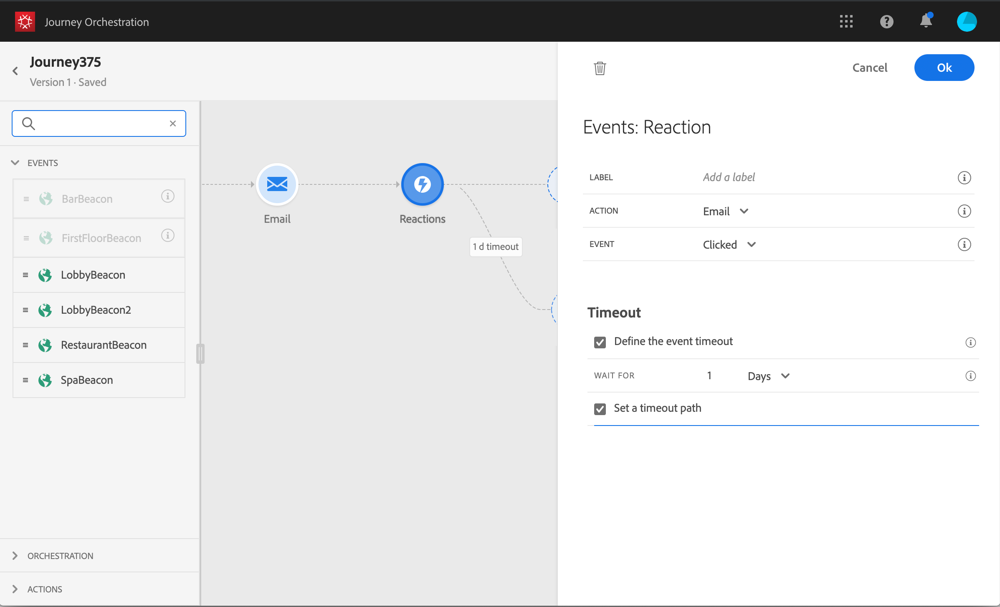

# 事件活動 {#concept_rws_1rt_52b}

由技術使用者設定的事件(請  參閱)都會顯示在畫面左側浮動視窗的第一類類別中。

透過拖放活動，始終從您的旅程開始。 您也可以按兩下它。

當您按一下畫布中的事件活動時，會顯示活動設定窗格。 依預設，當您多次使用相同事件時，畫布中的事件名稱會新增遞增的數字。 此外，您也可以使用欄 **[!UICONTROL Label]** 位為事件名稱新增尾碼，事件名稱會顯示在畫布中的活動下方。 這對於識別畫布中的事件非常有用，尤其是當您使用相同事件多次時。 此外，在發生錯誤時，除錯也會更輕鬆，並讓報表更容易閱讀。

## 一般事件 {#section_ofg_jss_dgb}

對於此類型的事件，您只能添加標籤和說明。 無法編輯其餘的配置。 由技術使用者執行。 請參見。

## 反應事件 {#section_dhx_gss_dgb}

在浮動視窗中提供的不同事件活動中，您會找到內建的 **Reactions** 事件。 此活動可讓您對追蹤與電子郵件、簡訊或推播活動所傳送之訊息相關的資料做出回應。 這些資訊來自Adobe Campaign Standard中的交易訊息。 我們會在與資料平台共用資訊時即時擷取資訊。 對於推播通知，您可以回應已點按、已傳送或失敗的訊息。 對於SMS訊息，您可以回應已傳送或失敗的訊息。 對於電子郵件，您可以對被點按、傳送、開啟或失敗的訊息做出回應。

您也可以使用此機制，在您的訊息沒有反應時執行動作。 若要這麼做，請建立與反應活動平行的第二條路徑，並新增等待活動。 如果在等待活動中定義的時段內沒有反應，則將選擇第二個路徑。 您可以選擇傳送，例如後續訊息。

請注意，您只能在畫布中使用之前有電子郵件、推播或SMS活動的反應活動。

See [About action activities](../building-journeys/about-action-activities.md).

以下是設定反應事件的不同步驟：

1. 增加 **[!UICONTROL Label]** 反應。 此步驟為選填。
1. 從下拉式清單中，選取您要回應的動作活動。 您可以選取路徑上前幾個步驟中定位的任何動作活動。
1. 根據您選取的動作（電子郵件、簡訊或推播通知），選擇您要回應的項目。
1. 您可以將條件定義為可選步驟。 例如，在執行電子郵件動作後，您可以決定建立兩個路徑，一個路徑包含僅追蹤VIP客戶點按次數的反應事件，另一個路徑包含追蹤女性點按次數的反應事件。

>[!NOTE]
>
>反應事件可與Adobe Campaign Standard搭配運作，不論其部署在AWS或Azure伺服器上。
>
>反應事件無法追蹤在不同歷程中發生的電子郵件、簡訊或推播動作。
>
>反應事件會追蹤「追蹤」類型連結的點按次數(請參閱 [本頁](https://docs.adobe.com/content/help/en/campaign-standard/using/designing-content/links.html#about-tracked-urls))。 未考慮取消訂閱和鏡像頁面連結。

>[!IMPORTANT]
>
>Gmail等電子郵件用戶端允許封鎖影像。 開啟的電子郵件會使用電子郵件中包含的0像素影像來追蹤。 如果影像遭到封鎖，則不會考慮開啟的電子郵件。

## 區段資格事件 {#segment-qualification}

本活動可讓您的旅程聆聽Platform區段中描述檔的入口和出口，讓個人在旅程中進入或前進。 For more information on segment creation, refer to this [section](../segment/about-segments.md).

假設您有「銀色客戶」群體。 透過此活動，您可以讓所有新的銀級客戶進入歷程並傳送一系列個人化訊息。

此類事件可定位為旅程的第一步或稍後步驟。

如果區段是使用「平台」的「高頻觀眾」選項串流，則會即時聆聽入口和出口。 如果區段未串流化，則會在區段計算時考慮入口和出口。

1. 展開「 **事件** 」類別，並將「區 **段」資格** 活動拖曳至畫布。

   

1. 新增 **標籤** 至活動。 此步驟為選填。

1. 按一下「 **區段** 」欄位，並選取您要運用的區段。

   

1. 在「行 **為** 」欄位中，選擇您要監聽區段入口、出口或兩者。

1. 選擇命名空間。 只有在將活動定位為旅程的第一步時，才需要這個選項。

   

裝載包含下列上下文資訊，您可在條件和動作中使用：

* 行為（入口、出口）
* 資格的時間戳記
* 區段ID

在「區段限定」活動之後的條件或動作中使用運算式編輯器時 **，您可以存取「** SegmentQualification **** 」節點。 您可以選擇「上次 **限定時間** 」和 **狀態** （進入或退出）。

請參閱 [條件活動](../building-journeys/condition-activity.md#about_condition)。

## 進階使用： 並行等待的事件{#section_vxv_h25_pgb}

**您如何只在特定時間內才能聆聽活動？**

位於歷程中的事件活動會無限期地監聽事件。 若要僅在特定時間監聽事件，您必須新增與事件路徑平行的等待活動。 然後，該歷程將在等待活動中指定的時間內偵聽事件。 如果在該期間收到事件，則人員將在事件路徑中流動。 否則，客戶將流入等待路徑。

例如，您先將歡迎推播傳送給客戶，而且您只想在客戶在6小時內進入餐廳時傳送餐點折扣推播。 若要這麼做，您將建立第二個路徑（與餐廳事件一平行），並有6小時的等待活動。 如果在歡迎推播後不到6小時收到餐廳活動，則會傳送餐點折扣推播活動。 如果未在接下來的6小時內收到任何餐廳事件，則該人員會流過等待路徑。

