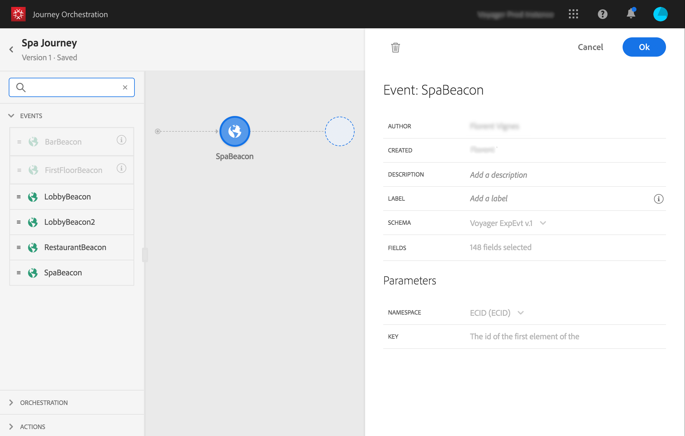

# 一般事件 {#section_ofg_jss_dgb}

>[!CAUTION]
>
>**正在尋找 Adobe Journey Optimizer**？ 按一下[這裡](https://experienceleague.adobe.com/zh-hant/docs/journey-optimizer/using/ajo-home){target="_blank"}以取得 Journey Optimizer 文件。
>
>
>_本文件指的是已由 Journey Optimizer 取代的舊版 Journey Orchestration 資料。 如果您對 Journey Orchestration 或 Journey Optimizer 的存取權有任何疑問，請聯絡您的帳戶團隊。_

對於這類事件，您只能新增標籤和說明。 無法編輯其餘的組態。 它由技術使用者執行。 請參閱[此頁面](../event/about-events.md)。

