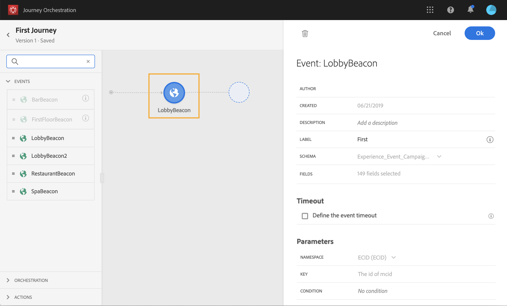

# 建立歷程 {#concept_gq5_sqt_52b}

此步驟由&#x200B;**業務用戶**&#x200B;執行。 這是您建立歷程的位置。 結合不同的事件、協調和動作活動，以建立您的多步驟跨管道情境。

歷程介面可讓您輕鬆將活動從浮動視窗拖放至畫布中。 您也可以連按兩下某個活動，以在下一個可用步驟將其新增至畫布中。 每個活動在流程中都有特定角色和位置。 活動會排序。 活動完成後，流程會繼續並處理下一個活動，以此類推。

每個歷程僅允許一個命名空間。 當您放置第一個事件時，具有不同命名空間的事件將會呈現灰色。 如果第一個事件沒有命名空間，則具有命名空間的所有事件都會呈現灰色。 請參閱[本頁](../event/selecting-the-namespace.md)。此外，如果歷程中有沒有命名空間的事件，Adobe Experience Platform欄位群組會呈現灰色。 最後，如果您在相同歷程中使用數個事件，它們需要使用相同的命名空間。

開始新歷程時，無法將第一個步驟放置在畫布中的元素隱藏。 這與所有動作、條件活動、等待和反應有關。

## 快速入門 {#creating_journey}

以下是建立和發佈歷程的主要步驟。

1. 在頂端功能表中，按一下 **[!UICONTROL Home]** 索引標籤。

   歷程清單隨即顯示。 有關介面的詳細資訊，請參閱[此頁](../building-journeys/using-the-journey-designer.md)。

   

1. 按一下&#x200B;**[!UICONTROL Create]**&#x200B;以建立新歷程。

   

1. 在右側顯示的設定窗格中，編輯歷程的屬性。請參閱[本頁](../building-journeys/changing-properties.md)。

   

1. 首先，將事件活動從浮動視窗拖放至畫布中。 您也可以連按兩下活動，將其新增至畫布。

   

1. 拖放其他活動並加以設定。 請參閱頁面[事件活動](../building-journeys/event-activities.md)、[關於協調活動](../building-journeys/about-orchestration-activities.md)和[關於動作活動](../building-journeys/about-action-activities.md)。

   

1. 您的歷程會自動儲存。 測試您的歷程並發佈。 請參閱[測試歷程](../building-journeys/testing-the-journey.md)和[發佈歷程](../building-journeys/publishing-the-journey.md)。

   

## 結束歷程 {#ending_a_journey}

歷程可能會因為兩個原因而結束：

* 人員到達路徑的最後一個活動。 最後一個活動可以是結束活動或其他活動。 沒有義務以結束活動結束路徑。 請參閱[本頁](../building-journeys/end-activity.md)。
* 人員到達條件活動（或具有條件的等待活動），且不符合任何條件。

如果允許重新進入，則人員可以重新進入歷程。 請參閱[本頁](../building-journeys/changing-properties.md)。

歷程可能會關閉，原因如下：

* 透過&#x200B;**[!UICONTROL Close to new entrances]**&#x200B;按鈕手動關閉歷程。
* 已到達歷程的結束日期。

歷程關閉時（基於上述任何原因），其狀態將為&#x200B;**[!UICONTROL Closed (no entrance)]**。 歷程將停止讓新人進入歷程。 已在歷程中的人員會正常完成歷程。 在30天的預設全域逾時後，歷程會切換為&#x200B;**已完成**&#x200B;狀態。 請參閱此[節](../building-journeys/changing-properties.md#entrance)。

如果您需要停止歷程中所有個人的進度，您可以加以停止。 停止歷程會逾時歷程中的所有個人。

若要了解如何手動關閉或停止歷程，請參閱此[區段](../building-journeys/terminating-a-journey.md)。
