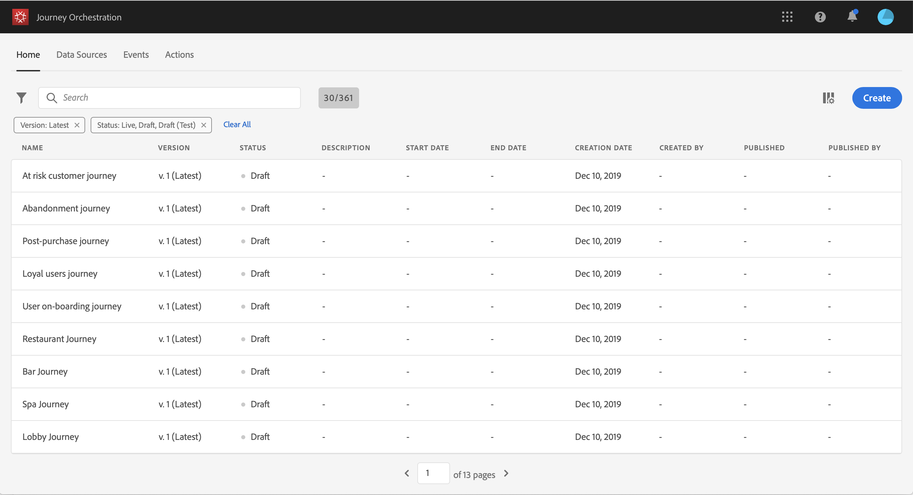

# 建立歷程 {#concept_gq5_sqt_52b}

此步驟由 **業務用戶**。 這是你建立旅程的地方。 結合不同的事件、協調和動作活動，以建立您的多步驟跨管道情境。

通過旅程介面，您可以輕鬆地將活動從調色板拖放到畫布中。 您還可以按兩下某個活動，在下一步可用步驟的畫布中將其添加。 每個活動都在流程中具有特定的角色和位置。 活動被排序。 完成活動後，流將繼續並處理下一個活動，依此類推。

每個行程只允許一個命名空間。 刪除第一個事件時，具有不同命名空間的事件將呈灰色顯示。 如果第一個事件沒有命名空間，則具有命名空間的所有事件將呈灰色顯示。 請參閱[此頁面](../event/selecting-the-namespace.md)。此外，如果行程中包含沒有命名空間的事件，則Adobe Experience Platform欄位組將呈灰色顯示。 最後，如果在同一行程中使用多個事件，它們需要使用相同的命名空間。

開始新行程時，無法作為第一步放入畫布中的元素將被隱藏。 這關係到所有動作、狀況活動、等待和反應。

## 快速入門 {#creating_journey}

以下是建立和發佈行程的主要步驟。

1. 在頂端功能表中，按一下 **[!UICONTROL Home]** 索引標籤。

   將顯示行程清單。 請參閱 [此頁](../building-journeys/using-the-journey-designer.md) 的上界。

   

1. 按一下 **[!UICONTROL Create]** 創造新的旅程。

   

1. 在右側顯示的設定窗格中，編輯歷程的屬性。請參閱[此頁面](../building-journeys/changing-properties.md)。

   

1. 從將事件活動從調色板拖放到畫布中開始。 也可以按兩下某個活動將其添加到畫布。

   

1. 拖放其他活動並配置它們。 請參閱頁面 [活動](../building-journeys/event-activities.md)。 [關於業務流程活動](../building-journeys/about-orchestration-activities.md) 和 [關於操作活動](../building-journeys/about-action-activities.md)。

   

1. 您的旅程將自動保存。 Test你的旅程，然後發表。 請參閱 [測試旅程](../building-journeys/testing-the-journey.md) 和 [發佈旅程](../building-journeys/publishing-the-journey.md)。

   

## 結束旅程 {#ending_a_journey}

一次旅行可能會因個人而結束，原因有二：

* 該人到達了路徑的最後一個活動。 最後一個活動可以是結束活動或其他活動。 沒有義務用結束活動結束路徑。 請參閱[此頁面](../building-journeys/end-activity.md)。
* 此人到達條件活動（或具有條件的等待活動），且與任何條件都不匹配。

如果允許重新進入，則人員可以重新進入旅程。 請參閱[此頁面](../building-journeys/changing-properties.md)。

行程可能會關閉，原因如下：

* 通過 **[!UICONTROL Close to new entrances]** 按鈕
* 到達行程的結束日期。

當行程關閉時（出於以上任何原因），它將具有 **[!UICONTROL Closed]**。 旅程將停止讓新人進入旅程。 已經在旅途中的人將正常完成旅程。 在預設全局超時30天後，該行程將切換到 **已完成** 狀態。 查看 [節](../building-journeys/changing-properties.md#entrance)。

如果你需要阻止所有人在旅途中的進步，你可以阻止它。 停止行程將超時行程中的所有人。

要瞭解如何手動關閉或停止行程，請參閱此 [節](../building-journeys/terminating-a-journey.md)。
