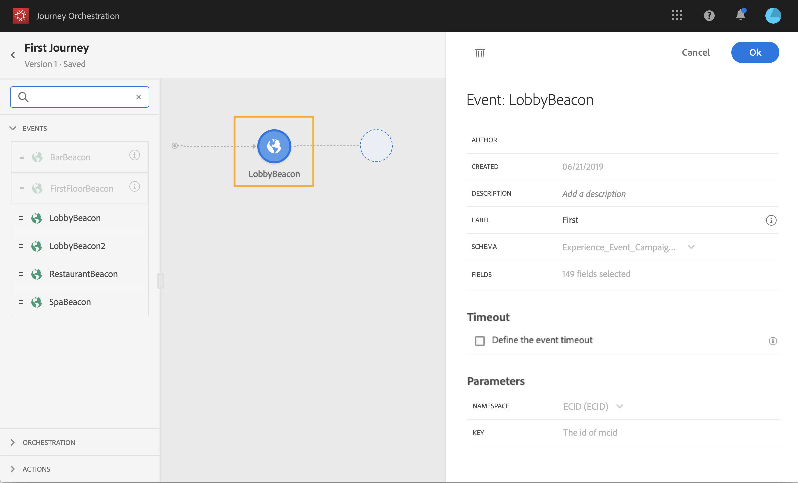

# 建立歷程 {#concept_gq5_sqt_52b}

此步驟由業務用 **戶執行**。 這是您建立歷程的地方。 結合不同的事件、協調和行動活動，建立您的跨通道多步驟藍本。

歷程介面可讓您輕鬆將活動從浮動視窗拖放至畫布中。 您也可以連按兩下某個活動，在下一個可用步驟將其新增至畫布中。 每個活動在流程中都有特定的角色和位置。 活動被排序。 當活動完成時，流會繼續並處理下一個活動，依此類推。

每個歷程僅允許一個命名空間。 當您放置第一個事件時，具有不同名稱空間的事件會變灰。 如果第一個事件沒有命名空間，則所有具有命名空間的事件都將變灰。 參見。此外，如果歷程中有事件沒有命名空間，「體驗平台」欄位群組也會變灰。 最後，如果您在同一歷程中使用數個事件，他們需要使用相同的命名空間。

## Quick start {#creating_journey}

以下是建立和發佈歷程的主要步驟。

1. 在頂端功能表中，按一下標 **[!UICONTROL Home]**簽。

   將顯示歷程清單。 有關  介面的詳細資訊，請參閱。

   

1. 按一 **[!UICONTROL Create]**下以建立新的歷程。

   

1. 在右側顯示的設定窗格中編輯歷程的屬性。 參見。

   

1. 首先，從浮動視窗拖放事件活動至畫布。 您也可以連按兩下活動，將其新增至畫布。

   

1. 拖放您的其他活動並加以設定。 請參 閱，  然後 。

   

1. 您的歷程會自動儲存。 測試您的歷程並發佈。 請參閱  和 。

   

## 結束旅程{#ending_a_journey}

結束旅程有兩種方式：

* 人到達路徑的最後一個活動。 最後一個活動可以是結束活動或其他活動。 沒有義務以結束活動結束路徑。 參見。
* 該人員到達條件活動（或具有條件的等待活動），且不符合任何條件。

如果允許重新入場，人就可以重新進入旅程。 參見。

