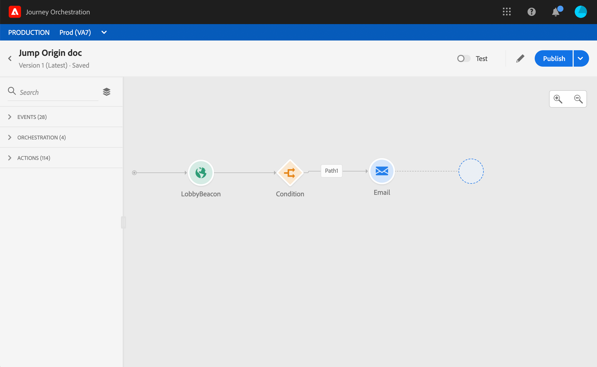
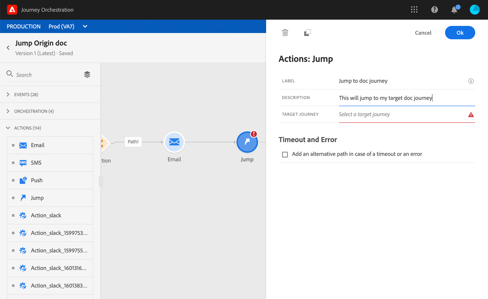
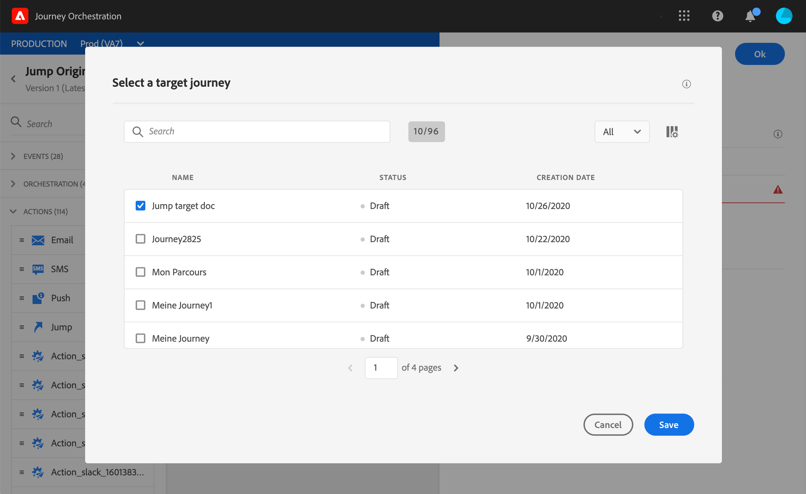
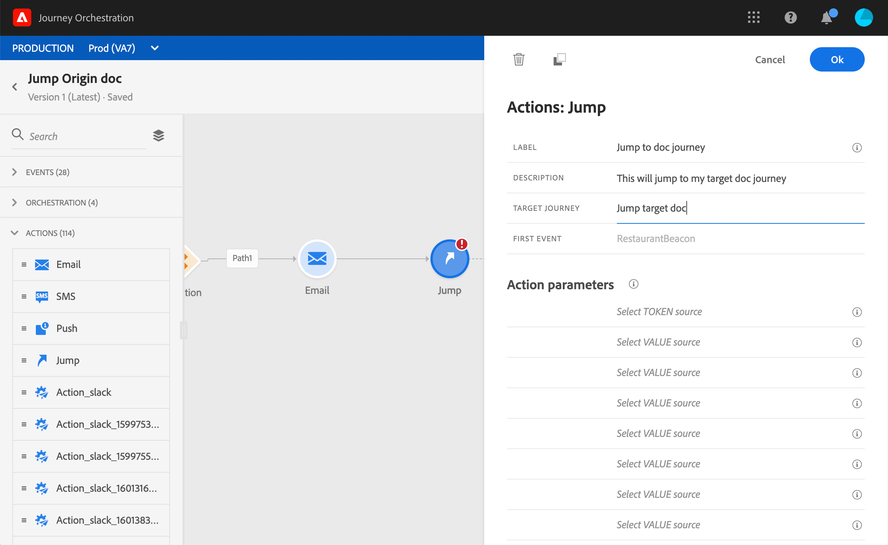
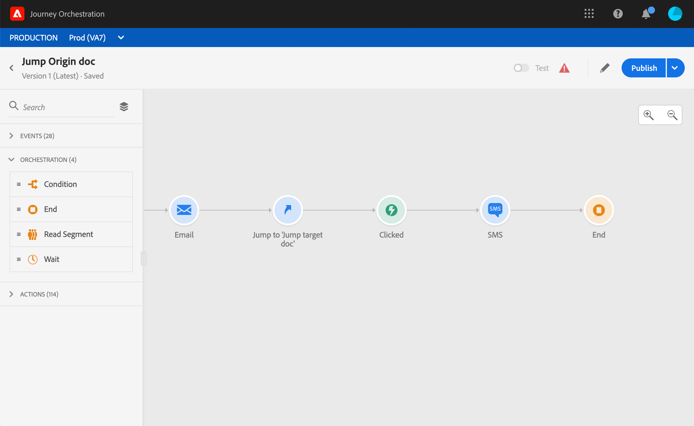
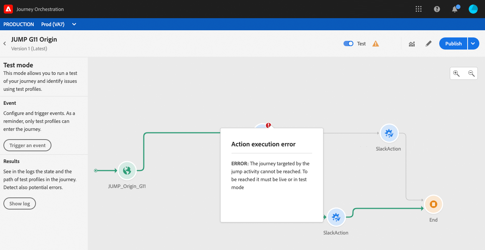

# 從一個旅程跳至另一個{#jump}

**Jump**&#x200B;動作活動可讓您將個人從一個歷程推送至另一個歷程。 此功能可讓您：

* 將複雜的旅程分割為數個旅程，以簡化複雜的旅程設計
* 根據常見且可重複使用的歷程模式建立歷程

在原始歷程中，只需新增&#x200B;**Jump**&#x200B;並選取目標歷程。 當個人進入跳躍步驟時，內部事件會傳送至目標歷程的第一個事件。 如果跳躍動作成功，個人將繼續在歷程中前進。 行為與其他動作類似。

在目標歷程中，由跳躍內部觸發的第一個事件將使個體在歷程中流動。

## 生命週期

假設您已將A旅程的跳躍加入B旅程。旅程A是&#x200B;**原始歷程**&#x200B;和旅程B,**目標歷程**。
以下是執行程式的不同步驟：

**從外** 部事件觸發的歷程識別：

1. 旅程A會接收與個人相關的外部事件。
1. 個人就到了跳步。
1. 在跳躍後，個人會被推至B旅程，並在A旅程中繼續下一步。

在旅程B中，第一個活動是透過旅程A的跳躍在內部觸發：

1. 旅程B從旅程A收到內部活動。
1. 個人開始流入B旅程。

>[!NOTE]
>
>旅程B也可透過外部事件觸發。

## 重要附註

### 編寫

* 此跳轉僅適用於使用命名空間的歷程。
* 您只能跳至使用與原始歷程相同命名空間的歷程。
* 您無法跳至以&#x200B;**區段資格**&#x200B;事件開始的歷程。
* 在同一歷程中，您不能有跳躍和&#x200B;**區段資格**&#x200B;事件。
* 您可以在旅程中加入所需的跳躍次數。 跳轉後，您可以新增任何所需的活動。
* 您可以視需要擁有任意數量的跳躍層級。 例如，A躍進到B旅程，C旅程等。
* 目標歷程也可視需要包含多個跳躍點。
* 不支援循環圖樣。 無法將兩個或兩個以上的旅程連結在一起，以產生無限回圈。 **Jump**&#x200B;活動配置螢幕會阻止您執行此操作。

### 執行

* 執行跳轉時，會觸發目標歷程的最新版本。
* 和往常一樣，一個獨特的個人只能在同一行程中出現一次。 因此，如果從原始歷程推送的個人已經進入目標歷程，則個人將不會進入目標歷程。 不會報告跳轉錯誤，因為這是正常行為。

## 設定跳轉

1. 設計您的原始旅程。

   

1. 在旅程的任何步驟中，從&#x200B;**Action**&#x200B;類別新增&#x200B;**Jump**&#x200B;活動。 新增標籤和說明。

   

1. 在&#x200B;**Target journey**欄位內按一下。
清單會顯示草稿、即時或在測試模式中的所有歷程版本。 無法使用使用不同名稱空間或以**區段限定**&#x200B;事件開頭的歷程。 也會篩選出會建立回圈模式的目標歷程。

   

   >[!NOTE]
   >
   >您可以按一下右側的&#x200B;**開啟目標歷程**&#x200B;圖示，在新標籤中開啟目標歷程。

1. 選擇您要跳至的目標歷程。
**第一個事件**&#x200B;欄位會預先填入目標歷程的第一個事件的名稱。 如果您的目標歷程包含多個事件，則僅允許在第一個事件上跳轉。

   

1. **動作參數**&#x200B;區段會顯示目標事件的所有欄位。 與其他動作類型相同，請將每個欄位對應至原始事件或資料來源的欄位。 這些資訊會在執行時期傳遞至目標歷程。
1. 新增下一個活動，以完成您的原始旅程。

   

   >[!NOTE]
   >
   >個人的身分會自動對應。 此資訊在介面中不可見。

您的跳轉已設定。 一旦您的旅程進入即時或處於測試模式，到達跳躍的個人就會被推送到目標旅程。

當在歷程中設定跳轉時，在目標歷程的開頭會自動新增跳轉項目圖示。 這可協助您識別旅程可從外部觸發，也可從內部觸發。

## 疑難排解

當旅程發佈或處於測試模式時，若發生下列情況，將會發生錯誤：
* 目標旅程不再存在
* 目標旅程是草稿、關閉或停止
* 如果目標歷程的第一個事件已變更，且地圖已中斷

