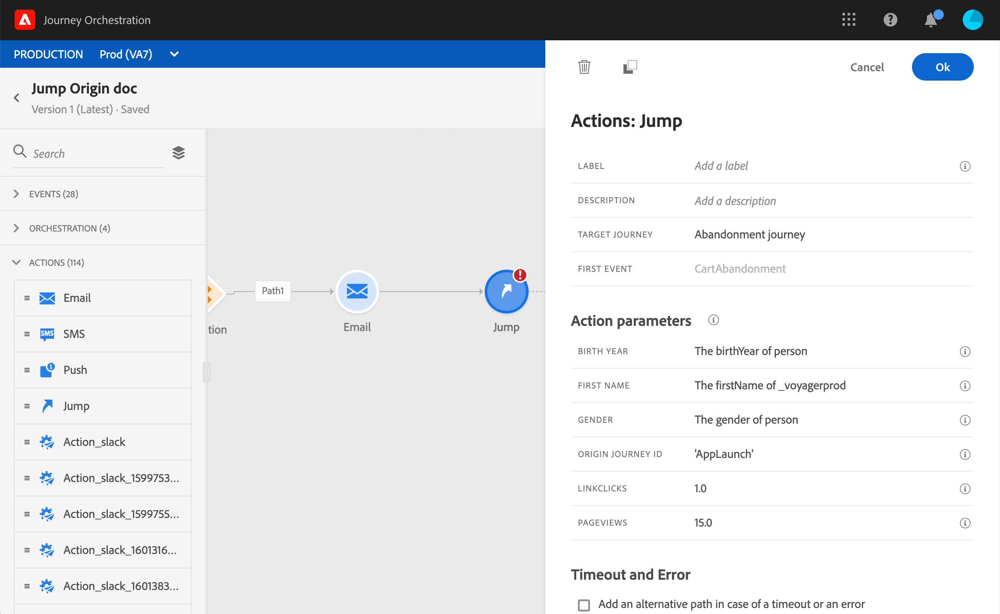

# 從一個旅程跳到另一個旅程 {#jump}

>[!NOTE]
>
>有效的可用性：2020年11月15日

「跳 **躍** 」動作活動可讓您將個人從一個歷程推向另一個歷程。 此功能可讓您：

* 將複雜的旅程分割為數個旅程，以簡化複雜的旅程設計
* 根據常見且可重複使用的歷程模式建立歷程

在原始歷程中，只需新增 **Jump** ，並選取目標歷程。 當個人進入跳躍步驟時，內部事件會傳送至目標歷程的第一個事件。 如果跳躍動作成功，個人將繼續在歷程中前進。 行為與其他動作類似。

在目標歷程中，由跳躍內部觸發的第一個事件將使個體在歷程中流動。

## 生命週期

假設您已將A旅程的跳躍加入B旅程。旅程A是起 **源的歷程** ，而旅程B是 **目標旅程**。
以下是執行程式的不同步驟：

**旅程A** 是從外部事件觸發：

1. 旅程A會接收與個人相關的外部事件。
1. 個人就到了跳步。
1. 在跳躍後，個人會被推至B旅程，並在A旅程中繼續下一步。

在 **B旅程**，第一個活動可以在外部（例如常規活動）觸發，或在內部，透過從A旅程跳轉：

1. 旅程B從旅程A收到內部活動。
1. 「旅程B」的第一個事件是由來自「旅程A」的資訊觸發。
1. 個人開始流入B旅程。

## 重要附註

* 您只能跳至使用與原始歷程相同命名空間的歷程。
* 您無法跳至以「區段」資格事件開 **始的歷程** 。
* 執行跳轉時，會觸發目標歷程的最新版本。
* 您可以在旅程中加入所需的跳躍次數。 跳轉後，您可以新增任何所需的活動。
* 您可以視需要擁有任意數量的跳躍層級。 例如，A躍進到B旅程，C旅程等。
* 目標歷程也可視需要包含多個跳躍點。
* 不支援循環圖樣。 無法將兩個或兩個以上的旅程連結在一起，以產生無限回圈。 Jump活 **** 動配置螢幕會阻止您執行此操作。
* 和往常一樣，一個獨特的個人只能在同一行程中出現一次。 因此，如果從原始歷程推送的個人已經進入目標歷程，則個人將不會進入目標歷程。 不會報告跳轉錯誤，因為這是正常行為。

## 設定跳轉

1. 設計您的原始旅程。

   

1. 在歷程的任何步驟中，從「動作 **」類別新增** 「跳 **躍」活動** 。 新增標籤和說明。

   

1. 按一下Target歷 **程欄位** 。
清單會顯示草稿、即時或在測試模式中的所有歷程版本。 無法使用使用不同名稱空間或以區段限定事 **件開始的** 「歷程」。 也會篩選出會建立回圈模式的目標歷程。

   

   >[!NOTE]
   >
   >您可以按一下右 **側的「開啟目標歷程** 」圖示，在新標籤中開啟目標歷程。

1. 選擇您要跳至的目標歷程。
「第 **一個事件** 」欄位會預先填入目標歷程的第一個事件的名稱。 如果您的目標歷程包含多個事件，則僅允許在第一個事件上跳轉。

   

1. 「動 **作參數** 」區段會顯示目標事件的所有欄位。 與其他動作類型相同，請將每個欄位對應至原始事件或資料來源的欄位。 這些資訊會在執行時期傳遞至目標歷程。
1. 新增下一個活動，以完成您的原始旅程。

   

您的跳轉已設定。 一旦您的旅程進入即時或處於測試模式，到達跳躍的個人就會被推送到目標旅程。

當在歷程中設定跳轉時，在目標歷程的開頭會自動新增跳轉項目圖示。 這可協助您識別旅程可從外部觸發，也可從內部觸發。

## 疑難排解

當旅程發佈或處於測試模式時，若發生下列情況，將會發生錯誤：
* 目標旅程不再存在
* 目標旅程是草稿、關閉或停止
* 如果目標歷程的第一個事件已變更，且地圖已中斷
