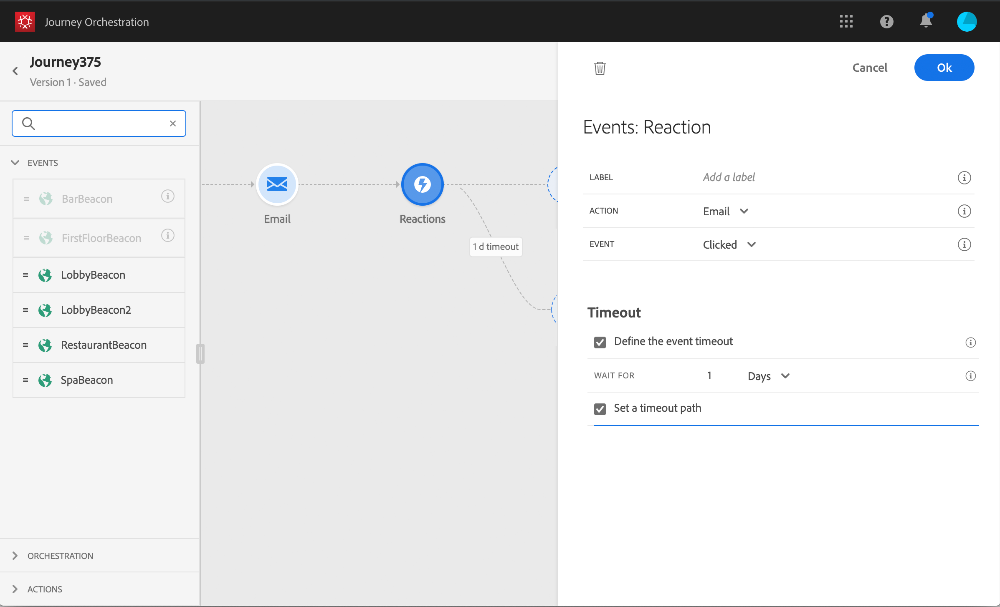

# 反應事件 {#section_dhx_gss_dgb}

在浮動視窗中提供的不同事件活動中，您會找到內建的&#x200B;**[!UICONTROL Reactions]**&#x200B;事件。 此活動可讓您對追蹤與電子郵件、簡訊或推播活動所傳送之訊息相關的資料做出回應。 這些資訊來自Adobe Campaign Standard中的交易訊息。 我們會在與Adobe Experience Platform共用資訊時即時擷取此資訊。 對於推播通知，您可以回應已點按、已傳送或失敗的訊息。 對於SMS訊息，您可以回應已傳送或失敗的訊息。 對於電子郵件，您可以對被點按、傳送、開啟或失敗的訊息做出回應。

您也可以使用此機制，在您的訊息沒有反應時執行動作。 若要這麼做，請建立與反應活動平行的第二條路徑，並新增等待活動。 如果在等待活動中定義的時段內沒有反應，則將選擇第二個路徑。 您可以選擇傳送，例如後續訊息。

請注意，您只能在畫布中使用之前有電子郵件、推播或SMS活動的反應活動。

請參閱[關於操作活動](../building-journeys/about-action-activities.md)。

以下是設定反應事件的不同步驟：

1. 將&#x200B;**[!UICONTROL Label]**&#x200B;加入反應。 此步驟為選填。
1. 從下拉式清單中，選取您要回應的動作活動。 您可以選取路徑上前幾個步驟中定位的任何動作活動。
1. 根據您選取的動作（電子郵件、簡訊或推播通知），選擇您要回應的項目。
1. 您可以將條件定義為可選步驟。 例如，在執行電子郵件動作後，您可以決定建立兩個路徑，一個路徑包含僅追蹤VIP客戶點按次數的反應事件，另一個路徑包含追蹤女性點按次數的反應事件。

>[!NOTE]
>
>反應事件可與Adobe Campaign Standard搭配運作，不論其部署在AWS或Azure伺服器上。
>
>反應事件無法追蹤在不同歷程中發生的電子郵件、簡訊或推播動作。
>
>反應事件會追蹤「tracked」類型連結的點按次數（請參閱此[page](https://docs.adobe.com/content/help/en/campaign-standard/using/designing-content/links.html#about-tracked-urls)）。 未考慮取消訂閱和鏡像頁面連結。

>[!IMPORTANT]
>
>Gmail等電子郵件用戶端允許封鎖影像。 開啟的電子郵件會使用電子郵件中包含的0像素影像來追蹤。 如果影像遭到封鎖，則不會考慮開啟的電子郵件。
