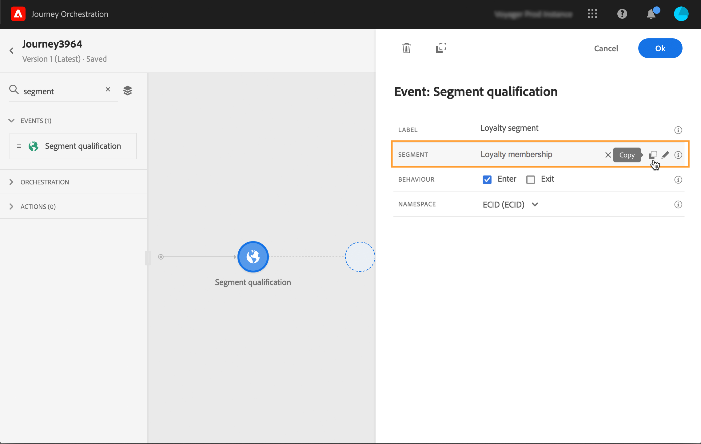

# 區段資格事件 {#segment-qualification}

## 關於區段資格事件{#about-segment-qualification}

本練習可讓您的旅程聆聽Adobe Experience Platform區段中描述檔的入口和出口，讓個人在旅程中進入或前進。 For more information on segment creation, refer to this [section](../segment/about-segments.md).

假設您有「銀色客戶」群體。 透過此活動，您可以讓所有新的銀級客戶進入歷程並傳送一系列個人化訊息。

此類事件可定位為旅程的第一步或稍後步驟。

>[!IMPORTANT]
>
>請記住，Adobe Experience Platform區段是使用Adobe Experience Platform的「高頻率觀眾」選項，每天計算一次(**批次區段** )或即時計算一次(串流&#x200B;**區段** )。
>
>如果選取的區段串流化，屬於此區段的個人可能會即時進入歷程。 如果區段是批次，新符合此區段資格的人員可能會在Adobe Experience Platform上執行區段計算時進入歷程。

1. 展開類 **[!UICONTROL Events]** 別並將活動拖 **[!UICONTROL Segment qualification]** 放到畫布中。

   

1. 新增 **[!UICONTROL Label]** 至活動。 此步驟為選填。

1. 按一下欄 **[!UICONTROL Segment]** 位並選取您要運用的區段。

   >[!NOTE]
   >
   >請注意，您可以自訂清單中顯示的欄，並加以排序。

   

   新增區段後，按鈕 **[!UICONTROL Copy]** 可讓您複製其名稱和ID:

   `{"name":"Loyalty membership“,”id":"8597c5dc-70e3-4b05-8fb9-7e938f5c07a3"}`

   

1. 在欄位 **[!UICONTROL Behavior]** 中，選擇您要監聽區段入口、出口或兩者。

1. 選擇命名空間。 只有在將活動定位為旅程的第一步時，才需要這個選項。

   

裝載包含下列上下文資訊，您可在條件和動作中使用：

* 行為（入口、出口）
* 資格的時間戳記
* 區段ID

在活動後面的條件或操作中使用表達式編輯器時， **[!UICONTROL Segment qualification]** 您可以訪問該節 **[!UICONTROL SegmentQualification]** 點。 您可以選擇 **[!UICONTROL Last qualification time]** 和( **[!UICONTROL status]** 輸入或退出)。

請參閱 [條件活動](../building-journeys/condition-activity.md#about_condition)。

## 最佳實務{#best-practices-segments}

本活 **[!UICONTROL Segment Qualification]** 動可讓符合資格或被Adobe Experience Platform區段取消資格的個人在旅程中立即進入。

這種資訊的接收速度很快。 所做的測量顯示每秒收到10,000個事件的速度。 因此，你應該確保你明白，入口高峰是如何發生的，如何避開它們，如何讓你的旅程為它們做好準備。

### 批次區段{#batch-speed-segment-qualification}

使用批段的段限定時，請注意，在每日計算時將出現入口高峰。 峰值的大小將視每日進入（或退出）區段的個人數而定。

此外，如果批次區段是新建立並立即用於歷程中，第一批計算可能會讓許多人進入歷程。

### 串流區段{#streamed-speed-segment-qualification}

使用串流區段的區段資格時，由於持續評估該區段，導致進入／退出高峰的風險較低。 不過，如果區段定義導致大量客戶同時符合資格，可能也會出現高峰。

### 如何避免過載{#overloads-speed-segment-qualification}

以下是一些最佳實務，可協助您避免在歷程中使用過載系統（資料來源、自訂動作、Adobe Campaign Standard動作）。

在活動中，請勿在建立 **[!UICONTROL Segment Qualification]** 批次區段後立即使用批次區段。 避免了第一個計算峰。 請注意，如果您要使用從未計算過的區段，歷程畫布中會出現黃色警告。

為歷程中使用的資料來源和動作設定上限規則，以避免超出負載(請參閱 [本節](../api/capping.md))。 請注意，上限規則沒有重試。 如果您需要重試，您必須勾選條件或動作中的方塊，以在歷程中使用 **[!UICONTROL Add an alternative path in case of a timeout or an error]** 替代路徑。

在生產歷程中使用區段之前，請務必先評估每天符合此區段資格的個人數量。 若要這麼做，您可以檢 **[!UICONTROL Segments]** 查Adobe Experience Platform中的章節，並查看右側的圖形。

