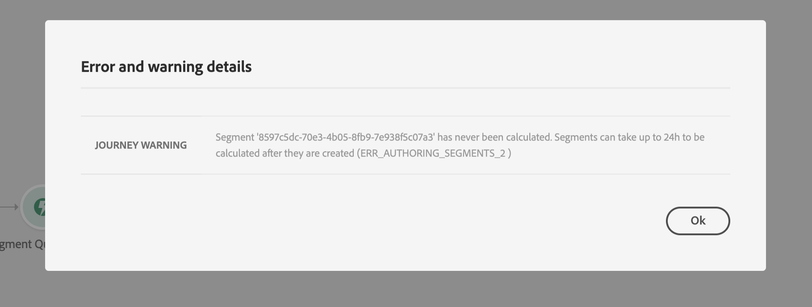

# 區段資格事件 {#segment-qualification}

## 關於段資格事件{#about-segment-qualification}

本活動可讓您的歷程聆聽 Adobe Experience Platform 區段中設定檔的入口和出口，讓個人得以在歷程中進入或前進。有關段建立的詳細資訊，請參閱 [節](../segment/about-segments.md)。

假設您有「銀色客戶」部分。 通過本練習，您可以讓所有新的銀發客戶輸入行程併發送一系列個性化消息。

此類事件可以定位為旅程的第一步或稍後的步驟。

>[!IMPORTANT]
>
>請記住，Adobe Experience Platform段的計算日數為一次(**批** 段)或即時(**流式** 段，使用Adobe Experience Platform的高頻觀眾選項)。
>
>如果對所選段進行流式處理，則屬於該段的個人可能會即時進入該行程。 如果段是批，則新符合此段資格的人員可能會在段計算在Adobe Experience Platform執行時輸入行程。

1. 展開 **[!UICONTROL Events]** 類別並刪除 **[!UICONTROL Segment qualification]** 活動到畫布中。

   

1. 添加 **[!UICONTROL Label]** 的子菜單。 此步驟為選填。

1. 按一下 **[!UICONTROL Segment]** 欄位，然後選擇要利用的段。

   >[!NOTE]
   >
   >請注意，您可以自定義清單中顯示的列並對其進行排序。

   

   添加段後， **[!UICONTROL Copy]** 按鈕，您可以複製其名稱和ID:

   `{"name":"Loyalty membership“,”id":"8597c5dc-70e3-4b05-8fb9-7e938f5c07a3"}`

   

1. 在 **[!UICONTROL Behaviour]** 欄位中，選擇是要收聽段入口、出口還是兩者。

   >[!NOTE]
   >
   >請注意 **[!UICONTROL Enter]** 和 **[!UICONTROL Exit]** 與 **已實現** 和 **已退出** 從Adobe Experience Platform分部參與狀態。 有關如何評估段的詳細資訊，請參閱 [分段服務文檔](https://experienceleague.adobe.com/docs/experience-platform/segmentation/tutorials/evaluate-a-segment.html?lang=en#interpret-segment-results)。

1. 選擇命名空間。 只有在將事件定位為旅程的第一步時，才需要這樣做。

   

負載包含以下上下文資訊，您可以在條件和操作中使用這些資訊：

* 行為（入口、出口）
* 限定時間戳
* 段ID

在以下條件或操作中使用表達式編輯器時 **[!UICONTROL Segment qualification]** 活動，您有權訪問 **[!UICONTROL SegmentQualification]** 的下界。 您可以在 **[!UICONTROL Last qualification time]** 和 **[!UICONTROL status]** （進入或退出）。

請參閱 [條件活動](../building-journeys/condition-activity.md#about_condition)。

包括段資格活動的新行程在您發佈後10分鐘內開始運行。 該時間間隔對應於專用服務的快取刷新間隔。 因此，您必須等待10分鐘才能使用此行程。

## 最佳做法 {#best-practices-segments}

的 **[!UICONTROL Segment Qualification]** 該活動使獲得資格或被取消資格的個人能夠立即進入Adobe Experience Platform段。

這種資訊的接收速度很快。 所做的測量顯示每秒接收10 000個事件的速度。 因此，你應該確保你明白入口的高峰是如何發生的，如何避開它們，以及如何讓你的旅程為它們做好準備。

### 批段{#batch-speed-segment-qualification}

使用批處理段的段資格時，請注意，在每日計算時將出現入口高峰。 峰值的大小取決於每天進入（或退出）該段的個人數。

此外，如果批段是新建立的並立即用於行程，則第一批計算可能會使很多人進入行程。

### 流式分段{#streamed-speed-segment-qualification}

當為流式傳輸的分部使用分部資格時，由於對分部持續進行評估，導致出入/出口高峰的風險較小。 不過，如果細分定義導致大量客戶同時獲得資格，那麼也可能會達到峰值。

有關流分段的詳細資訊，請參閱 [頁](https://experienceleague.adobe.com/docs/experience-platform/segmentation/api/streaming-segmentation.html#api)

### 如何避免過載{#overloads-speed-segment-qualification}

以下是一些有助於避免使系統超載的最佳實踐(資料源、自定義操作、Adobe Campaign Standard操作)。

不在 **[!UICONTROL Segment Qualification]** 活動，即建立後立即的批段。 避免了第一個計算峰。 請注意，如果您將要使用從未計算過的段，行程畫布中將出現黃色警告。

為資料源和行程中使用的操作設定上限規則，以避免超載（請參閱此） [節](../api/capping.md))。 請注意，上限設定規則沒有重試。 如果需要重試，必須選中該框，在行程中使用替代路徑 **[!UICONTROL Add an alternative path in case of a timeout or an error]** 或操作。

在生產過程中使用該段之前，始終首先評估每天符合此段條件的人數。 為此，您可以檢查 **[!UICONTROL Segments]** 在Adobe Experience Platform上，看右邊的圖。

