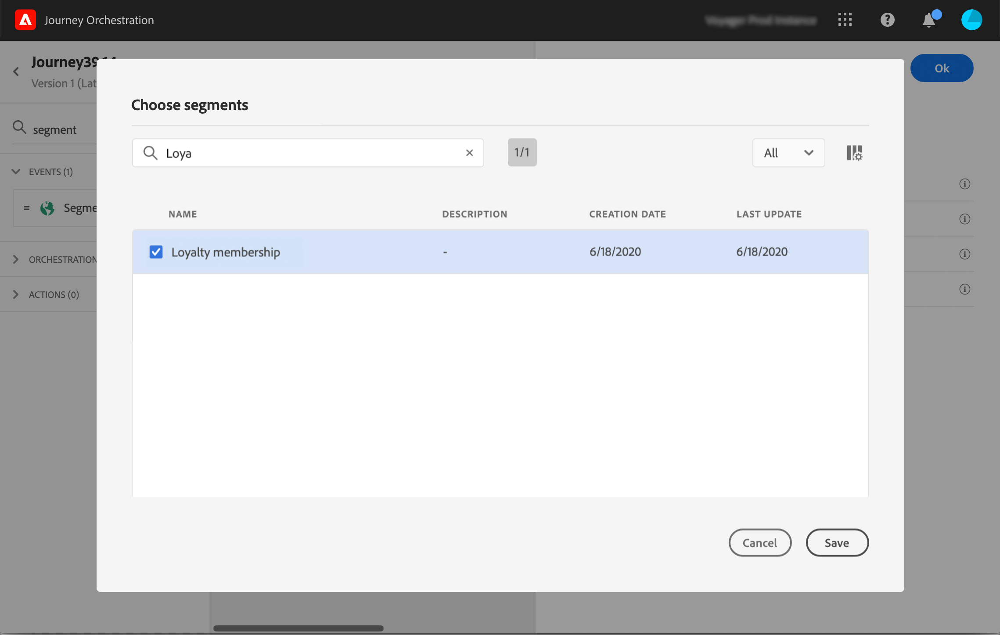

# 細分資格篩選事件 {#segment-qualification}

>[!CAUTION]
>
>**正在尋找Adobe Journey Optimizer**？ 如需Journey Optimizer檔案，請按一下[這裡](https://experienceleague.adobe.com/zh-hant/docs/journey-optimizer/using/ajo-home){target="_blank"}。
>
>
>_本檔案參考已由Journey Optimizer取代的舊版Journey Orchestration資料。 如果您對Journey Orchestration或Journey Optimizer的存取權有任何疑問，請聯絡您的帳戶團隊。_

## 關於區段資格事件{#about-segment-qualification}

此活動可讓您的歷程聆聽Adobe Experience Platform區段中設定檔的入口和出口，讓個人進入歷程或是在歷程中前進。 如需建立區段的詳細資訊，請參閱此[區段](../segment/about-segments.md)。

假設您有「銀級客戶」區段。 透過此活動，您可以讓所有新的銀級客戶進入歷程，並向他們傳送一系列個人化訊息。

此類事件可定位為歷程的第一步或後續步驟。

>[!IMPORTANT]
>
>請記住，Adobe Experience Platform段是每天計算一次（**批量** 區段）或實時&#x200B;**計算（流式** 區段，使用 Adobe Experience Platform 的高頻Audiences選項）。
>
>如果所選區段已流式傳輸，則屬於此區段的個人可能會實時進入旅程。 如果區段為批次，則新符合此區段資格的人可能會在Adobe Experience Platform上執行區段計算時進入歷程。

1. 展開&#x200B;**[!UICONTROL Events]**&#x200B;類別並將&#x200B;**[!UICONTROL Segment qualification]**&#x200B;活動拖放到畫布中。

   

1. 將&#x200B;**[!UICONTROL Label]**&#x200B;新增至活動。 此步驟為選填。

1. 按一下「**[!UICONTROL Segment]**」欄位，然後選取您要使用的區段。

   >[!NOTE]
   >
   >請注意，您可以自訂清單中顯示的欄並加以排序。

   

   新增區段後，**[!UICONTROL Copy]**&#x200B;按鈕可讓您複製其名稱和ID：

   `{"name":"Loyalty membership","id":"8597c5dc-70e3-4b05-8fb9-7e938f5c07a3"}`

   

1. 在&#x200B;**[!UICONTROL Behaviour]**&#x200B;欄位中，選擇您要聆聽區段入口、出口或兩者。

   >[!NOTE]
   >
   >請注意，**[!UICONTROL Enter]**&#x200B;和&#x200B;**[!UICONTROL Exit]**&#x200B;對應至Adobe Experience Platform中的&#x200B;**已實現**&#x200B;和&#x200B;**已退出**&#x200B;區段參與狀態。 如需如何評估區段的詳細資訊，請參閱[Segmentation Service檔案](https://experienceleague.adobe.com/docs/experience-platform/segmentation/tutorials/evaluate-a-segment.html?lang=en#interpret-segment-results)。

1. 選取名稱空間。 只有在將事件定位為歷程的第一步時，才需要此專案。

   

裝載包含以下內容資訊，您可在條件和動作中使用：

* 行為（入口、出口）
* 資格的時間戳記
* 區段id

在&#x200B;**[!UICONTROL Segment qualification]**&#x200B;活動之後的條件或動作中使用運算式編輯器時，您有權存取&#x200B;**[!UICONTROL SegmentQualification]**&#x200B;節點。 您可以選擇&#x200B;**[!UICONTROL Last qualification time]**&#x200B;與&#x200B;**[!UICONTROL status]** （進入或退出）。

檢視[條件活動](../building-journeys/condition-activity.md#about_condition)。

包含區段資格事件的新歷程在發佈後10分鐘即可運作。 此時間間隔對應到專用服務的快取重新整理間隔。 因此，您必須等待10分鐘才能使用此歷程。

## 最佳作法 {#best-practices-segments}

該 **[!UICONTROL Segment Qualification]** 活動使獲得Adobe Experience Platform區段資格或取消資格的個人能夠立即進入旅程。

這些資訊的接收速度很高。 測量顯示每秒接收 10,000 個事件的速度。 因此，您應該確保瞭解入口尖峰可能如何發生、如何避免以及如何讓您的歷程準備好迎接他們。

### 批次區段{#batch-speed-segment-qualification}

針對批次區段使用區段資格時，請注意，入口尖峰將發生在每日計算時。 尖峰的大小將取決於每天進入（或退出）區段的個人數量。

此外，如果在歷程中新建立並立即使用批次區段，則第一批計算可能會讓大量個人進入歷程。

### 串流區段{#streamed-speed-segment-qualification}

針對串流區段使用區段資格時，由於持續評估區段，入口/出口出現大型峰值的風險較低。 然而，如果區段定義導致大量客戶同時符合資格，則也可能出現峰值。

如需串流區段的詳細資訊，請參閱此[頁面](https://experienceleague.adobe.com/docs/experience-platform/segmentation/api/streaming-segmentation.html#api)

### 如何避免多載{#overloads-speed-segment-qualification}

以下是將有助於避免讓歷程中所運用的系統(資料來源、自訂動作、Adobe Campaign Standard動作)過載的一些最佳做法。

在&#x200B;**[!UICONTROL Segment Qualification]**&#x200B;活動中，請勿在建立批次區段後立即使用該批次區段。 它會避免第一個計算尖峰。 請注意，如果您即將使用從未計算的區段，歷程畫布中將會出現黃色警告。

為歷程中使用的資料來源和動作設定上限規則，以避免其過載（請參閱此[區段](../api/capping.md)）。 請注意，上限規則沒有重試。 如果您需要重試，則必須在條件或動作中核取方塊&#x200B;**[!UICONTROL Add an alternative path in case of a timeout or an error]**，以在歷程中使用替代路徑。

在生產旅程中使用區段之前，請始終首先評估每天有資格獲得此區段的人員數量。 若要這麼做，您可以檢查Adobe Experience Platform中的&#x200B;**[!UICONTROL Segments]**&#x200B;區段，並檢視右側的圖表。

