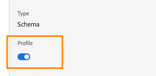

# 歷程步驟分享概觀{#sharing-overview}

[!DNL Journey Orchestration] 自動傳送歷程績效資料至Adobe Experience Platform，以便與其他資料結合以進行分析。

例如，您已設定傳送多封電子郵件的歷程。 這項功能可讓您將資料與 [!DNL Journey Orchestration] 下游事件資料結合，例如發生多少轉換、網站上發生多少參與，或在商店中發生多少交易。 旅程資訊可與平台上的資料結合，不論是來自其他數位屬性或離線屬性，以提供更完整的效能檢視。

[!DNL Journey Orchestration] 自動將個人在歷程中每個步驟的必要架構和串流建立至Platform的資料集。 步驟事件對應於在歷程中從一個節點移動到另一個節點的個人。 例如，在具有事件、條件和動作的歷程中，會傳送三個步驟事件至平台。

傳遞的XDM欄位清單是完整的。 有些包含系統產生的程式碼，有些則有人類可讀的好記名稱。 範例包括歷程活動的標籤或步驟狀態： 動作逾時或錯誤結束的次數。

>[!CAUTION]
>
>根據預設，即時設定檔服務不會開啟資料集。 如果您想要在描述檔服務中建立資料集，您必須開啟它(描述檔&#x200B;**切換** )。 請注意，大量事件將佔用您的配額中的儲存空間。 在啟用資料集以取得描述檔之前，請謹慎進行
>
>

>[!NOTE]
>
>Journeys也可以決定是否傳送「Journey Step Profile」（歷程步驟描述檔）活動至平台。 Journeys會透過技術切換來決定這個問題。
>
>

歷程會以串流方式在資料發生時傳送資料。 您可以使用查詢服務查詢此資料。 您可以連線至客戶歷程分析或其他BI工具，以檢視與這些步驟相關的資料。

將建立以下結構：

* 歷程步驟描述檔事 [!DNL Journey Orchestration] 件結構——體驗事件，以瞭解在歷程中執行的步驟以及用於對應至個別歷程參與者的身分地圖。
* 旅程步驟事 [!DNL Journey Orchestration] 件架構——系結至歷程中繼資料的歷程步驟事件。
* 使用Journey Fields for [!DNL Journey Orchestration] - Journey Metadata描述Journeys的旅程架構。

傳遞下列資料集：

* Journey Step Profile Event架構 [!DNL Journey Orchestration]
* 歷程步驟活動
* 旅程

傳遞至平台的XDM欄位清單詳列如下：

* [journeySteps事件常見欄位](../building-journeys/sharing-common-fields.md)
* [journeyStep事件動作執行欄位](../building-journeys/sharing-execution-fields.md)
* [journeyStep事件資料擷取欄位](../building-journeys/sharing-fetch-fields.md)
* [journeyStep事件識別欄位](../building-journeys/sharing-identity-fields.md)
* [旅程欄位](../building-journeys/sharing-journey-fields.md)

