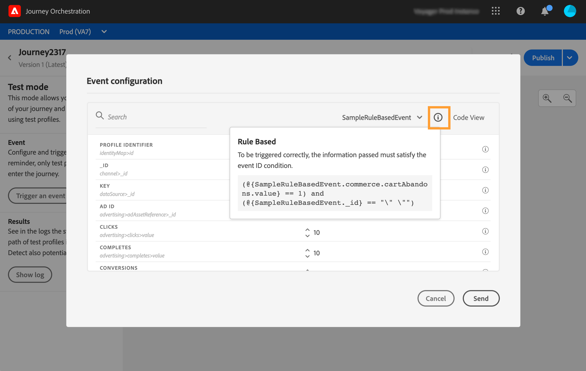

# 測試歷程{#testing_the_journey}

在能夠測試您的歷程之前，您必須解決所有錯誤（如果有的話）。 請參閱[本節](../about/troubleshooting.md#section_h3q_kqk_fhb)。

您可以使用測試設定檔，在發佈歷程之前測試歷程。 這可讓您分析個人在歷程中的流動方式並在發佈前進行疑難排解。

只有測試設定檔才能進入旅程測試模式。您可以建立新的測試設定檔，或將現有的設定檔轉換為測試設定檔。 請參閱本[章節](../building-journeys/creating-test-profiles.md)。

若要使用測試模式，請遵循下列步驟：

1. 測試您的歷程之前，請先確認歷程有效且沒有錯誤。 您將無法啟動含有錯誤的歷程測試。 請參閱[本節](../about/troubleshooting.md#section_h3q_kqk_fhb)。發生錯誤時，會顯示警告符號。

1. 若要啟動測試模式，請按一下 **[!UICONTROL Test]** 切換，位於右上角。

   

1. 使用 **[!UICONTROL Wait time]** 引數，定義每個等待活動和事件逾時在測試模式中的持續時間。 等待和事件逾時的預設時間為10秒。 這將確保您能快速獲得測試結果。 此引數只會在您已在歷程中捨棄一或多個等待活動時顯示。

   

   >[!NOTE]
   >
   >當歷程中使用具有逾時的回應事件時，等待時間的預設值及最小值為40秒。 請參閱[本節](../building-journeys/reaction-events.md)。

1. 按一下 **[!UICONTROL Trigger an event]** 以設定事件並傳送至歷程。

   

1. 設定所需的不同欄位。 在 **設定檔識別碼** 欄位，輸入用於識別測試設定檔的欄位值。 例如，可以是電子郵件地址。 請務必傳送與測試設定檔相關的事件。 另請參閱 [引發您的事件](#firing_events).

   

1. 收到事件後，按一下 **[!UICONTROL Show log]** 按鈕以檢視測試結果並進行驗證。 另請參閱 [檢視記錄](#viewing_logs).

   

1. 如果發生任何錯誤，請停用測試模式、修改您的歷程並再次測試。當測試得出結果時，您可以發佈您的歷程。 請參閱[此頁面](../building-journeys/publishing-the-journey.md)。

## 重要備註 {#important_notes}

* 提供介面以觸發事件至測試的歷程，但事件也可以由第三方系統(例如Postman)傳送。
* 只有即時客戶設定檔服務中標示為「測試設定檔」的個人才能進入測試歷程。 請參閱本[章節](../building-journeys/creating-test-profiles.md)。
* 測試模式僅適用於使用名稱空間的草稿歷程。 測試模式需要檢查進入歷程的人員是否為測試設定檔，因此必須能夠存取Adobe Experience Platform。
* 在測試工作階段中可以進入歷程的測試設定檔最大數量為100。
* 停用測試模式時，它會從過去進入該模式或目前進入該模式的所有人員中清空歷程。 這樣也會清除報表。
* 您可以視需要多次啟用/停用測試模式。
* 測試模式啟用時，您無法修改歷程。 在測試模式中，您可以直接發佈歷程，之前不需要停用測試模式。
* 達到分割時，一律選擇頂端分支。 如果您希望測試選擇不同的路徑，可以重新組織分割分支的位置。
* 為了最佳化效能及避免過時資源的使用，所有處於測試模式且一週內未觸發的歷程將切換回草稿狀態。

## 將設定檔轉換為測試設定檔{#turning-profile-into-test}

您可以將現有的設定檔轉換為測試設定檔。 在Adobe Experience Platform中，您可以透過API呼叫更新設定檔屬性，但無法透過介面執行。

最簡單的方法是使用 **更新設定檔** 動作活動，並將測試設定檔布林欄位從false變更為true。 請參閱[本節](../building-journeys/update-profiles.md#using-the-test-mode)。

## 建立測試設定檔{#create-test-profile}

如果您想要建立新的測試設定檔，程式與在Adobe Experience Platform中建立設定檔時相同。 這會透過API呼叫執行。 檢視此 [頁面](https://experienceleague.adobe.com/docs/experience-platform/profile/home.html?lang=zh-Hant)

您必須使用包含「設定檔測試詳細資料」mixin的設定檔結構描述。 testProfile旗標是此mixin的一部分。

建立設定檔時，請務必傳遞值： testProfile = true。

請注意，您也可以更新現有的設定檔，將其testProfile標幟變更為「true」。

以下為建立測試設定檔的API呼叫範例：

```
curl -X POST \
'https://dcs.adobedc.net/collection/xxxxxxxxxxxxxx' \
-H 'Cache-Control: no-cache' \
-H 'Content-Type: application/json' \
-H 'Postman-Token: xxxxx' \
-H 'cache-control: no-cache' \
-H 'x-api-key: xxxxx' \
-H 'x-gw-ims-org-id: xxxxx' \
-d '{
"header": {
"msgType": "xdmEntityCreate",
"msgId": "xxxxx",
"msgVersion": "xxxxx",
"xactionid":"xxxxx",
"datasetId": "xxxxx",
"imsOrgId": "xxxxx",
"source": {
"name": "Postman"
},
"schemaRef": {
"id": "https://example.adobe.com/mobile/schemas/xxxxx",
"contentType": "application/vnd.adobe.xed-full+json;version=1"
}
},
"body": {
"xdmMeta": {
"schemaRef": {
"contentType": "application/vnd.adobe.xed-full+json;version=1"
}
},
"xdmEntity": {
"_id": "xxxxx",
"_mobile":{
"ECID": "xxxxx"
},
"testProfile":true
}
}
}'
```

## 引發您的事件 {#firing_events}

此 **[!UICONTROL Trigger an event]** 按鈕可讓您設定讓人員進入歷程的事件。

>[!NOTE]
>
>當您在測試模式中觸發事件時，會產生實際事件，這表示它也會點選聆聽此事件的其他歷程。

您必須先瞭解哪些設定檔在Adobe Experience Platform中標示為測試設定檔。 事實上，測試模式僅允許在歷程中這些設定檔，而且事件必須包含ID。 預期的ID取決於事件設定。 例如，可以是ECID或電子郵件地址。 需要將此索引鍵的值新增到 **設定檔識別碼** 欄位。

>[!NOTE]
>
>對於預期分項清單的欄位，會顯示下拉式清單。 只要選擇一個可用的值。

如果您的歷程包含多個事件，請使用下拉選單選取一個事件。然後，對於每個事件，設定傳遞的欄位和事件傳送的執行。介面可協助您在事件裝載中傳遞正確的資訊，並確保資訊型別正確無誤。 測試模式會儲存最後用於測試工作階段的引數以供稍後使用。


介面可讓您傳遞簡單事件引數。 如果您想要在事件中傳遞集合或其他進階物件，可以按一下 **[!UICONTROL Code View]** 檢視裝載的整個程式碼並加以修改。 例如，您可以複製並貼上技術使用者準備的事件資訊。


技術使用者也可以使用此介面來撰寫事件裝載和觸發事件，而不必使用協力廠商工具。

按一下 **[!UICONTROL Send]** 按鈕時，測試開始。 歷程中個人的進度以視覺流程表示。 當個人在歷程中移動時，路徑會逐步變成綠色。 如果發生錯誤，會在對應的步驟上顯示警告符號。 您可以將游標放在錯誤上以顯示有關錯誤的更多資訊，並存取完整的詳細資訊（如果有的話）。


當您在事件設定畫面中選取不同的測試設定檔，然後再次執行測試時，視覺流程會清除並顯示新個人的路徑。

在測試中開啟歷程時，顯示的路徑對應於上次執行的測試。

無論事件是透過介面或從外部觸發(例如使用Postman)，視覺流程都會運作。

## 規則型歷程的測試模式 {#test-rule-based}

測試模式也可用於使用規則型事件的歷程。 如需規則型事件的詳細資訊，請參閱 [此頁面](../event/about-events.md).

觸發事件時， **事件設定** 畫面可讓您定義要在測試中傳遞的事件引數。 您可以按一下右上角的工具提示圖示來檢視事件ID條件。 規則評估的每個欄位旁也提供工具提示。



有關如何使用測試模式的詳細資訊，請參閱 [此頁面](../building-journeys/testing-the-journey.md).

## 檢視記錄 {#viewing_logs}

此 **[!UICONTROL Show log]** 按鈕可讓您檢視測試結果。 此頁面以JSON格式顯示歷程的目前資訊。 按鈕可讓您複製整個節點。 您需要手動重新整理頁面以更新歷程的測試結果。


>[!NOTE]
>
>在測試記錄中，如果在呼叫協力廠商系統（資料來源或動作）時發生錯誤，則會顯示錯誤代碼和錯誤回應。

目前顯示在歷程中的個人（技術上稱為執行個體）數量。 以下是為個別使用者顯示的實用資訊：

* _Id_：個人在歷程中的內部ID。 這可用於偵錯。
* _currentstep_：個人在歷程中的步驟。 建議您為活動新增標籤，以便更輕鬆識別。
* _currentstep_ >階段：個人歷程的狀態（執行中、已完成、錯誤或逾時）。 請參閱下方以了解更多資訊。
* _currentstep_ > _extraInfo_：錯誤說明和其他內容相關資訊。
* _currentstep_ > _fetchErrors_：此步驟中發生擷取資料錯誤的相關資訊。
* _外部索引鍵_：事件中定義的索引鍵公式值。
* _擴充資料_：如果歷程使用資料來源，則為歷程已擷取的資料。
* _transitionHistory_：個人遵循的步驟清單。 對於事件，會顯示裝載。
* _actionExecutionErrors_ ：有關所發生錯誤的資訊。

以下是個人歷程的不同狀態：

* _執行中_：個人目前處於歷程中。
* _已完成_：個人位於歷程結尾。
* _錯誤_：個人在歷程中因錯誤而停止。
* _已逾時_：個人在歷程中停止，因為步驟耗費太多時間。

使用測試模式觸發事件時，會自動以來源名稱產生資料集。

使用測試模式觸發事件時，會自動以來源名稱產生資料集。

測試模式會自動建立體驗事件並將其傳送至Adobe Experience Platform。 此體驗事件的來源名稱是「Journey Orchestration測試事件」。
