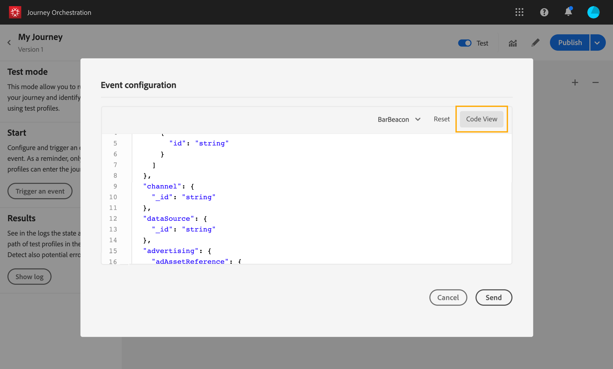

# 測試歷程{#testing_the_journey}

您必須先解決所有錯誤（若有），才能測試您的歷程。 請參閱[本節](../about/troubleshooting.md#section_h3q_kqk_fhb)。

您可以使用測試設定檔，在歷程發佈前先測試歷程。 這可讓您分析個人在歷程中的流程，並在發佈前進行疑難排解。

只有測試設定檔才能在測試模式中進入歷程。 您可以建立新的測試設定檔，或將現有設定檔轉換為測試設定檔。 請參閱 [節](../building-journeys/creating-test-profiles.md).

若要使用測試模式，請遵循下列步驟：

1. 在測試您的歷程之前，請先確認其有效且無錯誤。 您將無法啟動含有錯誤之歷程的測試。 請參閱[本節](../about/troubleshooting.md#section_h3q_kqk_fhb)。出現錯誤時，將顯示警告符號。

1. 若要啟動測試模式，請按一下 **[!UICONTROL Test]** 切換，位於右上角。

   

1. 使用 **[!UICONTROL Wait time]** 參數，在左下角，定義每個等待活動和事件逾時在測試模式中的持續時間。 等待和事件逾時的預設時間為10秒。 這可確保您快速取得測試結果。 只有在您的歷程中捨棄了一或多個等待活動時，才會顯示此參數。

   

   >[!NOTE]
   >
   >歷程中使用反應事件時，預設等候時間和最小值為40秒。 請參閱[本節](../building-journeys/reaction-events.md)。

1. 按一下 **[!UICONTROL Trigger an event]** 設定事件並將事件傳送至歷程。

   

1. 設定預期的不同欄位。 在 **設定檔識別碼** 欄位中，輸入用於識別測試設定檔的欄位值。 例如，可以是電子郵件地址。 請務必傳送與測試設定檔相關的事件。 請參閱 [引發事件](#firing_events).

   

1. 收到事件後，按一下 **[!UICONTROL Show log]** 按鈕，查看測試結果並驗證結果。 請參閱 [檢視記錄檔](#viewing_logs).

   

1. 如果發生任何錯誤，請停用測試模式、修改您的歷程並再次測試。當測試結果確定時，您可以發佈您的歷程。 請參閱[此頁面](../building-journeys/publishing-the-journey.md)。

## 重要備註 {#important_notes}

* 提供介面，以引發事件至測試的歷程，但事件也可由協力廠商系統（例如Postman）傳送。
* 只有在即時客戶個人檔案服務中標示為「測試個人檔案」的個人，才能進入測試的歷程。 請參閱 [節](../building-journeys/creating-test-profiles.md).
* 測試模式僅適用於使用命名空間的草稿歷程。 測試模式需要檢查進入歷程的人員是否為測試設定檔，因此必須能夠存取Adobe Experience Platform。
* 在測試工作階段期間，測試設定檔數量上限為100。
* 當您停用測試模式時，它會從過去或目前進入該模式的所有使用者處搶佔歷程。 也會清除報表。
* 您可以視需要多次啟用/停用測試模式。
* 啟動測試模式時，您無法修改您的歷程。 在測試模式中時，您可以直接發佈歷程，不需要先停用測試模式。
* 到達分割時，一律會選取頂端分支。 如果希望測試選擇不同的路徑，則可以重新組織拆分分支的位置。

## 將輪廓轉換為測試輪廓{#turning-profile-into-test}

您可以將現有設定檔轉換為測試設定檔。 在Adobe Experience Platform中，您可以透過API呼叫更新設定檔屬性，但無法透過介面執行。

要執行此作業，最簡單的方法是使用 **更新設定檔** 動作活動，並將測試設定檔布林欄位從false變更為true。 請參閱[本節](../building-journeys/update-profiles.md#using-the-test-mode)。

## 建立測試設定檔{#create-test-profile}

如果您想要建立新的測試設定檔，此程式與您在Adobe Experience Platform中建立設定檔時的程式相同。 會透過API呼叫執行。 看這個 [頁面](https://experienceleague.adobe.com/docs/experience-platform/profile/home.html?lang=zh-Hant)

您必須使用包含「設定檔測試詳細資料」的設定檔結構混合。 testProfile旗標是此混合的一部分。

建立設定檔時，請務必傳遞值：testProfile = true。

請注意，您也可以更新現有的設定檔，將其testProfile標幟變更為「true」。

以下是建立測試設定檔的API呼叫範例：

```
curl -X POST \
'https://dcs.adobedc.net/collection/xxxxxxxxxxxxxx' \
-H 'Cache-Control: no-cache' \
-H 'Content-Type: application/json' \
-H 'Postman-Token: xxxxx' \
-H 'cache-control: no-cache' \
-H 'x-api-key: xxxxx' \
-H 'x-gw-ims-org-id: xxxxx' \
-d '{
"header": {
"msgType": "xdmEntityCreate",
"msgId": "xxxxx",
"msgVersion": "xxxxx",
"xactionid":"xxxxx",
"datasetId": "xxxxx",
"imsOrgId": "xxxxx",
"source": {
"name": "Postman"
},
"schemaRef": {
"id": "https://example.adobe.com/mobile/schemas/xxxxx",
"contentType": "application/vnd.adobe.xed-full+json;version=1"
}
},
"body": {
"xdmMeta": {
"schemaRef": {
"contentType": "application/vnd.adobe.xed-full+json;version=1"
}
},
"xdmEntity": {
"_id": "xxxxx",
"_mobile":{
"ECID": "xxxxx"
},
"testProfile":true
}
}
}'
```

## 引發事件 {#firing_events}

此 **[!UICONTROL Trigger an event]** 按鈕可讓您設定讓人員進入歷程的事件。

>[!NOTE]
>
>當您在測試模式中觸發事件時，會產生一個實際事件，這表示它也會點擊聆聽此事件的其他歷程。

您必須知道哪些設定檔在Adobe Experience Platform中會標籤為測試設定檔。 事實上，測試模式只允許歷程中的這些設定檔，而事件必須包含ID。 預期的ID取決於事件設定。 例如，它可以是ECID或電子郵件地址。 此索引鍵的值需要新增至 **設定檔識別碼** 欄位。

>[!NOTE]
>
>會針對預期列舉的欄位顯示下拉式清單。 只需選取任一可用值即可。

如果您的歷程包含數個事件，請使用下拉式清單來選取事件。 然後，針對每個事件，設定傳遞的欄位以及事件傳送的執行。 介面可協助您在事件裝載中傳遞正確的資訊，並確定資訊類型正確無誤。 測試模式會儲存測試工作階段中使用的最後一個參數，以供稍後使用。


介面可讓您傳遞簡單事件參數。 如果要在事件中傳遞集合或其他高級對象，可以按一下 **[!UICONTROL Code View]** 來查看裝載的整個程式碼，並加以修改。 例如，您可以複製並貼上技術使用者準備的事件資訊。



技術使用者也可以使用此介面來撰寫事件裝載和觸發事件，而不需使用協力廠商工具。

按一下 **[!UICONTROL Send]** 按鈕，測試開始。 歷程中的個人進度會以視覺流程表示。 當個人在歷程中移動時，路徑會逐漸變成綠色。 如果發生錯誤，則在對應的步驟上會顯示警告符號。 您可以將游標置於其上以顯示有關錯誤的更多資訊，並訪問完整詳細資訊（如果可用）。


當您在事件設定畫面中選取不同的測試設定檔並再次執行測試時，會清除視覺流程並顯示新個人的路徑。

在測試中開啟歷程時，顯示的路徑對應於上次執行的測試。

不論事件是透過介面觸發還是從外部觸發（例如使用Postman），視覺流程皆可運作。

## 規則型歷程的測試模式 {#test-rule-based}

測試模式也適用於使用規則型事件的歷程。 如需規則型事件的詳細資訊，請參閱 [本頁](../event/about-events.md).

觸發事件時， **事件設定** 畫面可讓您定義要傳遞至測試的事件參數。 您可以按一下右上角的工具提示圖示，以檢視事件ID條件。 規則評估的每個欄位旁也會提供工具提示。


有關如何使用測試模式的詳細資訊，請參閱 [本頁](../building-journeys/testing-the-journey.md).

## 檢視記錄檔 {#viewing_logs}

此 **[!UICONTROL Show log]** 按鈕可讓您檢視測試結果。 本頁面以JSON格式顯示歷程的目前資訊。 按鈕可讓您複製整個節點。 您需要手動重新整理頁面，以更新歷程的測試結果。


>[!NOTE]
>
>在測試記錄中，如果在呼叫協力廠商系統（資料來源或動作）時發生錯誤，則會顯示錯誤碼和錯誤回應。

歷程中目前會顯示個人（技術上稱為例項）的人數。 以下是針對每個個人顯示的實用資訊：

* _Id_:歷程中的個人內部ID。 這可用於偵錯用途。
* _currentstep_:個人在歷程中的步驟。 建議您在活動中新增標籤，以便更輕鬆地加以識別。
* _currentstep_ >階段：個人歷程的狀態（執行中、完成、錯誤或逾時）。 請參閱參下方瞭解詳情。
* _currentstep_ > _extraInfo_:錯誤的說明和其他內容資訊。
* _currentstep_ > _fetchErrors_:有關此步驟期間發生的擷取資料錯誤的資訊。
* _externalKeys_:在事件中定義的鍵公式值。
* _chenchedData_:歷程使用資料來源時，歷程已擷取的資料。
* _transitionHistory_:個人遵循的步驟清單。 對於事件，會顯示裝載。
* _actionExecutionErrors_ :發生錯誤的相關資訊。

以下是個人歷程的不同狀態：

* _執行中_:個人目前在歷程中。
* _已完成_:個人位於歷程結束。
* _錯誤_:由於錯誤，個人會在歷程中停止。
* _超時_:由於步驟耗費太多時間，個人會在歷程中停止。

使用測試模式觸發事件時，資料集會以來源名稱自動產生。

使用測試模式觸發事件時，資料集會以來源名稱自動產生。

測試模式會自動建立體驗事件，並將其傳送至Adobe Experience Platform。 此體驗事件的來源名稱為「Journey Orchestration測試事件」。

若是從多個歷程觸發多個事件

從多個歷程傳送多個事件，且其結構不同時，即會發生此情況。 能否將結構對應至1個資料集？ 否則，將需要多個資料集。

如果體驗事件中未包含目標資料集，則會執行這些資料集的自動建立和命名。 這就是為什麼今天我們會看到「自動為旅行者建立資料集」。

源的命名驅動著自動建立。 如果有多個事件，則應串連，並將其設為「Journey Orchestration測試事件 — 結構名稱」。 這會自動轉換為「自動為Journey Orchestration測試事件產生的資料集 — 結構名稱」。
