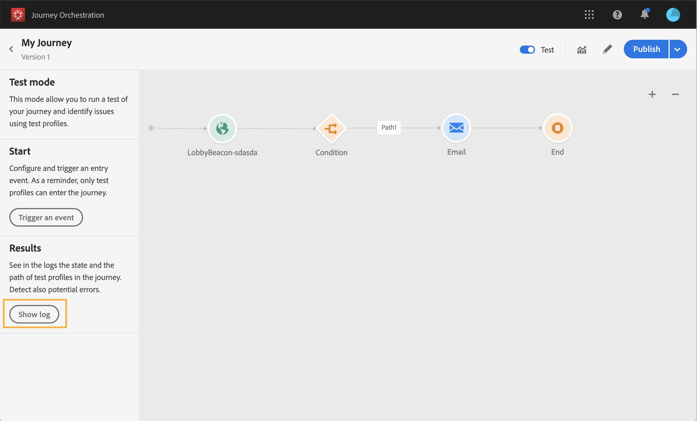

# 測試歷程{#testing_the_journey}

您必須先解決所有錯誤（如果有），才能測試您的旅程。 請參見[](../about/troubleshooting.md#section_h3q_kqk_fhb)。

您有可能在發佈之前，使用測試設定檔來測試您的旅程。 這可讓您分析個人在歷程中的流程，並在發佈前進行疑難排解。

若要使用測試模式，請依照下列步驟進行：

1. 在測試您的歷程之前，請先確認其有效且無錯誤。 您將無法針對有錯誤的歷程進行測試。 請參見[](../about/troubleshooting.md#section_h3q_kqk_fhb)。出現錯誤時會顯示警告符號。

1. 若要啟動測試模式，請按一下位 **[!UICONTROL Test]** 於右上角的切換。

   

1. 使用左 **下角的「在測試中等待時間** 」參數，定義每個等待活動在測試模式下的持續時間。 預設時間為 10 秒。這可確保您快速取得測試結果。 只有在您的歷程中丟棄了一個或多個等待活動時，才會顯示此參數。

   

1. 按一 **[!UICONTROL Trigger an event]** 下以設定並傳送活動至旅程。 請確定傳送與測試設定檔相關的事件。 請參 [閱觸發事件](#firing_events)。

   

1. 收到事件後，按一下按 **[!UICONTROL Show log]** 鈕以檢視測試結果並加以驗證。 請參 [閱查看日誌](#viewing_logs)。

   

1. 如果有任何錯誤，請停用測試模式、修改您的歷程並再次測試。 當測試結果確定時，您就可以發佈您的旅程。 請參見[](../building-journeys/publishing-the-journey.md)。

## 重要附註 {#important_notes}

* 提供一個介面，可將事件觸發至測試的歷程，但事件也可由第三方系統（例如Postman）傳送。
* 只有在即時客戶個人檔案服務中標示為「測試個人檔案」的個人才能進入測試的歷程。 請參見[](../building-journeys/testing-the-journey.md#create-test-profile)。
* 測試模式僅適用於使用命名空間的草稿歷程。 事實上，測試模式需要檢查進入旅程的人員是否是測試設定檔，因此必須能夠到達資料平台。
* 在測試階段作業中，測試描述檔的最大數量可超過進入歷程的次數為100。
* 當您停用測試模式時，它會佔用過去或目前已進入測試模式的所有人員的歷程。
* 您可以視需要多次啟用／停用測試模式。
* 您無法在啟動測試模式時修改歷程。 在測試模式中，您可以直接發佈歷程，而不需先停用測試模式。

## 建立測試設定檔{#create-test-profile}

建立測試描述檔的程式與在Experience Platform中建立描述檔的程式相同。 它是透過API呼叫來執行。 請參閱此 [頁](https://docs.adobe.com/content/help/zh-Hant/experience-platform/profile/home.html)

您必須使用包含「描述檔測試詳細資訊」混合的描述檔結構。 事實上，testProfile旗標是此混音的一部分。

建立描述檔時，請務必傳遞值： testprofile = true。

請注意，您也可以更新現有的描述檔，將其testProfile標幟變更為&quot;true&quot;。

以下是建立測試設定檔的API呼叫範例：

```
curl -X POST \
'https://example.adobe.com/collection/xxxxxxxxxxxxxx' \
-H 'Cache-Control: no-cache' \
-H 'Content-Type: application/json' \
-H 'Postman-Token: xxxxx' \
-H 'cache-control: no-cache' \
-H 'x-api-key: xxxxx' \
-H 'x-gw-ims-org-id: xxxxx' \
-d '{
"header": {
"msgType": "xdmEntityCreate",
"msgId": "xxxxx",
"msgVersion": "xxxxx",
"xactionid":"xxxxx",
"datasetId": "xxxxx",
"imsOrgId": "xxxxx",
"source": {
"name": "Postman"
},
"schemaRef": {
"id": "https://example.adobe.com/mobile/schemas/xxxxx",
"contentType": "application/vnd.adobe.xed-full+json;version=1"
}
},
"body": {
"xdmMeta": {
"schemaRef": {
"contentType": "application/vnd.adobe.xed-full+json;version=1"
}
},
"xdmEntity": {
"_id": "xxxxx",
"_mobile":{
"ECID": "xxxxx"
},
"testProfile":true
}
}
}'
```

## 觸發事件 {#firing_events}

按 **[!UICONTROL Trigger an event]** 鈕可讓您設定事件，讓人員進入歷程。

>[!NOTE]
>
>當您在測試模式中觸發事件時，會產生實際事件，這表示它也會點擊其他聆聽此事件的歷程。

作為先決條件，您必須知道哪些描述檔在「資料平台」中被標幟為測試描述檔。 事實上，測試模式僅允許在歷程中使用這些描述檔，而且事件必須包含ID。 預期的ID取決於事件設定。 例如，它可以是ECID。

如果您的歷程包含數個事件，請使用下拉式清單來選取事件。 然後，針對每個事件，設定傳遞的欄位和事件傳送的執行。 此介面可協助您在事件裝載中傳遞正確的資訊，並確保資訊類型正確無誤。 測試模式會儲存測試工作階段中使用的最後一個參數，以供日後使用。


此介面可讓您傳遞簡單事件參數。 如果您想要在事件中傳遞系列或其他進階物件，可以按一下， **[!UICONTROL Code View]** 查看裝載的整個程式碼並加以修改。 例如，您可以複製和貼上由技術使用者準備的事件資訊。


技術使用者也可以使用此介面來合成事件負載並觸發事件，而不需使用協力廠商工具。

按一下「傳 **送** 」按鈕時，測試開始。 個體在歷程中的進展由視覺流量表示。 當個人在旅程中移動時，路徑會逐漸變綠。 如果發生錯誤，警告符號會顯示在對應的步驟上。 您可以將游標置於其上，以顯示有關錯誤的更多資訊，並存取完整的詳細資料（如果有）。


當您在事件設定畫面中選取不同的測試設定檔並再次執行測試時，會清除視覺化流程並顯示新個人的路徑。

在測試中開啟歷程時，顯示的路徑會對應於上次執行的測試。

無論事件是透過介面觸發還是從外部觸發（例如使用Postman），視覺流程都能運作。

## 查看日誌 {#viewing_logs}

按 **[!UICONTROL Show log]** 鈕可讓您檢視測試結果。 此頁面以JSON格式顯示歷程的目前資訊。 一個按鈕允許您複製整個節點。 您需要手動重新整理頁面，以更新歷程的測試結果。


>[!NOTE]
>
>在測試日誌中，如果呼叫第三方系統（資料源或操作）時發生錯誤，則顯示錯誤代碼和錯誤響應。

此時會顯示目前在歷程中的個人（技術上稱為例項）數量。 以下是每個個人顯示的有用資訊：

* _Id_: 歷程中個人的內部ID。 這可用於除錯用途。
* _currentstep_: 個體在旅程中所處的階段。 我們建議將標籤新增至您的活動，以便更輕鬆地識別。
* _currentstep_ > phase: 個人歷程的狀態（執行、完成、錯誤或逾時）。 請參閱下方以取得詳細資訊。
* _currentstep_ > _extraInfo_: 錯誤的描述和其他上下文資訊。
* _currentstep_ > _fetchErrors_: 此步驟中發生的讀取資料錯誤的資訊。
* _externalKeys_: 在事件中定義的鍵公式值。
* _豐富的資料_: 旅程使用資料來源時所擷取的資料。
* _transitionHistory_: 個人遵循的步驟清單。 對於事件，會顯示裝載。
* _actionExecutionErrors_ : 錯誤的相關資訊。

以下是個人旅程的不同狀態：

* _正在運行_: 這個人目前正在旅程中。
* _完成_: 個人正處於旅程的盡頭。
* _錯誤_: 由於錯誤，個人在旅途中被停止。
* _超時_: 由於一個步驟花了太多時間，這個人在旅途中被攔住了。
