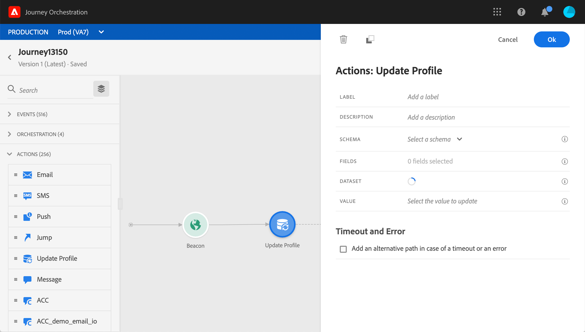
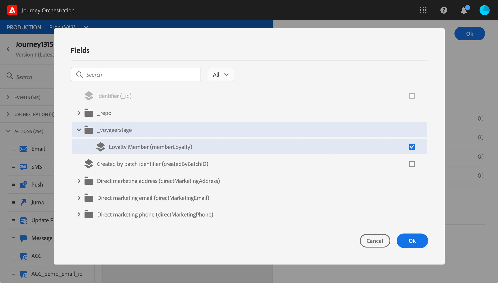
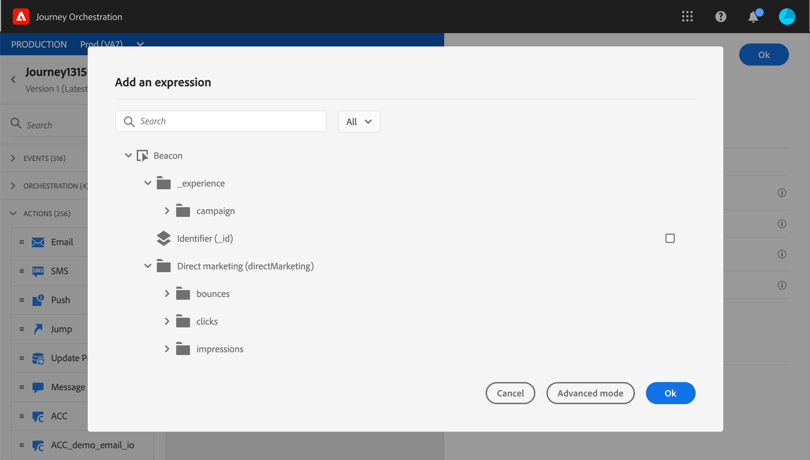
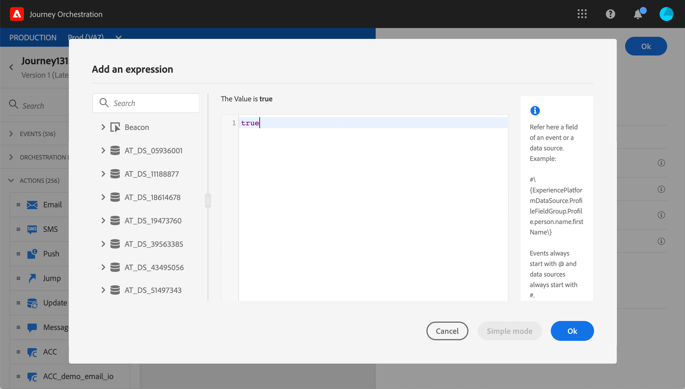

# 更新設定檔 {#update-profile}

的 **[!UICONTROL Update profile]** action活動允許您使用事件、資料源或使用特定值提供的資訊更新現有的Adobe Experience Platform配置檔案。

## 重要備註

* 的 **更新配置檔案** 只能在從具有命名空間的事件開始的行程中使用操作。
* 該操作僅更新現有欄位，不會建立新的配置檔案欄位。
* 不能使用 **更新配置檔案** 操作以生成體驗事件，例如採購。
* 與任何其他操作一樣，在出現錯誤或超時時，您可以定義替代路徑，並且不能並行放置兩個操作。
* 發送到平台的更新請求將快速，但不是立即/在一秒內。 通常需要幾秒，但有時還需要更多時間，而且無法保證。 因此，例如，如果操作使用的是「欄位1」，而更新配置檔案操作正在前面定位，則您不應期望在操作中更新「欄位1」。
* 在test模式下，將不模擬配置檔案更新。 將對test配置檔案執行更新。
* 的 **更新配置檔案** 活動不支援定義為枚舉的XDM欄位。

## 使用配置檔案更新

1. 從活動開始設計您的旅程。 請參閱[本章節](../building-journeys/journey.md)。

1. 在 **操作** 的下一頁 **更新配置檔案** 的下界。

   

1. 從清單中選擇一個架構。

1. 按一下 **欄位** 的子菜單。 只能選擇一個欄位。

   

1. 從清單中選擇資料集。

   >[!NOTE]
   >
   >的 **更新配置檔案** 操作即時更新配置檔案資料，但不更新資料集。 由於配置檔案是與資料集相關的記錄，所以需要資料集選擇。

1. 按一下 **值** 欄位以定義要使用的值：

   * 使用簡單表達式編輯器，可以從資料源或傳入事件中選擇一個欄位。

      

   * 如果要定義特定值或利用高級功能，請按一下 **高級模式**。

      

的 **更新配置檔案** 已配置。

