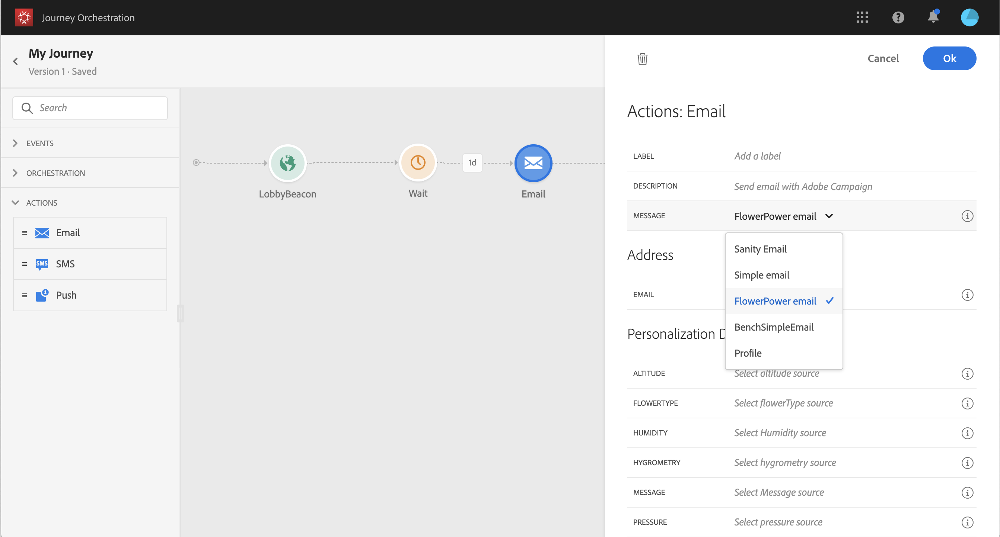
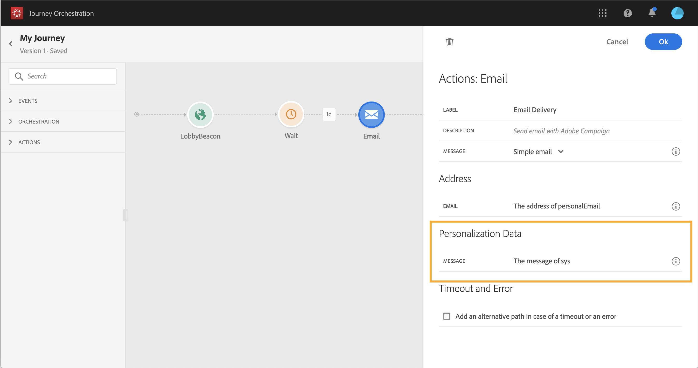

# 使用Adobe Campaign Standard {#using_campaign_action}

如果您有Adobe Campaign Standard，則可使用下列現成可用的動作活動：**[!UICONTROL Email]**、**[!UICONTROL Push]**&#x200B;和&#x200B;**[!UICONTROL SMS]**。

>[!NOTE]
>
>為此，您需要設定內建動作。 請參見[此頁面](../action/working-with-adobe-campaign.md)。

對於這些通道，請選擇Adobe Campaign Standard交易式消息&#x200B;**template**。 事實上，[!DNL Journey Orchestration]不是訊息傳送解決方案。 對於內建的電子郵件、簡訊和推播通道，我們依賴交易式訊息來執行訊息傳送。 這表示，如果您想在歷程中使用特定訊息範本，必須在Adobe Campaign Standard中發佈。 請參閱[本頁面](https://docs.adobe.com/content/help/zh-Hant/campaign-standard/using/communication-channels/transactional-messaging/about-transactional-messaging.html)以了解如何使用此功能。

>[!NOTE]
>
>必須發佈Campaign Standard交易式訊息及其相關事件，才能用於Journey Orchestration。 如果已發佈事件但未顯示訊息，則Journey Orchestration介面中將不會顯示該事件。 如果訊息已發佈，但其相關事件未發佈，則訊息會顯示在Journey Orchestration介面中，但無法使用。



您可以使用事件（也稱為即時）或設定檔交易式訊息範本。

>[!NOTE]
>
>當我們傳送即時交易式訊息(rtEvent)，或當我們透過協力廠商系統透過自訂動作傳送訊息時，需要特定設定才能進行疲勞、封鎖清單或取消訂閱管理。 例如，如果「取消訂閱」屬性儲存在Adobe Experience Platform或協力廠商系統中，則必須在訊息傳送前新增條件，以檢查此條件。

選取範本時，訊息裝載中預期的所有欄位會顯示在&#x200B;**[!UICONTROL Address]**&#x200B;和&#x200B;**[!UICONTROL Personalization Data]**&#x200B;下的活動設定窗格中。 您需要將每個欄位對應至您要使用的欄位，不論是來自事件或來自資料來源。 您也可以使用進階運算式編輯器手動傳遞值、對擷取的資訊執行資料處理（例如將字串轉換為大寫），或使用「if,then, else」等函式。 請參閱[本頁](../expression/expressionadvanced.md)。


## 電子郵件和簡訊 {#section_asc_51g_nhb}

對於&#x200B;**[!UICONTROL Email]**&#x200B;和&#x200B;**[!UICONTROL SMS]**，參數相同。

>[!NOTE]
>
>對於電子郵件，如果您使用設定檔交易式範本，取消訂閱機制會由Campaign Standard立即處理。 您只需在範本中新增&#x200B;**[!UICONTROL Unsubscription link]**&#x200B;內容區塊（[了解更多](https://docs.adobe.com/content/help/en/campaign-standard/using/communication-channels/transactional-messaging/about-transactional-messaging.html)）。 如果您使用事件型範本(rtEvent)，您必須在訊息中新增連結，將人員的電子郵件傳遞至URL參數，並指向取消訂閱的登陸頁面。 您需要建立此登錄頁面，並確認人員取消訂閱的決定已傳送至Adobe。

首先，您需要選擇交易式訊息範本。 請參見[此頁面](../building-journeys/about-action-activities.md)。

有兩個類別可供使用：**[!UICONTROL Address]**&#x200B;和&#x200B;**[!UICONTROL Personalization Data]**。

您可以使用介面輕鬆定義檢索&#x200B;**[!UICONTROL Address]**&#x200B;或&#x200B;**[!UICONTROL Personalization Data]**&#x200B;的位置。 您可以瀏覽事件和可用資料來源的欄位。 您也可以使用進階運算式編輯器來執行更進階的使用案例，例如使用需要傳遞參數或執行操作的資料來源。 請參閱[本頁](../expression/expressionadvanced.md)。

**[!UICONTROL Address]**

>[!NOTE]
>
>只有在您選取「事件」交易式訊息時，才會顯示此類別。 對於「profile」訊息，系統會自動從Adobe Campaign Standard擷取&#x200B;**[!UICONTROL Address]**&#x200B;欄位。

這些是系統需要知道要在何處發送消息的欄位。 若為電子郵件範本，則為電子郵件地址。 對於簡訊，是手機號碼。


**[!UICONTROL Personalization Data]**

>[!NOTE]
>
>您無法在個人化資料中傳遞集合。 如果交易式電子郵件或SMS預期集合，則無法運作。 另請注意，個人化資料具有預期的格式(範例：字串、小數等)。 您必須小心遵守這些預期的格式。

這些是Adobe Campaign Standard訊息預期的欄位。 這些欄位可用來個人化訊息、套用條件式格式，或選取特定訊息變體。



## 推播 {#section_im3_hvf_nhb}

使用推播活動之前，您的行動應用程式必須與Campaign Standard一起設定，才能傳送推播通知。 使用此[文章](https://helpx.adobe.com/tw/campaign/kb/integrate-mobile-sdk.html)為行動裝置執行必要的實作步驟。

首先，您必須從下拉式清單和交易式訊息中選擇行動應用程式。 請參閱[本頁](../building-journeys/about-action-activities.md)。


有兩個類別可供使用：**[!UICONTROL Target]**&#x200B;和&#x200B;**[!UICONTROL Personalization Data]**。

**[!UICONTROL Target]**

>[!NOTE]
>
>只有在您選取事件訊息時，才會顯示此類別。 對於設定檔訊息，系統會使用Adobe Campaign Standard執行的調解自動擷取&#x200B;**[!UICONTROL Target]**&#x200B;欄位。

在本節中，您需要定義&#x200B;**[!UICONTROL Push platform]**。 下拉式清單可讓您選取&#x200B;**[!UICONTROL Apple Push Notification Server]**(iOS)或&#x200B;**[!UICONTROL Firebase Cloud Messaging]**(Android)。 您也可以從事件或資料來源選取特定欄位，或定義進階運算式。

您也需要定義&#x200B;**[!UICONTROL Registration Token]**。 運算式取決於在事件裝載或其他[!DNL Journey Orchestration]資訊中定義代號的方式。 它可以是簡單欄位或更複雜的運算式，若是例項的集合中已定義代號：

```
@{Event_push._experience.campaign.message.profileSnapshot.pushNotificationTokens.first().token}
```

**[!UICONTROL Personalization Data]**

>[!NOTE]
>
>您無法在個人化資料中傳遞集合。 如果交易式推送預期集合，則無法運作。 另請注意，個人化資料具有預期的格式(範例：字串、小數等)。 您必須小心遵守這些預期的格式。

這些是Adobe Campaign Standard訊息中使用的交易式範本所預期的欄位。 這些欄位可用來個人化您的訊息、套用條件式格式，或選取特定的訊息變體。
