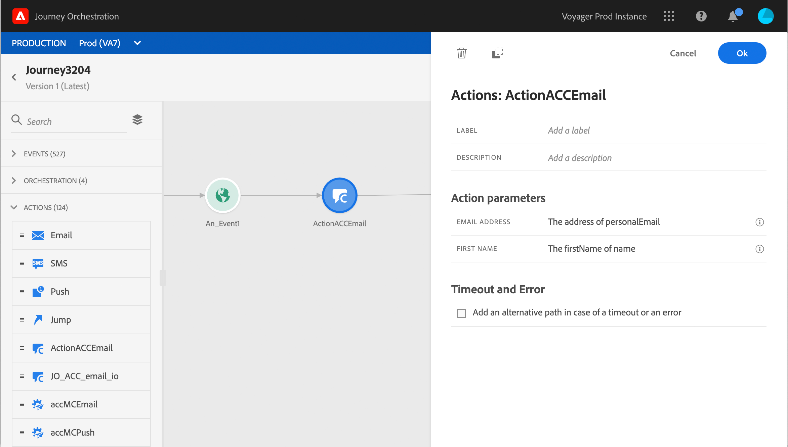

# 使用 Adobe Campaign v7/v8 {#using_campaign_classic}

如果您有Adobe Campaign v7或v8，則可使用整合。 它可讓您使用Adobe Campaign交易訊息功能來傳送電子郵件、推播通知和簡訊。

Journey Orchestration 與 Campaign 執行個體之間的連線在佈建時由 Adobe 設定。聯繫Adobe。

若要讓此功能發揮作用，您需要設定專用的動作。 請參閱 [節](../action/acc-action.md).

本節提供端對端使用案例 [節](../usecase/campaign-classic-use-case.md).

1. 從事件開始，設計您的歷程。 看這個 [節](../building-journeys/journey.md).
1. 在 **動作** 區段中，選取「促銷活動」動作並將其新增至您的歷程。
1. 在 **動作參數**，則會顯示訊息裝載中預期的所有欄位。 您需要將每個欄位對應至您要使用的欄位，不論是來自事件或來自資料來源。 這類似於自訂動作。 請參閱 [節](../building-journeys/using-custom-actions.md).

