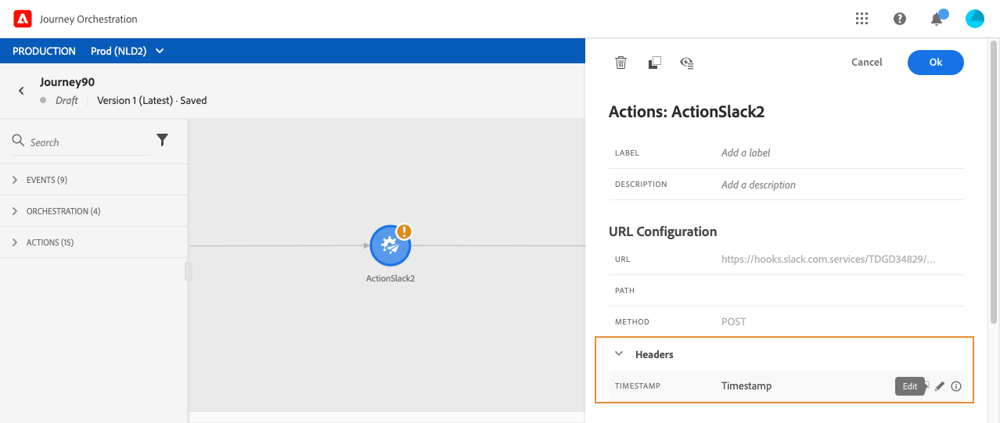

# 使用自訂動作 {#section_f2c_hbg_nhb}

活動設定窗格會顯示URL設定引數，以及為自訂動作設定的驗證引數。 [了解更多](../action/about-custom-action-configuration.md)。

## URL 組態

### 動態路徑

如果URL包含動態路徑，請在 **[!UICONTROL Path]** 欄位。

>[!NOTE]
>
>您無法在歷程中設定URL的靜態部分，但在自訂動作的全域設定中設定。 [了解更多](../action/about-custom-action-configuration.md)。

若要串連欄位和純文字字串，請使用字串函式或進階運算式編輯器中的加號(+)。 以單引號(&#39;)或雙引號(&#39;&#39;)括住純文字字串。 [了解更多](../expression/expressionadvanced.md)。

此表格顯示組態範例：

| 欄位 | 值 |
| --- | --- |
| URL | `https://xxx.yyy.com:8080/somethingstatic/` |
| 路徑 | `The id of marketingCampaign + '/messages'` |

串連的URL具有以下形式：

`https://xxx.yyy.com:8080/somethingstatic/`\&lt;campaign id=&quot;&quot;>`/messages`

### 標頭

此 **[!UICONTROL URL Configuration]** 區段顯示動態標頭欄位，但不顯示常數標頭欄位。 動態標頭欄位是HTTP標頭欄位，其值已設定為變數。 [了解更多](../action/about-custom-action-configuration.md)。

必要時，請指定動態標頭欄位的值：

1. 選取歷程中的自訂動作。
1. 在設定窗格中，按一下標題欄位旁的鉛筆圖示 **[!UICONTROL URL Configuration]** 區段。

   

1. 選取欄位並按一下 **[!UICONTROL OK]**.

## 動作引數

在 **[!UICONTROL Action parameters]** 區段，您會看到訊息引數定義為 _&quot;變數&quot;_. 對於這些引數，您可以定義從何處取得此資訊（例如：事件、資料來源）、手動傳遞值或使用進階運算式編輯器進行進階使用案例。 進階使用案例可以是資料操控和其他函式用途。 [了解更多](../expression/expressionadvanced.md)。

**相關主題**

[設定動作](../action/about-custom-action-configuration.md)
