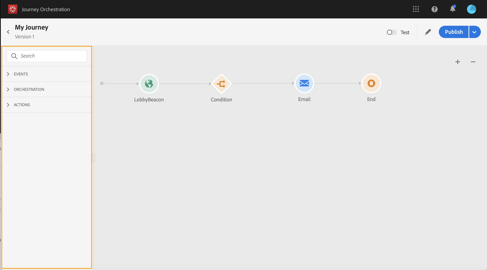
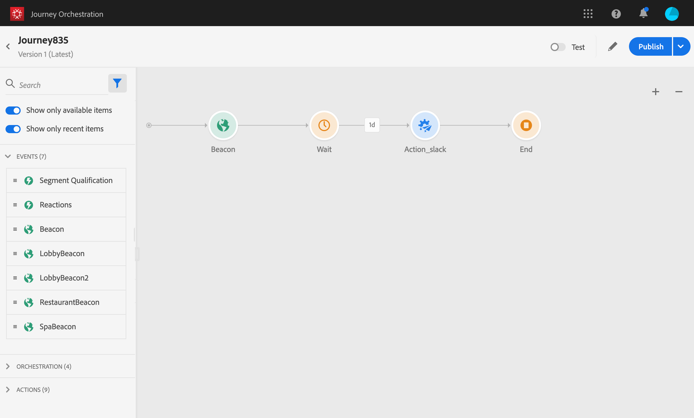
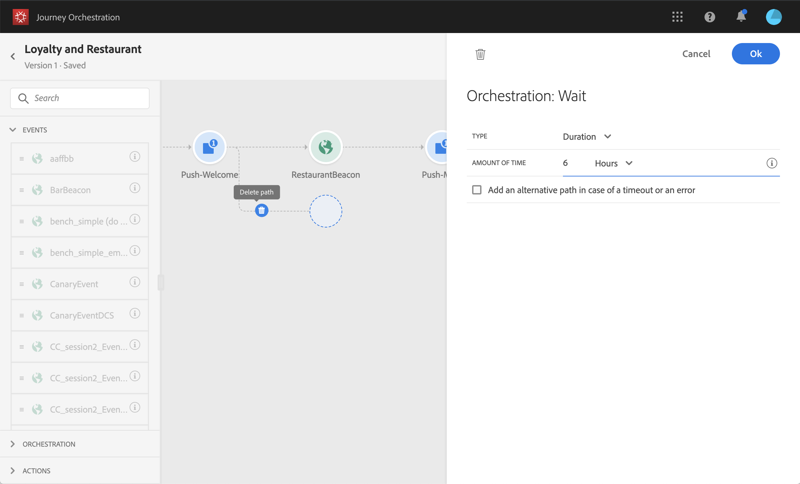

# 使用歷程設計器 {#concept_m1g_5qt_52b}

「首頁」(Journey Home)菜單允許您查看 **旅程清單**。 建立新行程或按一下現有行程以開啟 **旅程設計師介面**。 設計器由以下區域組成：調色板、畫布和活動配置窗格。

## 行程清單 {#journey_list}

的 **旅程清單** 允許您同時查看所有行程、查看其狀態並執行基本操作。 您可以複製、停止或刪除您的歷程。視歷程而定，某些動作可能無法使用。例如，您無法刪除或重新開始已關閉的歷程。您可以從中建立新版本、複製或停止它。 也可以使用搜尋列來搜尋歷程。

按一下清單左上方的篩選圖示，即可存取 **[!UICONTROL Filters]**。「篩選器」菜單允許您根據不同的條件（狀態、您建立的、在過去30天內修改的、僅最新版本等）篩選顯示的行程。 您也可以選擇只顯示使用特定事件、欄位組或操作的行程。 可以配置清單中顯示的列。 所有篩選器和列都按用戶保存。

所有版本的行程都顯示在包含版本號的清單中。 請參閱[此頁面](../building-journeys/journey-versions.md)。

>[!NOTE]
>
>要在不同的瀏覽器頁籤中開啟行程的畫布，請按住 **控制項** 或 **命令** 鍵，然後按一下旅程。

## 調色盤 {#palette}

的 **調色板** 在螢幕的左側。 所有可用活動都分為幾類： **[!UICONTROL Events]**。 **[!UICONTROL Orchestration]** 和 **[!UICONTROL Actions]**。 通過按一下不同類別的名稱，可以展開/折疊它們。 要在旅途中使用活動，請將其從調色板拖放到畫布中。 您也可以在下一步驟中按兩下調色板中的活動，將其添加到畫布中。 在發佈行程之前，必須配置從調色板添加的每個活動。 如果在畫布中放置活動，但未完成其配置，則活動將保留在畫布中，但紅色警告將指示尚未完成此活動的配置。

>[!NOTE]
>
>請注意，設定行程時有規則。 將放棄不允許的配置。 例如，您不能並行放置操作、將活動連結到上一步以建立循環、使用事件以外的其他內容開始行程等。

的 **[!UICONTROL Filter items]** 表徵圖在左上角顯示以下濾鏡：

* **僅顯示可用項**:隱藏或顯示調色板中不可用的元素，例如使用與旅途中使用的命名空間不同命名空間的事件。 依預設，系統會隱藏無法使用的項目。如果選擇顯示它們，則它們將顯示為灰色。

* **僅顯示最近的項目**:此篩選器允許您僅顯示使用的前五個事件和操作，而不是現成的事件和操作。 這特定於每位使用者。 預設情況下，所有項目都會顯示。 

您還可以使用 **[!UICONTROL Search]** 的子菜單。 只篩選事件和操作。

## 畫布 {#canvas}

的 **畫面** 是旅程設計師的中心地帶。 您可以在此區域中刪除活動並配置它們。 按一下畫布中的活動以配置它。 此操作將開啟右側的活動配置窗格。 可以使用右上角的「+」和「 — 」按鈕放大和縮小。 在畫布中，所有活動都允許您在它們之後添加下一步，但 **[!UICONTROL End]** 活動（請參見） [此頁](../building-journeys/end-activity.md))。

## 活動配置窗格 {#configuration_pane}

的 **活動配置窗格** 在元件面板中按一下活動時顯示。 填寫必填欄位。 按一下 **[!UICONTROL Delete]** 表徵圖以刪除活動。 按一下 **[!UICONTROL Cancel]** 取消修改或 **[!UICONTROL Ok]** 確認。 要刪除活動，還可以選擇一個活動（或多個），然後按回車鍵。 按轉義鍵將關閉活動配置窗格。

在畫布中，您的操作和事件活動由表徵圖表示，表徵圖下面顯示事件或操作的名稱。 在活動配置窗格中，可以使用 **[!UICONTROL Label]** 欄位，以向活動名稱添加尾碼。 這些標籤將幫助您將事件和操作的使用置於背景中，尤其是當您在旅途中多次使用同一事件或操作時。 您還將能夠查看在 [!DNL Journey Orchestration] 報告。 您也可以為條件活動定義標籤。

預設情況下，只讀欄位是隱藏的。 要顯示只讀欄位，請按一下 **顯示只讀欄位** 表徵圖。 此設定適用於所有行程中的所有活動。

## 頂欄操作 {#top_actions}

根據行程的狀態，您可以使用右上角的按鈕在行程中執行不同的操作： **[!UICONTROL Publish]**。 **[!UICONTROL Duplicate]**。 **[!UICONTROL Delete]**。 **[!UICONTROL Journey properties]**。 **[!UICONTROL Test]**。 未選擇任何活動時，將顯示這些按鈕。 某些按鈕將按上下文顯示。 激活test模式時，test模式日誌按鈕出現(請參閱 [此頁](../building-journeys/testing-the-journey.md))。 當行程即時、停止或關閉時，將顯示報告按鈕。

## 在畫布中使用路徑 {#paths}

若幹活動(**[!UICONTROL Condition]**。 **[!UICONTROL Action]** 活動)允許您在出現錯誤或超時時定義回退操作。 在活動配置窗格中，選中該框： **[!UICONTROL Add an alternative path in case of a timeout or an error]**。 在活動後添加另一個路徑。 超時持續時間在行程的屬性中定義(請參閱 [此頁](../building-journeys/changing-properties.md) 管理員用戶。 例如，如果電子郵件發送時間過長或出錯，您可以決定發送SMS。

各種活動（事件、操作、等待）允許您在其後添加多個路徑。 為此，請將游標置於活動上，然後按一下「+」符號。 只能並行設定事件和等待活動。 如果多個事件並行設定，則所選路徑將是第一個事件。

在收聽事件時，我們建議您不要無限期地等待事件。 它不是強制性的，只是最佳做法。 如果只想在某個時間內收聽一個或多個事件，則將並行放置一個或多個事件和等待活動。 請參閱[本節](../building-journeys/event-activities.md#section_vxv_h25_pgb)。

要刪除路徑，請將游標置於路徑上，然後按一下 **[!UICONTROL Delete arrow]** 表徵圖

在畫布中，當兩個活動斷開連接時，將顯示警告。 將游標置於警告表徵圖上以顯示錯誤消息。 要解決此問題，只需移動已斷開的活動並將其連接到上一活動即可。

## 複製和貼上活動 {#copy-paste}

您可以複製一個行程的一個或多個活動，並貼上到同一行程或另一個行程中。 如果要重新使用在上一次行程中已配置的許多活動，這樣您就可以節省時間。

**重要備註**

* 您可以跨不同的頁籤和瀏覽器複製/貼上。 您只能複製/貼上同一實例中的活動。
* 如果目標行程中的事件使用不同的命名空間，則無法複製/貼上事件。
* 貼上的活動可能會引用目標行程中不存在的資料，例如，如果您在不同沙箱之間複製/貼上。 始終檢查錯誤並進行所需的調整。
* 請注意，無法撤消操作。 要刪除貼上的活動，您需要選擇並刪除它們。 因此，請確保在複製活動之前僅選擇所需的活動。
* 您可以從任何行程複製活動，甚至只讀活動。
* 您可以選擇任何活動，即使是未連結的活動。 貼上後連結的活動將保持連結狀態。

以下是複製/貼上活動的步驟：

1. 開路。
1. 通過在按一下時移動滑鼠來選擇要複製的活動。 也可以在按 **Ctrl/命令** 按鈕 使用 **Ctrl/Command + A** 的子菜單。
   
1. 按 **Ctrl/Command + C**。
如果只想複製一個活動，可按一下該活動並使用 **複製** 表徵圖。
   
1. 在任何旅程中，按 **Ctrl/Command + V** 貼上活動，而不將其連結到現有節點。 貼上的活動按同一順序放置。 貼上後，活動將保持選定狀態，以便您可以輕鬆移動活動。 也可以將游標置於空佔位符上並點擊 **Ctrl/Command + V**。 貼上的活動將連結到節點。
   
