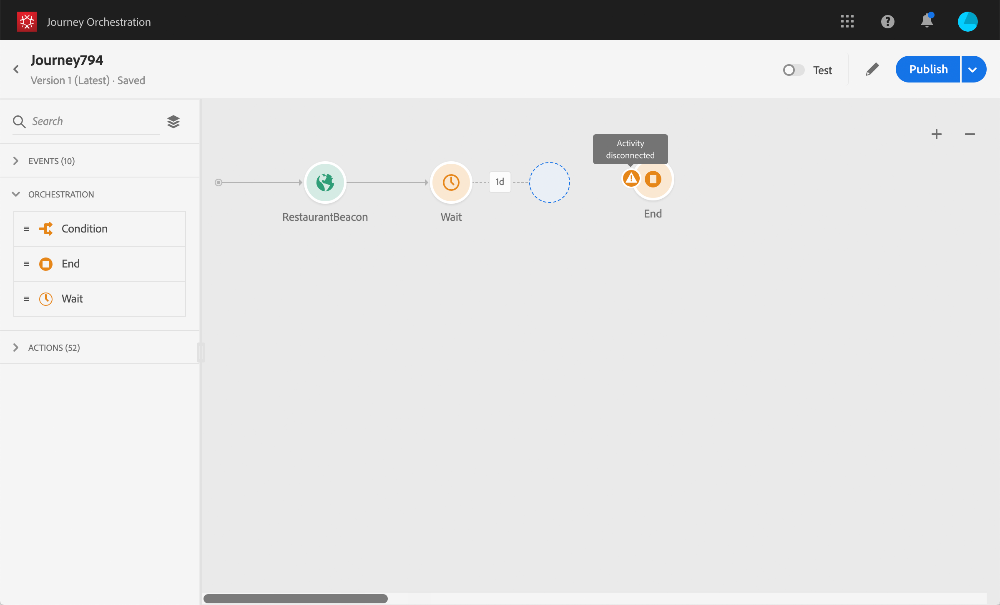

# 使用歷程設計器 {#concept_m1g_5qt_52b}

歷程首頁功能表可讓您檢視歷程&#x200B;**清單**。 建立新歷程或按一下現有歷程，以開啟&#x200B;**歷程設計器的介面**。 設計器由以下區域組成：浮動視窗、畫布和活動設定窗格。

## 歷程清單 {#journey_list}

**歷程清單**&#x200B;可讓您一次檢視所有歷程、查看其狀態並執行基本動作。 您可以複製、停止或刪除您的歷程。視歷程而定，某些動作可能無法使用。例如，您無法刪除或重新開始已關閉的歷程。您可以從中建立新版本、複製或停止。 也可以使用搜尋列來搜尋歷程。

按一下清單左上方的篩選圖示，即可存取 **[!UICONTROL Filters]**。篩選功能表可讓您根據不同的條件（狀態、您建立的狀態、在過去30天修改的狀態、僅最新版本等）篩選顯示的歷程。 您也可以選擇只顯示使用特定事件、欄位群組或動作的歷程。 清單上顯示的欄可以設定。 所有篩選器和欄會依每位使用者儲存。

您歷程的所有版本都會以版本號碼顯示在清單中。 請參閱[此頁面](../building-journeys/journey-versions.md)。

>[!NOTE]
>
>若要在不同的瀏覽器標籤中開啟歷程的畫布，請按住&#x200B;**Control**&#x200B;或&#x200B;**Command**&#x200B;鍵，然後按一下歷程。

## 浮動視窗 {#palette}

**浮動視窗**&#x200B;位於畫面左側。 所有可用活動皆分為數個類別：**[!UICONTROL Events]**、**[!UICONTROL Orchestration]**&#x200B;和&#x200B;**[!UICONTROL Actions]**。 您可以按一下不同類別的名稱，以展開/收合其他類別。 若要在歷程中使用活動，請將其從浮動視窗拖放至畫布中。 您也可以在下一個可用步驟中，連按兩下浮動視窗中的活動，以將其新增至畫布。 您必須先設定從浮動視窗新增的每個活動，才能發佈歷程。 如果您將活動拖曳至畫布中，但未完成其設定，活動會保留在畫布中，但會出現紅色警告，指出此活動的設定尚未完成。

>[!NOTE]
>
>請注意，設定歷程時有一些規則。 將捨棄不允許的配置。 例如，您無法同時放置動作、將活動連結至上一個步驟以建立回圈、以事件以外的其他方式啟動歷程，等等。

左上角的&#x200B;**[!UICONTROL Filter items]**&#x200B;圖示可讓您顯示下列篩選器：

* **僅顯示可用項目**:隱藏或顯示浮動視窗中無法使用的元素，例如使用與歷程中所用不同命名空間的事件。依預設，系統會隱藏無法使用的項目。如果您選擇顯示，則會顯示為灰色。

* **僅顯示最近的項目**:除了現成可用的事件和動作外，此篩選器還可讓您只顯示最近5個使用的事件和動作。這是每個使用者專屬的。 依預設，會顯示所有項目。

您也可以使用&#x200B;**[!UICONTROL Search]**&#x200B;欄位。

## 畫布 {#canvas}

**canvas**&#x200B;是歷程設計器中的中央區域。 您可以在此區域中放置活動並加以設定。 按一下畫布中的活動以進行設定。 這會開啟右側的活動設定窗格。 您可以使用右上角的「+」和「 — 」按鈕來放大和縮小。 在畫布中，所有活動都可讓您在活動後面新增下一個步驟，但活動&#x200B;**[!UICONTROL End]**&#x200B;除外（請參閱[此頁面](../building-journeys/end-activity.md)）。

## 活動設定窗格 {#configuration_pane}

按一下浮動視窗中的活動時，會顯示&#x200B;**活動設定窗格**。 填寫必填欄位。 按一下&#x200B;**[!UICONTROL Delete]**&#x200B;圖示以刪除活動。 按一下&#x200B;**[!UICONTROL Cancel]**&#x200B;取消修改，或按一下&#x200B;**[!UICONTROL Ok]**&#x200B;確認。 若要刪除活動，您也可以選取一個活動（或數個），然後按空格鍵。 按下逸出鍵會關閉活動設定窗格。

在畫布中，您的動作和事件活動會以圖示表示，而下方會顯示事件或動作的名稱。 在活動配置窗格中，可以使用&#x200B;**[!UICONTROL Label]**&#x200B;欄位向活動名稱添加尾碼。 這些標籤可協助您將事件和動作的使用方式與情境結合，尤其是當您在歷程中多次使用相同事件或動作時。 您也可以在[!DNL Journey Orchestration]報表中看到新增的標籤。 您也可以為條件活動定義標籤。

預設情況下，只讀欄位是隱藏的。 若要顯示唯讀欄位，請按一下活動配置窗格左上角的&#x200B;**顯示唯讀欄位**&#x200B;圖示。 此設定會套用至所有歷程中的所有活動。

## 頂端列動作 {#top_actions}

根據歷程的狀態，您可以使用右上角的按鈕，在歷程上執行不同的動作：**[!UICONTROL Publish]**、**[!UICONTROL Duplicate]**、**[!UICONTROL Delete]**、**[!UICONTROL Journey properties]**、**[!UICONTROL Test]**。 未選取任何活動時，這些按鈕就會顯示。 有些按鈕會根據內容顯示。 激活測試模式時，測試模式日誌按鈕將出現（請參見[此頁](../building-journeys/testing-the-journey.md)）。 歷程為即時、停止或關閉時，報表按鈕就會顯示。

## 在畫布中使用路徑 {#paths}

數個活動（**[!UICONTROL Condition]**、**[!UICONTROL Action]**&#x200B;活動）可讓您定義回退動作，以防發生錯誤或逾時。 在活動設定窗格中，核取方塊：**[!UICONTROL Add an alternative path in case of a timeout or an error]**。 活動後會新增另一個路徑。 逾時期間會在歷程的屬性中定義（請參閱管理員使用者[此頁面](../building-journeys/changing-properties.md)）。 例如，如果電子郵件太長而無法傳送或發生錯誤，您可以決定傳送簡訊。

各種活動（事件、動作、等待）可讓您在其後新增數個路徑。 要執行此操作，請將游標置於活動上，然後按一下「+」符號。 只能同時設定事件和等待活動。 如果同時設定多個事件，則選擇的路徑將是第一個發生的事件之一。

監聽事件時，建議您不要無限期等待事件。 這不是強制性的，只是最佳做法。 如果您只想在特定時間內監聽一或多個事件，您會同時放置一或多個事件和等待活動。 請參閱[本節](../building-journeys/event-activities.md#section_vxv_h25_pgb)。

若要刪除路徑，請將游標置於路徑上，然後按一下&#x200B;**[!UICONTROL Delete arrow]**&#x200B;圖示。

在畫布中，當兩個活動中斷連線時，會顯示警告。 將游標置於警告表徵圖上以顯示錯誤消息。 若要修正問題，只需移動已中斷連線的活動，並將其連線至上一個活動即可。

## 複製和貼上活動 {#copy-paste}

您可以複製歷程的一或多個活動，並貼到相同歷程或不同歷程中。 如果您想要重複使用先前歷程中已設定的許多活動，這可讓您節省時間。

**重要附註**

* 您可以在不同標籤和瀏覽器之間複製/貼上。 您只能複製/貼上相同例項內的活動。
* 如果目的地歷程的事件使用不同的命名空間，則無法複製/貼上事件。
* 貼上的活動可能會參照目標歷程中不存在的資料，例如當您複製/貼到不同的沙箱時。 始終檢查錯誤並進行必要的調整。
* 請注意，您無法還原動作。 若要刪除貼上的活動，您必須選取並刪除這些活動。 因此，請務必僅在複製活動之前選取您需要的活動。
* 您可以複製任何歷程中的活動，即使是唯讀的活動亦然。
* 您可以選取任何活動，甚至是未連結的活動。 連結的活動在貼上後會保持連結。

以下是複製/貼上活動的步驟：

1. 開啟歷程。
1. 按一下時移動滑鼠，以選取您要複製的活動。 按&#x200B;**Ctrl/Command**&#x200B;鍵時，您也可以按一下每個活動。 如果要選取所有活動，請使用&#x200B;**Ctrl/Command + A**。
   
1. 按&#x200B;**Ctrl/Command + C**鍵。
如果您只想複製一個活動，可以按一下該活動，然後使用活動配置窗格左上角的**Copy**圖示。
   
1. 在任何歷程中，按&#x200B;**Ctrl/Command + V**&#x200B;以貼上活動，而不需將其連結至現有節點。 貼上的活動會以相同順序放置。 貼上後，活動會保持選取狀態，以便您輕鬆移動活動。 您也可以將游標置於空的放置器上，然後按一下&#x200B;**Ctrl/Command + V**。 貼上的活動會連結至節點。
   
