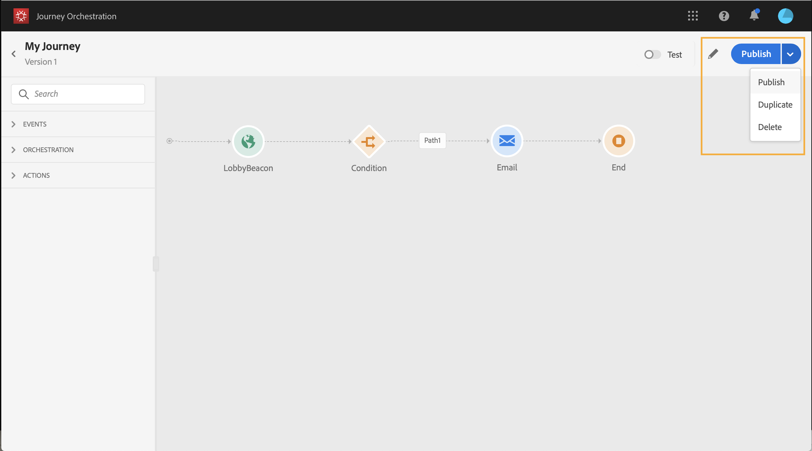

# 使用歷程設計器 {#concept_m1g_5qt_52b}

>[!CAUTION]
>
>**正在尋找Adobe Journey Optimizer**？ 如需Journey Optimizer檔案，請按一下[這裡](https://experienceleague.adobe.com/zh-hant/docs/journey-optimizer/using/ajo-home){target="_blank"}。
>
>
>_本檔案參考已由Journey Optimizer取代的舊版Journey Orchestration資料。 如果您對Journey Orchestration或Journey Optimizer的存取權有任何疑問，請聯絡您的帳戶團隊。_

歷程首頁功能表可讓您檢視歷程的&#x200B;**清單**。 建立新歷程或按一下現有歷程以開啟&#x200B;**歷程設計工具的介面**。 設計工具由下列區域組成：浮動視窗、畫布和活動設定窗格。

## 歷程清單 {#journey_list}

**歷程清單**&#x200B;可讓您一次檢視所有歷程、檢視其狀態並執行基本動作。 您可以複製、停止或刪除您的歷程。視歷程而定，某些動作可能無法使用。例如，您無法刪除或重新開始已關閉的歷程。您可以從中建立新版本、復製版本或停止版本。 也可以使用搜尋列來搜尋歷程。

按一下清單左上方的篩選圖示，即可存取 **[!UICONTROL Filters]**。篩選器功能表可讓您根據不同的條件（狀態、您建立的歷程、過去30天內修改的歷程、僅限最新版本等）來篩選顯示的歷程。 您也可以選擇只顯示使用特定事件、欄位群組或動作的歷程。 可以設定清單上顯示的欄。 所有篩選器和欄都會依使用者儲存。

您歷程的所有版本都會以版本編號顯示在清單中。 請參閱[此頁面](../building-journeys/journey-versions.md)。

>[!NOTE]
>
>若要在其他瀏覽器分頁中開啟歷程的畫布，請按住&#x200B;**Control**&#x200B;或&#x200B;**Command**&#x200B;鍵，然後按一下歷程。

## 調色盤 {#palette}

**浮動視窗**&#x200B;位於熒幕的左側。 所有可用的活動都分為幾個類別： **[!UICONTROL Events]**、**[!UICONTROL Orchestration]**&#x200B;和&#x200B;**[!UICONTROL Actions]**。 您可以按一下不同類別的名稱，以展開/收合不同類別。 若要在歷程中使用活動，請將其從浮動視窗拖放至畫布中。 您也可以在下一個可用步驟中，在浮動視窗中的活動上按兩下，將其新增至畫布。 發佈歷程之前，您必須設定從浮動視窗新增的每個活動。 如果您將活動拖放到畫布中而未完成其設定，則它會停留在畫布中，但紅色警告會指出此活動的設定未完成。

>[!NOTE]
>
>請注意，設定歷程時會有規則。 將會捨棄不允許的設定。 例如，您無法同時執行動作、將活動連結至上一個步驟以建立回圈、使用事件以外的其他專案開始歷程等。

左上角的&#x200B;**[!UICONTROL Filter items]**&#x200B;圖示可讓您顯示下列篩選器：

* **僅顯示可用的專案**：隱藏或顯示浮動視窗中無法使用的元素，例如使用與歷程所用名稱空間不同的名稱空間的事件。 依預設，會隱藏無法使用的專案。 如果您選擇顯示，這些區段將會顯示為灰色。

* **僅顯示最近使用的專案**：此篩選器除了現成可用的專案之外，還允許您僅顯示最近使用的五個事件和動作。 這特定於每位使用者。 依預設，會顯示所有專案。

您也可以使用&#x200B;**[!UICONTROL Search]**&#x200B;欄位。 系統只會篩選事件和動作。

## 畫布 {#canvas}

**畫布**&#x200B;是歷程設計器中的中央區域。 您可以在此區域中放置並設定活動。 按一下畫布中的活動以進行設定。 這會開啟右側的活動設定窗格。 您可以使用右上角的「+」和「 — 」按鈕來放大和縮小。 在畫布中，除了&#x200B;**[!UICONTROL End]**&#x200B;個活動以外，所有活動都可讓您在活動之後新增下一個步驟（請參閱[此頁面](../building-journeys/end-activity.md)）。

## 活動設定窗格 {#configuration_pane}

當您按一下浮動視窗中的活動時，**活動設定窗格**&#x200B;就會顯示。 填寫必填欄位。 按一下&#x200B;**[!UICONTROL Delete]**&#x200B;圖示以刪除活動。 按一下&#x200B;**[!UICONTROL Cancel]**&#x200B;以取消修改，或按一下&#x200B;**[!UICONTROL Ok]**&#x200B;以確認。 若要刪除活動，您也可以選取一個活動（或數個活動）並按退格鍵。 按下ESC鍵將關閉活動設定窗格。

在畫布中，您的動作和事件活動會以圖示表示，圖示下方會顯示事件或動作的名稱。 在活動設定窗格中，您可以使用&#x200B;**[!UICONTROL Label]**&#x200B;欄位來新增尾碼至活動名稱。 這些標籤可協助您具體化事件和動作的使用，尤其是在歷程中多次使用相同事件或動作時。 您也能看到您在[!DNL Journey Orchestration]報表中新增的標籤。 您也可以為條件活動定義標籤。

依預設，唯讀欄位會隱藏。 若要顯示唯讀欄位，請按一下活動設定窗格左上方的&#x200B;**顯示唯讀欄位**&#x200B;圖示。 此設定適用於所有歷程中的所有活動。

## 頂端列動作 {#top_actions}

根據歷程的狀態，您可以使用右上角的按鈕對歷程執行不同的動作： **[!UICONTROL Publish]**、**[!UICONTROL Duplicate]**、**[!UICONTROL Delete]**、**[!UICONTROL Journey properties]**、**[!UICONTROL Test]**。 未選取任何活動時，這些按鈕就會顯示。 有些按鈕會根據內容顯示。 啟動測試模式時，測試模式記錄按鈕會出現（請參閱[此頁面](../building-journeys/testing-the-journey.md)）。 當歷程為即時、停止或關閉時，報告按鈕會出現。

## 在畫布中使用路徑 {#paths}

有數個活動（**[!UICONTROL Condition]**、**[!UICONTROL Action]**&#x200B;個活動）可讓您定義發生錯誤或逾時時的遞補動作。 在活動設定窗格中，核取方塊： **[!UICONTROL Add an alternative path in case of a timeout or an error]**。 在活動後新增另一個路徑。 逾時期間在歷程的屬性中定義(請參閱[此頁面](../building-journeys/changing-properties.md)由管理員使用者定義。 例如，如果電子郵件傳送時間太長或發生錯誤，您可以決定傳送簡訊。

各種活動（事件、動作、等待）可讓您在它們之後新增數個路徑。 若要這麼做，請將游標置於活動上，然後按一下「+」符號。 只有事件和等待活動可以並行設定。 如果同時設定多個事件，則選擇的路徑將是第一個發生的事件之一。

在聆聽事件時，建議您不要無限期等待該事件。 這並非強制性，只是最佳做法。 如果您只想在特定時間監聽一或多個事件，您可以同時放置一或多個事件和等待活動。 請參閱[本節](../building-journeys/event-activities.md#section_vxv_h25_pgb)。

若要刪除路徑，請將游標置於路徑上，然後按一下&#x200B;**[!UICONTROL Delete arrow]**&#x200B;圖示。

在畫布中，當兩個活動中斷連線時，會顯示警告。 將游標放在警告圖示上以顯示錯誤訊息。 若要修正問題，只需移動已中斷連線的活動，並將其連線至上一個活動即可。

## 複製和貼上活動 {#copy-paste}

您可以複製歷程的一或多個活動，並將其貼到相同歷程或其他歷程中。 如果您想要重複使用先前歷程中已設定的許多活動，這可讓您節省時間。

**重要備註**

* 您可以在不同標籤和瀏覽器之間複製/貼上。 您只能複製/貼上相同執行個體中的活動。
* 如果目的地歷程具有使用不同名稱空間的事件，則您無法複製/貼上事件。
* 貼上的活動可能參考不存在於目的地歷程中的資料，例如，如果您跨不同沙箱複製/貼上。 務必檢查錯誤，並進行必要的調整。
* 請注意，您無法復原動作。 若要刪除貼上的活動，您必須選取並刪除活動。 因此，在複製活動之前，請務必僅選取所需的活動。
* 您可以從任何歷程複製活動，甚至是唯讀的活動。
* 您可以選取任何活動，甚至是未連結的活動。 連結的活動在貼上後將保持連結。

以下是複製/貼上活動的步驟：

1. 開啟歷程。
1. 在按一下滑鼠的同時移動滑鼠，選取您要複製的活動。 您也可以在按下&#x200B;**Ctrl/Command**&#x200B;鍵的同時按一下每個活動。 如果要選取所有活動，請使用&#x200B;**Ctrl/Command + A**。
   
1. 按&#x200B;**Ctrl/Command + C**。
如果您只想複製一個活動，可以按一下該活動，並使用活動設定窗格左上角的&#x200B;**複製**&#x200B;圖示。
   
1. 在任何歷程中，按下&#x200B;**Ctrl/Command + V**&#x200B;貼上活動而不將其連結到現有節點。 貼上的活動會以相同順序放置。 貼上活動後，活動會維持選取狀態，以便您輕鬆移動。 您也可以將游標放在空的預留位置上，然後按一下&#x200B;**Ctrl/Command + V**。 貼上的活動將連結至節點。
   
