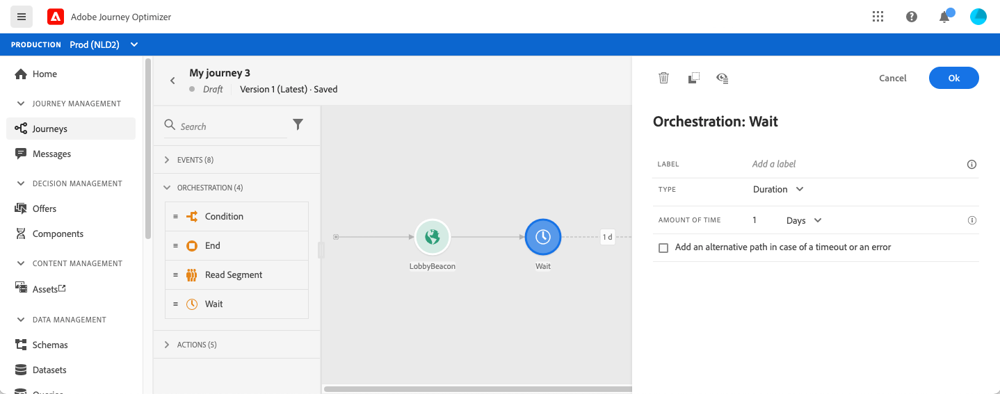
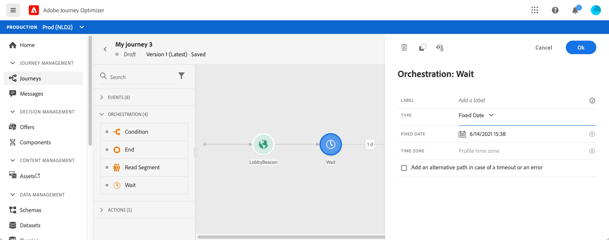
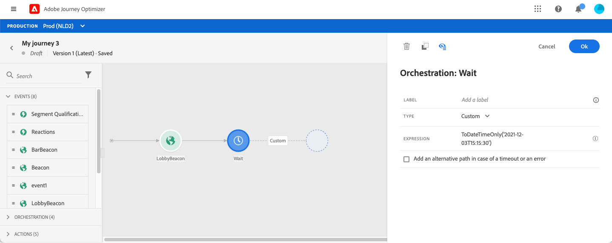
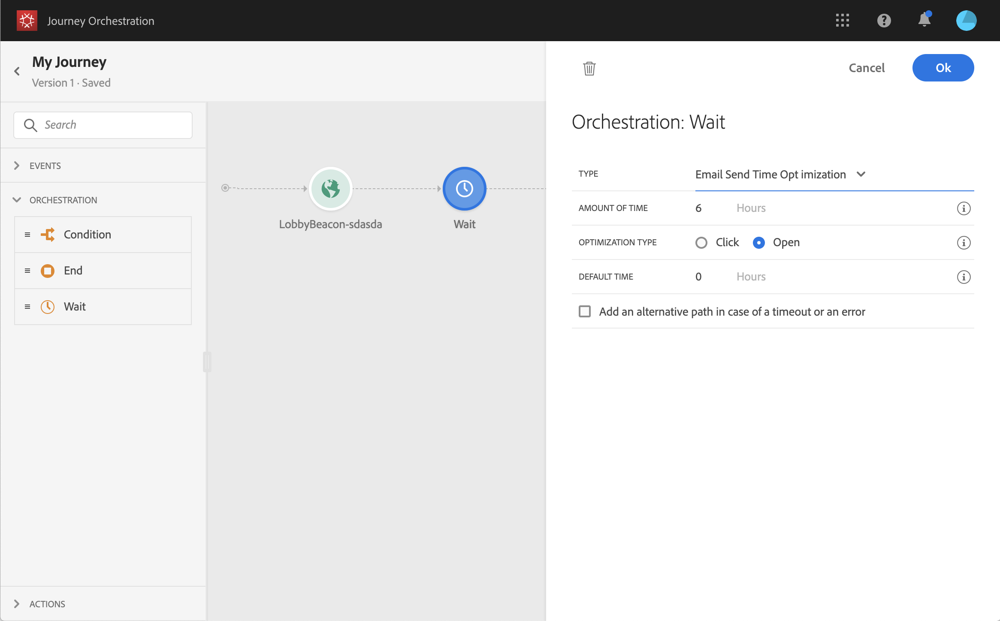

# 等待活動{#section_rlm_nft_dgb}

如果要在路徑中執行下一個活動之前等待，可以使用活 **[!UICONTROL Wait]** 動。 它可讓您定義執行下一個活動的時間。 有四個選項可供使用：

* [持續時間](#duration)
* [固定日期](#fixed_date)
* [自訂](#custom)

<!--* [Email send time optimization](#email_send_time_optimization)-->

## 關於等待活動{#about_wait}

以下是當您同時使用數個等待時，等待的優先順序。 如果它們具有相同的時間配置和不同但重疊的條件，則位於上面的等待將是優先順序。 例如，第一次等待的條件是「成為女性」，而第二次等待的條件是「成為VIP」。 第一個等待活動將優先化

另請注意，如果兩個不同的等待同時進行，則無論其垂直位置如何，都會優先排列第一個發生的等待。 例如，如果1小時的等待高於30分鐘，而30分鐘的等待低於30分鐘，則30分鐘的等待將被處理。

如果要將等待限制在特定人口中，可以定義條件。

>[!NOTE]
>
>等待時間上限為30天。
>
>在測試模式中， **[!UICONTROL Wait time in test]** 參數可讓您定義每個等待活動的持續時間。 預設時間為 10 秒。這可確保您快速取得測試結果。 See [this page](../building-journeys/testing-the-journey.md)

## 持續等待{#duration}

選擇在執行下一個活動之前等待的持續時間。



## 固定日期等待{#fixed_date}

選擇下一活動的執行日期。



## 自訂等待{#custom}

此選項可讓您使用根據事件或資料來源產生的欄位的進階運算式，來定義自訂日期，例如2020年7月12日下午5點。 它不會讓您定義自訂持續時間，例如7天。 運算式編輯器中的運算式應提供dateTimeOnly格式。 請參閱[本頁](../expression/expressionadvanced.md)。如需dateTimeOnly格式的詳細資訊，請參 [閱本頁](../expression/data-types.md)。

>[!NOTE]
>
>您可以運用dateTimeOnly運算式，或使用函式來轉換為dateTimeOnly。 例如： ```toDateTimeOnly(@{Event.offerOpened.activity.endTime})```，該欄位的格式為2016-08-12T09:46:06Z。
>
>您 **的旅程** ，時區是必要的。 因此，今天無法從介面直接指向完全ISO-8601時間戳記混合時間與時區偏移，例如2016-08-12T09:46:06.982-05。 請參閱[本頁](../building-journeys/timezone-management.md)。



<!--## Email send time optimization{#email_send_time_optimization}

>[!CAUTION]
>
>The email send time optimization capability is only available to customers who use the [Adobe Experience Platform Data Connector](https://docs.adobe.com/content/help/en/campaign-standard/using/developing/mapping-campaign-and-aep-data/aep-about-data-connector.html).

This type of wait uses a score calculated in the Adobe Experience Platform. The score calculates the propensity to click or open an email in the future based on past behavior. Note that the algorithm calculating the score needs a certain amount of data to work. As a result, when it does not have enough data, the default wait time will apply. At publication time, you’ll be notified that the default time applies.

>[!NOTE]
>
>The first event of your journey must have a namespace.
>
>This capability is only available after an **[!UICONTROL Email]** activity. You need to have Adobe Campaign Standard.

1. In the **[!UICONTROL Amount of time]** field, define the number of hours to consider to optimize email sending.
1. In the **[!UICONTROL Optimization type]** field, choose if the optimization should increase clicks or opens.
1. In the **[!UICONTROL Default time]** field, define the default time to wait if the predictive send time score is not available.

    >[!NOTE]
    >
    >Note that the send time score can be unavailable because there is not enough data to perform the calculation. In this case, you will be informed, at publication time, that the default time applies.

-->
