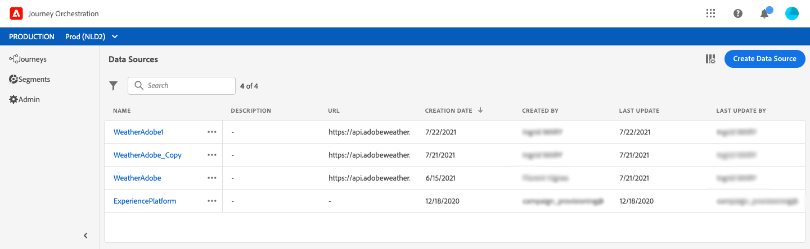

# 關於資料來源 {#concept_s1s_dqt_52b}

>[!CONTEXTUALHELP]
>id=&quot;jo_datasources&quot;
>title=&quot;關於資料來源&quot;
>abstract=&quot;資料來源組態一律由技術使用者執行。 資料來源設定可讓您定義系統連線，以擷取將用於歷程的其他資訊，例如：條件定義、參數和個人化動作資料、自訂等待定義、自訂時區定義。」

資料源配置始終由技術用戶 **執行**。

資料來源設定可讓您定義系統連線，以擷取將用於歷程的其他資訊，例如：

* 條件定義
* 動作中的參數和個人化資料
* 自定義等待定義
* 自定義時區定義

如果您的歷程僅利用來自事件裝載的本機資料，則不需要此設定。 例如，如果您的旅程是由事件組成，接著是只使用事件資料的電子郵件活動，則不需要設定資料來源。

資料來源有兩種類型：

* 預先設定的Experience platform資料來源，定義即時客戶個人檔案服務的連線。 這是內建的資料來源。 參見。
* 可讓您定義外部系統連線的外部資料來源。 您可以建立這些。 參見。

對於每個資料源，您定義要使用欄位組檢索的資訊。 參見。

以下是主要的資料來源設定步驟：

1. 在頂端功能表中，按一下標 **[!UICONTROL Data Sources]**簽。

   隨即顯示資料來源清單。 有關  介面的詳細資訊，請參閱。

   

1. 然後，您可以將欄位群組新增至內建資料來源(請參閱 )，或建立新的外部資料來源(請參閱 )和關聯欄位群組(請參閱 )。

   

1. 按一下 **[!UICONTROL Save]**.

   資料來源現在已設定好，可供您在歷程中使用。
