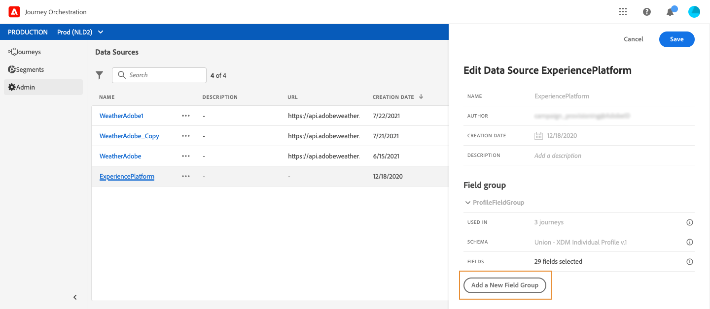

# Adobe Experience Platform 資料來源 {#concept_zrb_nqt_52b}

Adobe Experience Platform資料來源會定義與即時客戶個人檔案服務的連線。 此資料來源是內建並預先設定的。 無法刪除它。 此資料來源旨在擷取及使用即時客戶個人檔案服務的資料（例如，檢查進入歷程的人員是否為女性）。 其可讓您使用個人檔資料與體驗事件資料。 如需即時客戶個人檔案服務的詳細資訊，請參閱此[頁面](https://experienceleague.adobe.com/docs/experience-platform/profile/home.html?lang=zh-Hant)。

>[!NOTE]
>
>您可以擷取不到一年前建立的1000個最新體驗事件。

若要允許連線到即時客戶個人檔案服務，我們必須使用金鑰來識別人員，並使用名稱空間將金鑰內容化。 因此，如果您的歷程以包含索引鍵和名稱空間的事件開始，您只能使用此資料來源。 請參閱[此頁面](../building-journeys/journey.md)。

您可以編輯名為「ProfileFieldGroup」的預先設定欄位群組、新增欄位群組，以及移除未用於任何草稿或即時歷程的欄位群組。 請參閱[此頁面](../datasource/field-groups.md)。

以下是新增欄位群組至內建資料來源的主要步驟。

1. 從資料來源清單中，選取內建的Adobe Experience Platform資料來源。

   這會開啟畫面右側的資料來源設定窗格。

   

1. 按一下&#x200B;**[!UICONTROL Add a New Field Group]**&#x200B;以定義要擷取的一系列新欄位。 請參閱[此頁面](../datasource/field-groups.md)。

   

1. 從&#x200B;**[!UICONTROL Schema]**&#x200B;下拉式清單中選取結構描述。 此欄位列出Adobe Experience Platform中可用的設定檔和體驗事件結構。 未在[!DNL Journey Orchestration]中執行結構描述建立。 在Adobe Experience Platform中執行。
1. 選取您要使用的欄位。
1. 按一下&#x200B;**[!UICONTROL Save]**。

將游標放在欄位群組的名稱上時，您會在右側看到兩個圖示。 它們可讓您刪除和複製欄位群組。 請注意，**[!UICONTROL Delete]**&#x200B;圖示僅適用於未在任何即時或草稿歷程中使用欄位群組（**[!UICONTROL Used in]**&#x200B;欄位中顯示的資訊）。
