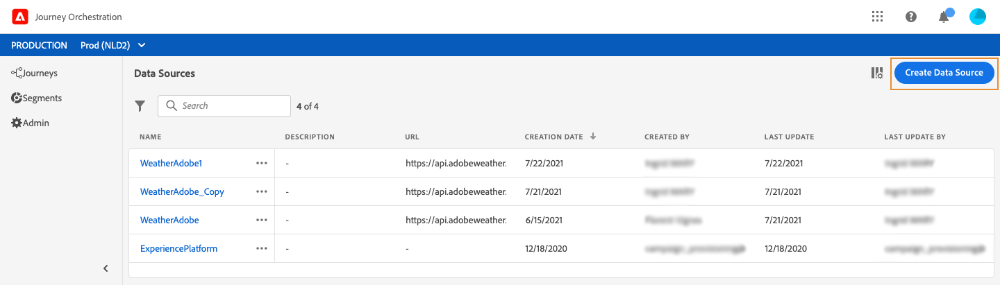
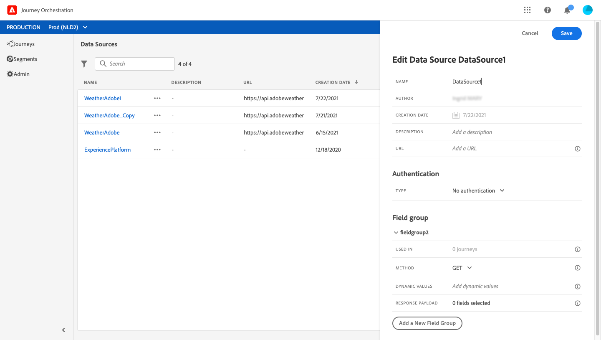
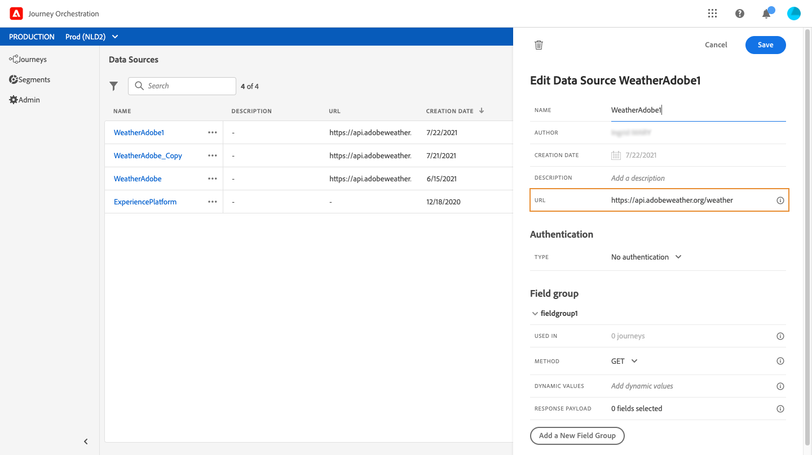
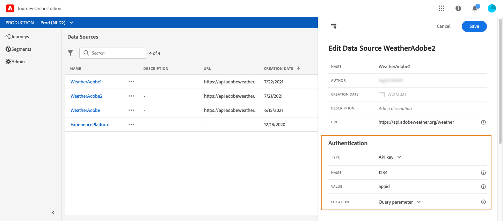
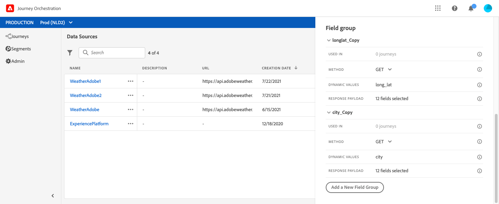
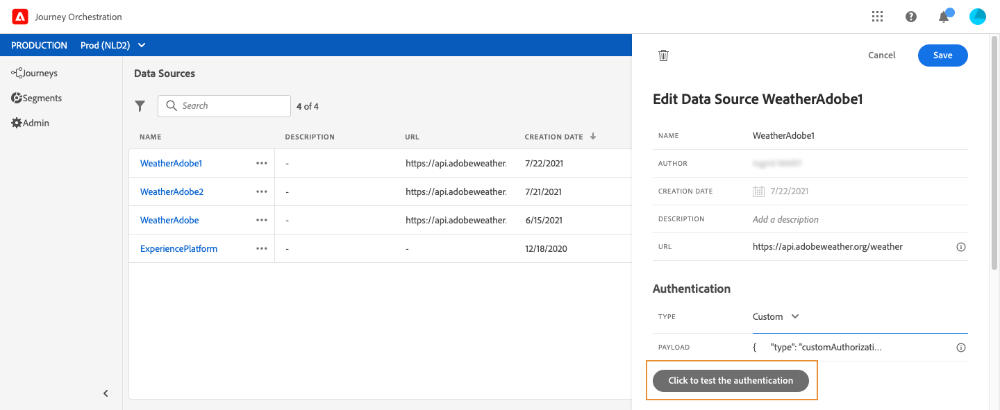
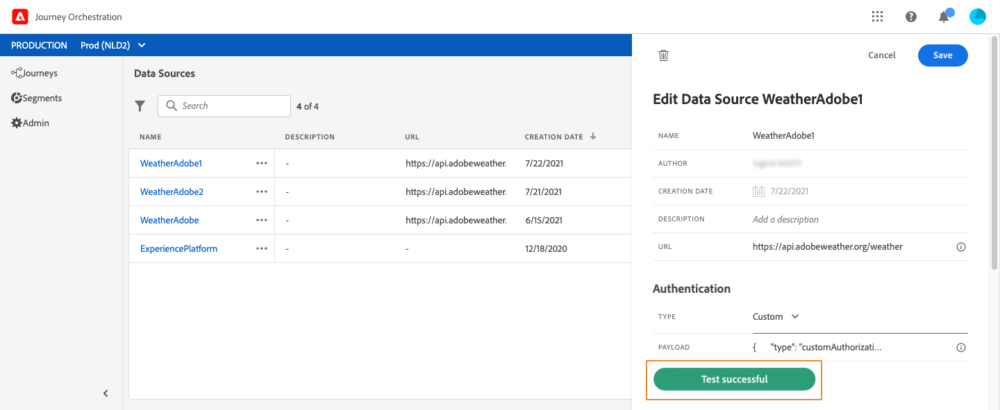

# 外部資料來源 {#concept_t2s_kqt_52b}

外部資料來源可讓您定義與協力廠商系統的連線，例如，如果您使用飯店訂房系統來檢查該人是否已註冊房間。 與內建的Experience Platform資料來源不同，您可以視需要建立盡可能多的外部資料來源。

支援使用POST或GET和傳回JSON的REST API。 支援API金鑰、基本和自訂驗證模式。

讓我們舉一個氣象API服務的例子，我想用它來根據即時氣象資料來自訂旅程的行為。

以下是API呼叫的兩個範例：

* _https://api.adobeweather.org/weather?city=London,uk&amp;appid=1234_
* _https://api.adobeweather.org/weather?lat=35&amp;lon=139&amp;appid=1234_

此呼叫由主要URL(_https://api.adobeweather.org/weather_)、兩個參數集（城市為「城市」，經緯度為「lat/long」）和API金鑰(appid)組成。

以下是建立和設定新外部資料來源的主要步驟：

1. 從資料來源清單中，按一下 **[!UICONTROL Add]** 以建立新的外部資料來源。

   

   這會開啟畫面右側的資料來源設定窗格。

   

1. 輸入您的資料來源名稱。

   >[!NOTE]
   >
   >請勿使用空格或特殊字元。 請勿使用超過30個字元。

1. 新增說明至您的資料來源。 此步驟為可選步驟。
1. 新增外部服務的URL。 在我們的例子中： _https://api.adobeweather.org/weather_。

   >[!CAUTION]
   >
   >我們強烈建議您基於安全原因使用HTTPS。 另請注意，我們不允許使用非公開的Adobe位址和IP位址。

   

1. 根據外部服務配置配置身份驗證： **[!UICONTROL No authentication]**、 **[!UICONTROL Basic]****[!UICONTROL Custom]** 或 **[!UICONTROL API key]**。 有關自定義身份驗證模式的詳細資訊，請參見 [](../datasource/external-data-sources.md#section_wjp_nl5_nhb)。 在我們的例子中，我們選擇：


   * **[!UICONTROL Type]**:&quot;API金鑰&quot;
   * **[!UICONTROL Value]**:&quot;1234&quot;（這是我們API金鑰的值）
   * **[!UICONTROL Name]**:&quot;appid&quot;（這是API金鑰參數名稱）
   * **[!UICONTROL Location]**:&quot;查詢參數&quot;（API金鑰位於URL中）
   

1. 按一下，為每個API參數集新增欄位群組 **[!UICONTROL Add a New Field Group]**。 請勿在欄位群組名稱中使用空格或特殊字元。 在我們的範例中，我們需要建立兩個欄位群組，每個參數集各一個（城市和長/lat）。

對於「long/lat」參數集，我們會建立包含下列資訊的欄位群組：

* **[!UICONTROL Used in]**:顯示使用欄位群組的歷程次數。 您可以按一下 **[!UICONTROL View journeys]** 圖示，顯示使用此欄位群組的歷程清單。
* **[!UICONTROL Method]**:選擇POST或GET方法。 在本例中，我們選擇了GET方法。
* **[!UICONTROL Cache duration]**:以我們為例，我們希望將天氣快取10分鐘。
* **[!UICONTROL Response Payload]**:在欄位內 **[!UICONTROL Payload]** 按一下，並貼上呼叫傳回之裝載的範例。 例如，我們使用氣象API網站上找到的裝載。 驗證欄位類型是否正確。 每次呼叫API時，系統都會擷取裝載範例中包含的所有欄位。 請注意，如果您想要變 **[!UICONTROL Paste a new payload]** 更目前傳遞的裝載，可以按一下。
* **[!UICONTROL Dynamic Values]**:在本例中輸入以&quot;long,lat&quot;分隔的不同參數。 由於參數值取決於執行上下文，因此它們將在歷程中定義。 參見[](../expression/expressionadvanced.md)。
* **[!UICONTROL Sent Payload]**:本欄位不會出現在我們的範例中。 只有選擇POST方法時，才可使用它。 貼上將傳送至協力廠商系統的裝載。

在需要參數的GET呼叫中，您會在欄位中輸入參數，並 **[!UICONTROL Parameters]** 在呼叫結束時自動新增這些參數。 若是POST呼叫，您需要：

* 在欄位中列出呼叫時傳遞的參 **[!UICONTROL Parameter]** 數(在以下範例中：「識別碼」)。
* 在已傳送裝載的正文中，也使用完全相同的語法來指定它們。 若要這麼做，您必須新增：&quot;param&quot;:&quot;name of your parameter&quot;(在以下範例中：「識別碼」)。 請遵循下列語法：

   ```
   {"id":{"param":"identifier"}}
   ```



按一下 **[!UICONTROL Save]**.

資料來源現在已設定好，可供您在歷程中使用，例如在您的條件中或個人化電子郵件。 如果溫度高於30°C，您可以決定傳送特定通訊。

## 自訂驗證模式{#section_wjp_nl5_nhb}

>[!CONTEXTUALHELP]
>id=&quot;jo_authentication_payload&quot;
>title=&quot;關於自訂驗證&quot;
>abstract=&quot;自訂驗證模式用於複雜驗證，以呼叫API封裝通訊協定，例如OAuth2。 動作執行是兩個步驟的程式。 首先，執行對端點的調用以生成訪問令牌。 接著，存取Token會插入動作的HTTP要求中。」

此驗證模式用於複雜驗證，常用來呼叫OAuth2等API封裝通訊協定，以擷取要插入實際HTTP要求中的存取Token，以執行動作。

當您設定自訂驗證時，可以按一下下方的按鈕，檢查自訂驗證裝載是否已正確設定。



如果測試成功，按鈕會變成綠色。



使用此驗證時，動作執行是兩個步驟的程式：

1. 呼叫端點以產生存取Token。
1. 以正確的方式注入存取Token，以呼叫REST API。

此驗證分為兩部分。

要調用的端點定義以生成訪問令牌：

* 端點：用於產生端點的URL
* 端點（GET或POST）上HTTP請求的方法
* 標題：鍵／值配對，視需要在此呼叫中插入為標題
* body:說明呼叫的主體（如果方法為POST）。 我們支援限定的主體結構，定義在bodyParams（key/value對）中。 bodyType說明呼叫中內文的格式和編碼：
   * &#39;form&#39;:這表示內容類型將是application/x-www-form-urlencoded(charset UTF-8)，而金鑰／值配對將依序序列化：key1=value1&amp;key2=value2&amp;...
   * &#39;json&#39;:這表示內容類型將是application/json(charset UTF-8)，而索引鍵值配對將依原樣序列化為json物件： _{ &quot;key1&quot;:&quot;value1&quot;、&quot;key2&quot;:&quot;value2&quot;, ...}_

在動作的HTTP要求中必須插入存取Token的方式定義：

* authorizationType:定義在動作的HTTP呼叫中必須插入產生的存取Token的方式。 可能的值包括：

   * 載體：指出存取Token必須插入授權標題，例如：授 _權：Bearer &lt;存取Token>_
   * 頁首：指出存取Token必須插入為標題（由屬性tokenTarget定義的標題名稱）。 例如，若tokenTarget是myHeader，存取Token會以下列方式插入為標題： _myHeader:&lt;access token>_
   * queryParam:指出存取Token必須插入為queryParam，即由屬性tokenTarget定義的查詢參數名稱。 例如，若tokenTarget是myQueryParam，則動作呼叫的URL將是： _&lt;url>?myQueryParam=&lt;access token>_

* tokenInResponse:指出如何從驗證呼叫擷取存取Token。 此屬性可以是：
   * &#39;response&#39;:指出HTTP回應是存取Token
   * json中的選擇器（假設回應是json，我們不支援其他格式，例如XML）。 此選擇器的格式為 _json://&lt;存取Token屬性的路徑>_。 例如，如果呼叫的回應是： _{ &quot;access_token&quot;:&quot;theToken&quot;, &quot;timestamp&quot;:12323445656_}tokenInResponse將是： _json://access_token_

此驗證的格式為：

```
{
    "type": "customAuthorization",
    "authorizationType": "<value in 'bearer', 'header' or 'queryParam'>",
    (optional, mandatory if authorizationType is 'header' or 'queryParam') "tokenTarget": "<name of the header or queryParam if the authorizationType is 'header' or 'queryParam'>",
    "endpoint": "<URL of the authentication endpoint>",
    "method": "<HTTP method to call the authentication endpoint, in 'GET' or 'POST'>",
    (optional) "headers": {
        "<header name>": "<header value>",
        ...
    },
    (optional, mandatory if method is 'POST') "body": {
        "bodyType": "<'form'or 'json'>,
        "bodyParams": {
            "param1": value1,
            ...

        }
    },
    "tokenInResponse": "<'response' or json selector in format 'json://<field path to access token>'"
}
```
