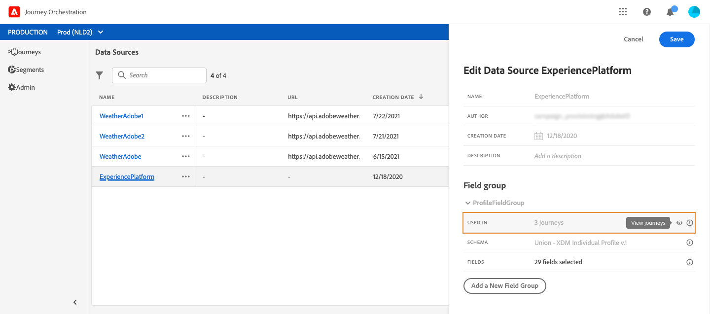

# 欄位群組 {#concept_ntl_ypt_52b}

欄位群組是一組欄位，您可從資料來源擷取並用於歷程中。

## 定義欄位組 {#section_dsz_kjd_fjb}

對於每個資料源，您可以定義多個欄位組，每個欄位組都具有特定的快取持續時間。

例如，您可以建立包含電話號碼、電子郵件、名字和描述檔位址的欄位群組。 然後，您就可以在歷程中使用這些資料來創造條件。 例如，您只有在描述檔的電話號碼不為空時，才可決定傳送SMS。 如果空白，您可以傳送電子郵件。

即使會自動新增預設名稱，我們仍建議您為欄位群組指定名稱。 事實上，Journey Orchestration中的其他使用者會看到欄位群組名稱。 為欄位群組指定相關名稱是最佳作法。

在歷程中使用資料來源欄位時，系統會擷取為該欄位群組定義的所有欄位。 因此，只選擇您歷程所需的欄位是最佳實務。 這將減少您歷程中的請求延遲，進而提高效能。 請注意，您稍後可以輕鬆在欄位群組中新增更多欄位。

**[!UICONTROL Cache duration]** 也很重要，因為它將幫助您優化效能。 快取持續時間表示在歷程中，如果從欄位群組擷取資料一次，系統就會暫時快取。 如果同一行程的稍後需要相同的資料，系統不會對資料來源提出其他要求。 快取持續時間的配置應適用於每個使用案例。 如果您需要擷取即時資料，例如飯店訂房狀態、氣象資訊或忠誠度點數，您會將包含這些欄位的欄位群組與短快取持續時間（例如1秒）產生關聯。 對於更新頻率較低的欄位（名稱、性別），您將建立快取持續時間較長的第二個欄位群組（例如5天）。

使用欄位群組的歷程次數會顯示在欄位 **[!UICONTROL Used in]** 中。 您可以按一下 **[!UICONTROL View journeys]** 按鈕，顯示使用此欄位群組的歷程清單。

>[!NOTE]
>
>請注意，如果欄位群組沒有欄位，表達式編輯器中就不會顯示欄位。

## 欄位群組生命週期 {#section_abk_njd_fjb}

您可以新增或移除任何草稿或即時歷程中未使用的欄位群組。

您可以新增欄位，但無法從一或多個草稿或即時歷程中使用的欄位群組中移除欄位。 這將避免重蹈覆轍。

若要從一或多個歷程中使用的欄位群組刪除欄位，請依照下列步驟進行。 讓我們使用名為「欄位群組A」的欄位群組範例。

1. 在欄位群組清單中，將游標置於「欄位群組A」上，然後按一下右 **[!UICONTROL Duplicate]** 側的圖示。 例如，將複製的欄位群組命名為「欄位群組B」。
1. 在「欄位群組B」中，移除您不再想要的欄位。
1. 在「欄位群組A」中，檢查此欄位群組的使用位置。 此資訊會顯示在欄位 **[!UICONTROL Used in]** 中。
1. 開啟所有使用「欄位群組A」的歷程。
1. 建立這些歷程的新版本。 使用「欄位群組A」編輯所有活動，並選取「欄位群組B」。
1. 停止使用「欄位群組A」的舊版歷程。 然後，您就不應使用「欄位群組A」進行旅程。
1. 移除「欄位群組A」，因為它不再使用。
