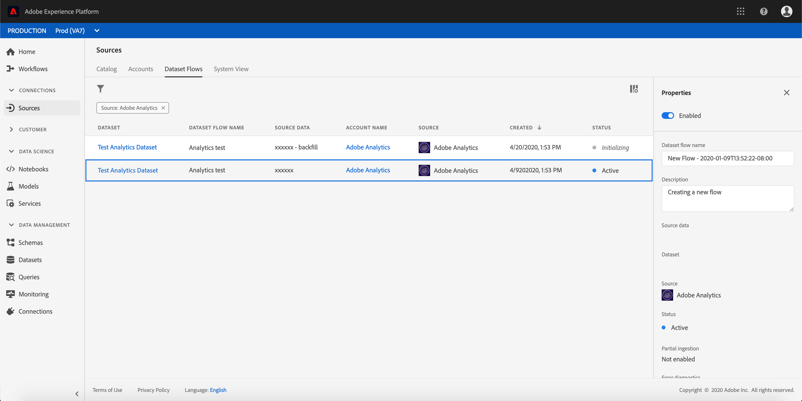

# 利用Adobe Analytics資料{#analytics-data}

>[!NOTE]
>
>本節僅適用於需要使用Adobe Analytics資料的規則型事件和客戶。

您可以運用您已擷取並串流至平台的所有Adobe Analytics行為事件資料，以觸發歷程並自動化客戶體驗。

為了達到此目的，您必須在Adobe Experience Platform啟用您要運用的報表套裝：

1. 在Adobe Experience Platform，在Adobe Analytics區選擇&#x200B;**[!UICONTROL Sources]**，然後選擇&#x200B;**[!UICONTROL Add data]**。 隨即顯示可用的Adobe Analytics報表套裝清單。

1. 選擇要啟用的報表套裝，按一下&#x200B;**[!UICONTROL Next]**，然後按一下&#x200B;**[!UICONTROL Finish]**。

1. 與您的Alpha程式聯絡點共用來源資料ID。

這會啟用該報表套裝的Analytics來源連接器。 每當資料傳入時，資料就會轉換為「體驗」事件並傳送至Adobe Experience Platform。

有關Adobe Analytics源連接器的詳細資訊，請參閱[文檔](https://docs.adobe.com/help/en/experience-platform/sources/connectors/adobe-applications/analytics.html)和[教程](https://docs.adobe.com/content/help/en/experience-platform/sources/ui-tutorials/create/adobe-applications/analytics.html)。
