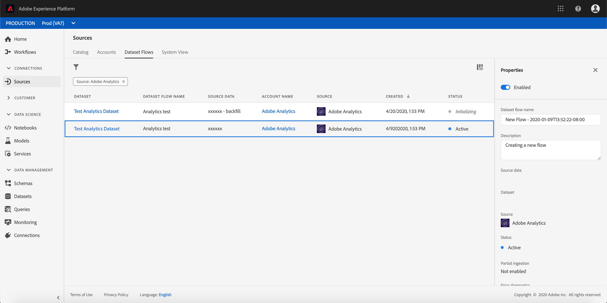

# 善用Adobe Analytics資料{#analytics-data}

>[!CAUTION]
>
>**正在尋找 Adobe Journey Optimizer**？ 按一下[這裡](https://experienceleague.adobe.com/zh-hant/docs/journey-optimizer/using/ajo-home){target="_blank"}以取得 Journey Optimizer 文件。
>
>
>_本文件指的是已由 Journey Optimizer 取代的舊版 Journey Orchestration 資料。 如果您對 Journey Orchestration 或 Journey Optimizer 的存取權有任何疑問，請聯絡您的帳戶團隊。_

>[!NOTE]
>
>本節僅適用於規則型事件以及需要使用Adobe Analytics資料的客戶。

您可以善用您已擷取並串流至Platform的所有Adobe Analytics行為事件資料，以觸發歷程並自動化客戶體驗。

為了讓此功能發揮作用，您需要在Adobe Experience Platform中啟用您要運用的報表套裝：

1. 在Adobe Experience Platform中，在Adobe Analytics區段中依序選取&#x200B;**[!UICONTROL Sources]**&#x200B;和&#x200B;**[!UICONTROL Add data]**。 畫面隨即顯示可用Adobe Analytics報表套裝清單。

1. 挑選您要啟用的報表套裝，按一下&#x200B;**[!UICONTROL Next]**&#x200B;並按一下&#x200B;**[!UICONTROL Finish]**。

1. 與您的Alpha程式聯絡人共用來源資料ID。

如此將可啟用該報表套裝的Analytics來源聯結器。 只要有資料進來，就會轉換為Experience事件並傳送到Adobe Experience Platform。

如需Adobe Analytics來源聯結器的詳細資訊，請參閱[檔案](https://experienceleague.adobe.com/docs/experience-platform/sources/connectors/adobe-applications/analytics.html?lang=zh-Hant)和[教學課程](https://experienceleague.adobe.com/docs/experience-platform/sources/ui-tutorials/create/adobe-applications/analytics.html?lang=zh-Hant)。
