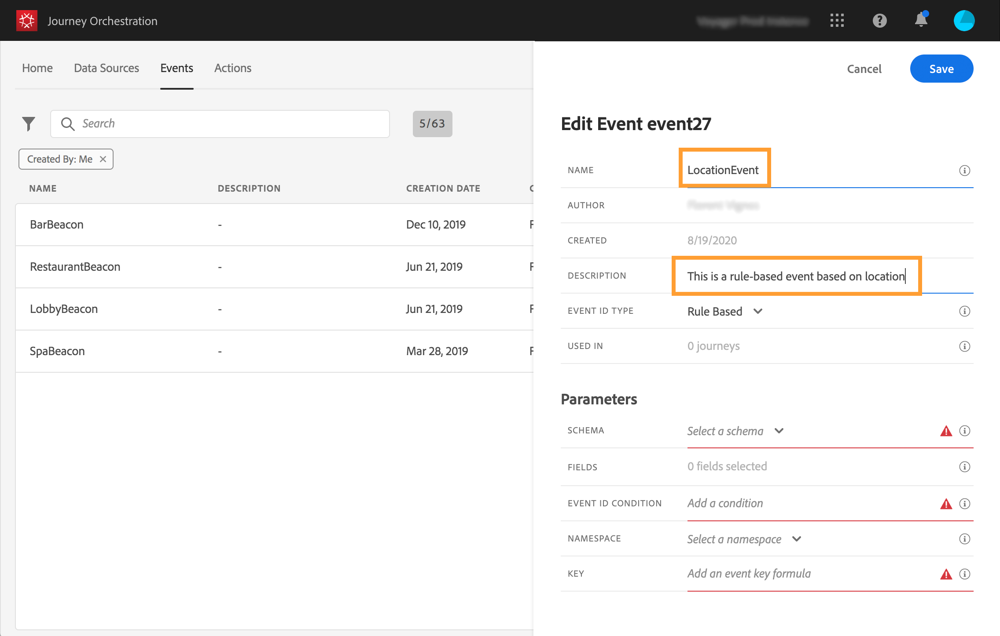
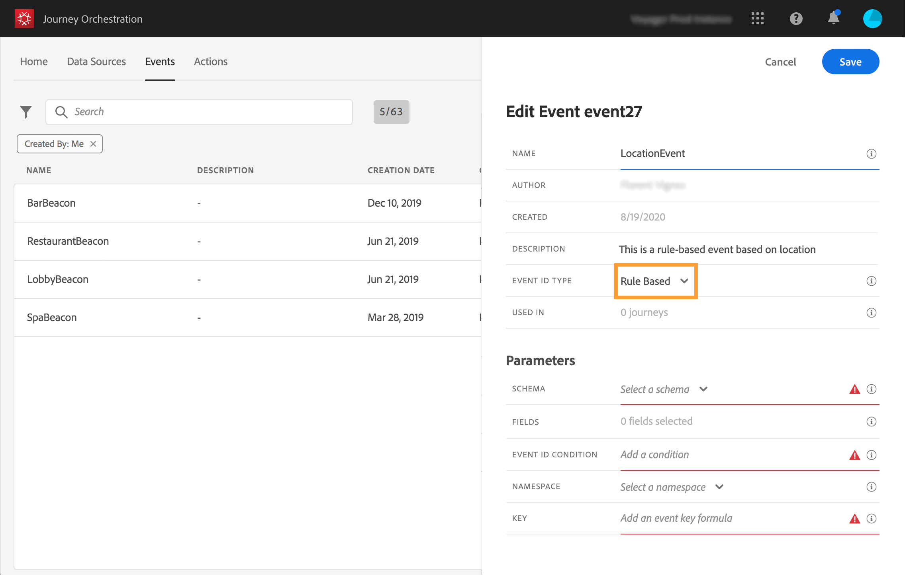
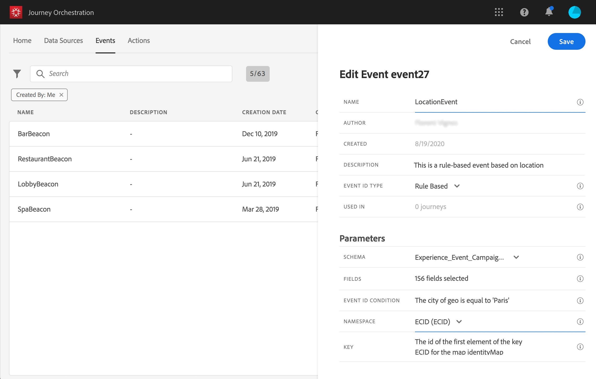

# 建立新事件 {#section_tbk_5qt_pgb}

以下是設定新事件的主要步驟：

1. 在頂端功能表中，按一下 **[!UICONTROL Events]** 索引標籤。畫面隨即顯示事件清單。有關介面的詳細資訊，請參閱[此頁](../about/user-interface.md)。

   

1. 按一下 **[!UICONTROL Add]** 以建立新事件。事件設定窗格會在畫面右側開啟。輸入事件的名稱。您也可以新增說明。

   

   >[!NOTE]
   >
   >請勿使用空格或特殊字元。請勿使用超過 30 個字元。

1. 在&#x200B;**[!UICONTROL Event ID type]**&#x200B;欄位中，選取您要使用的事件類型。

   

   * **規則基** 礎事件：此類型的事件不會產生eventID。在&#x200B;**事件ID條件**&#x200B;欄位中，您只需定義規則，系統將使用該規則來識別將觸發您歷程的相關事件。 此規則可以根據事件裝載中可用的任何欄位，例如設定檔的位置或新增至設定檔購物車的項目數。

   * **系統生** 成事件：此類型需要eventID。建立事件時會自動產生此eventID欄位，並新增至裝載預覽。 推送事件的系統不應產生ID，而應傳遞有效負載預覽中可用的ID。 請參閱[本節](../event/previewing-the-payload.md)。
   >[!NOTE]
   >
   >有關[此部分](../event/about-events.md)中事件類型的詳細資訊。
1. 使用此事件的歷程次數會顯示在 **[!UICONTROL Used in]** 欄位中。您可以按一下 **[!UICONTROL View journeys]** 圖示，以顯示使用此事件的歷程清單。
1. 定義結構和有效負載欄位：您可以在此處選取 [!DNL Journey Orchestration] 預期會收到的事件資訊（通常稱為有效負載）。接著，您就可以在歷程中使用這項資訊。請參閱[本頁](../event/defining-the-payload-fields.md)。
   >[!NOTE]
   >
   >選取&#x200B;**[!UICONTROL System Generated]**&#x200B;類型時，只有具有eventID類型mixin的結構才可用。 選取&#x200B;**[!UICONTROL Rule Based]**&#x200B;類型時，所有體驗事件結構皆可使用。

1. 若是規則型事件，請按一下&#x200B;**[!UICONTROL Event ID condition]**欄位內的。 使用簡單運算式編輯器，定義系統將使用的條件，以識別將觸發您歷程的事件。
   

   在範例中，我們根據設定檔的城市寫了條件。 這表示，每當系統收到符合此條件（**[!UICONTROL City]**&#x200B;欄位和&#x200B;**[!UICONTROL Paris]**&#x200B;值）的事件時，就會將其傳遞至Journey Orchestration。

1. 新增命名空間。此步驟為選填，但建議您新增命名空間，以便運用儲存在「即時客戶個人檔案服務」的資訊。它會定義事件具備的金鑰類型。請參閱[本頁](../event/selecting-the-namespace.md)。
1. 定義金鑰：從您的有效負載欄位選擇一個欄位，或是定義一個公式以識別與事件相關聯的人員。如果您選取命名空間，系統便會自動設定此金鑰（但您仍可加以編輯）。事實上，[!DNL Journey Orchestration] 會挑選應該與命名空間對應的金鑰（例如，如果您選取電子郵件命名空間，系統便會選取電子郵件金鑰）。請參閱[本頁](../event/defining-the-event-key.md)。
1. 對於系統產生的事件，您可以新增條件。 此步驟為選填。這可讓系統僅處理符合條件的事件。您只能根據事件含有之資訊設定條件。請參閱[本頁](../event/adding-a-condition.md)。
1. 按一下 **[!UICONTROL Save]**。

   

   條件現在已設定完畢，且準備好放入歷程中。若要接收事件，則需要完成其他設定步驟。請參閱[本頁](../event/additional-steps-to-send-events-to-journey-orchestration.md)。
