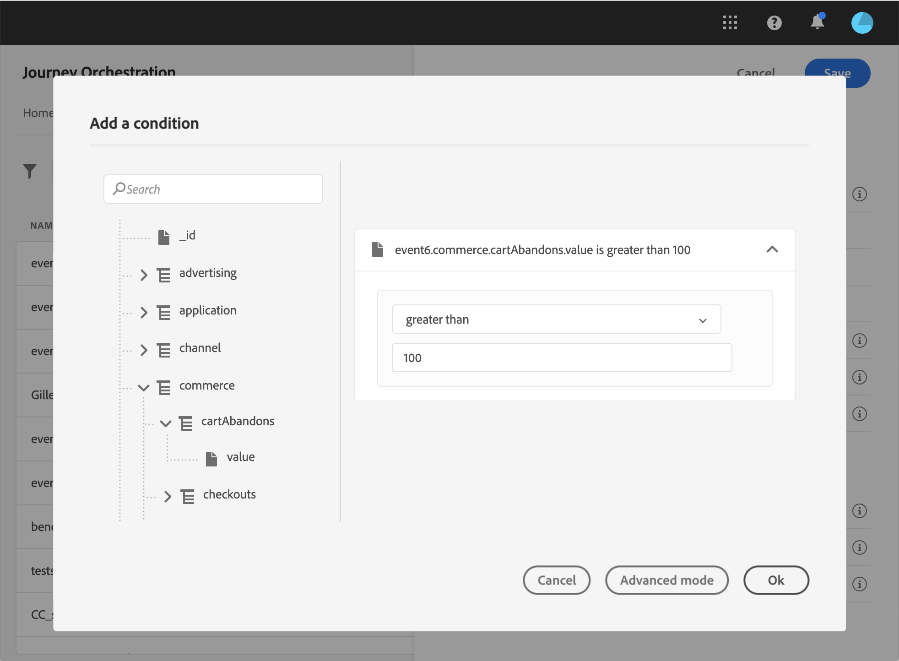

# 新增條件 {#concept_rbg_gqt_52b}

對於系統產生的事件，您可以定義事件條件，讓系統篩選事件的處理。 如果條件為true，則處理事件。 如果條件不成立，則忽略事件。

事件條件只能根據事件裝載中傳遞的資料。 行銷人員無法在畫布中變更在事件層級定義的條件。 其目的是在使用此事件時強化此條件。 例如，如果您不希望行銷人員在購物車值太小時使用購物車放棄事件，您可以在「購物車值」事件欄位上建立條件，並強加超過100美元的值。

您可以使用簡單運算式編輯器或進階運算式編輯器來設定事件的條件。 請參閱[本頁](../expression/expressionadvanced.md)。

例如，您可以定義條件，僅處理特定事件類型的事件，並忽略其他類型。 或者，如果您的事件是購物車放棄，而裝載包含購物車值欄位，則您可以定義事件條件，只有在購物車值大於100美元時，才能處理事件。

