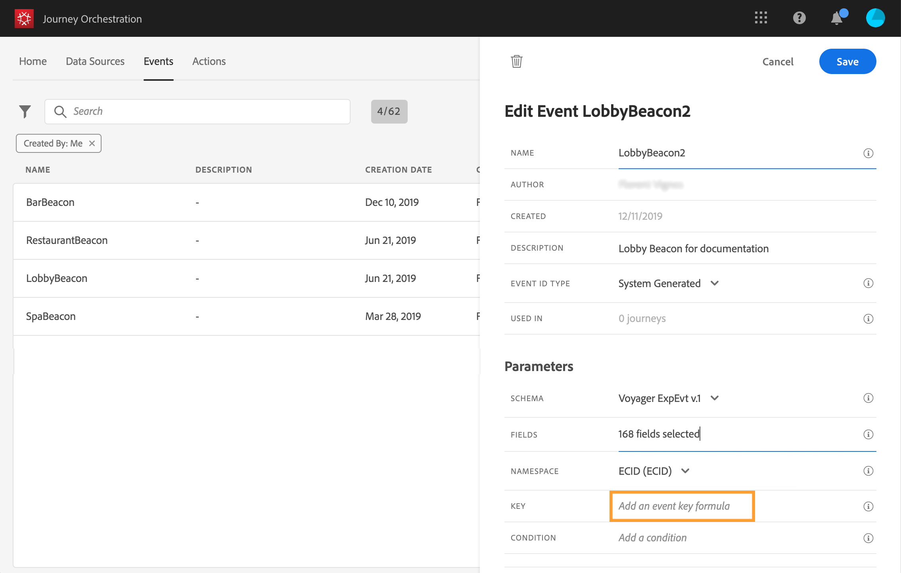

# 定義事件鍵 {#concept_ond_hqt_52b}

關鍵字是欄位或欄位組合是事件裝載資料的一部分，可讓系統識別與事件相關聯的人員。 金鑰可以是Experience Cloud ID、CRM ID或電子郵件地址。

如果您打算利用「即時客戶配置檔案」資料庫中儲存的資料，則必須選擇在「即時客戶配置檔案服務」中定義為配置檔案身份的資訊作為事件密鑰 。

它可讓系統執行事件與個人設定檔之間的協調。 如果選擇具有主標識的方案，則預 **[!UICONTROL Key]** 填充 **[!UICONTROL Namespace]** 和欄位。 如果未定義任何識別，我們會選 _擇identityMap > id_ (id)作為主要金鑰。 然後，您必須選取命名空間，然後使用identityMap > id預先填入 **[!UICONTROL Namespace]** 索引 _鍵（在欄位下）_。

選擇欄位時，標籤主標識欄位。

如果您需要使用不同的金鑰，例如CRM ID或電子郵件地址，則需手動新增：

1. 按一下欄 **[!UICONTROL Key]** 位內或鉛筆圖示。

   

1. 在裝載欄位清單中選擇作為鍵的欄位。 您也可以切換至進階運算式編輯器，以建立更複雜的索引鍵（例如，事件的兩個欄位串連）。 請參閱以下章節。

   

收到事件時，鍵值將允許系統識別與事件相關聯的人。 與命名空間相關聯(請 參閱)的索引鍵可用於在Adobe Experience Platform上執行查詢。 參見。鑰匙也用來檢查一個人是否在旅程中。 事實上，一個人不可能在同一旅程的兩個不同地方。 因此，系統不允許相同的密鑰（例如，密鑰CRMID=3224）在同一行程的不同位置。

如果您想要執行其他操作，也可以&#x200B;**[!UICONTROL Advanced mode]**&#x200B;訪問高級表達式函式()。 這些函式可讓您控制用於執行特定查詢的值，例如變更格式、執行欄位串連，只考慮欄位的一部分（例如10個前字元）。 參見。
